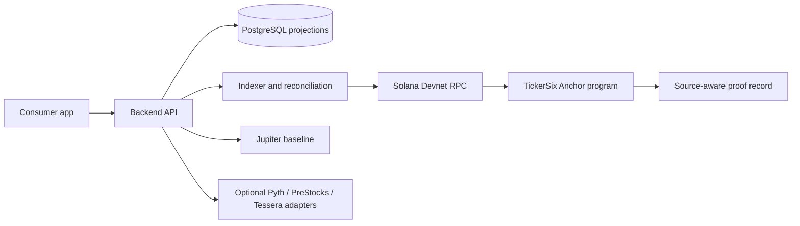

# Stocklana

Stocklana is a free-to-play Solana Devnet fantasy market competition built on
TickerSix. Each Battle uses six eligible representations and one captain. The
program commits the lineup, reveals it after the lock window, settles against
source-specific market evidence, and computes deterministic Q9 scores.

Stocklana is a game and technical demonstration, not an investment product or
financial advice.

## Current network

- Cluster: Solana Devnet
- Program: `8sehrRxpnLbvpzgJx8MqB5YApZAh69z5yVvdK1Zeyj6Z`
- Explorer: [Devnet program account](https://explorer.solana.com/address/8sehrRxpnLbvpzgJx8MqB5YApZAh69z5yVvdK1Zeyj6Z?cluster=devnet)
- Permanent public market baseline: Jupiter token spot data with signed
  threshold attestations
- Optional sponsor adapters: Pyth Pro, PreStocks, and Tessera
- Infrastructure target: zero paid services and public Devnet RPC only

Pyth is optional and trial-dependent. The Jupiter path remains the permanent
baseline when Pyth is disabled or unavailable.

## Repository map

```text
programs/tickersix/       Anchor program and on-chain invariants
crates/protocol/          Shared scoring, pairing, and evidence contracts
crates/relay/             Instruction builders for coordinator workflows
crates/market-data/       Provider adapters and market-quality validation
backend/                  Auth, indexing, settlement, proof, ratings, and API
app/                      Dependency-free mobile-first consumer surface
fixtures/                 Deterministic provider and release-contract fixtures
scripts/                  Non-signing checks and guarded operator commands
artifacts/                Public deployment verification records
```

## Architecture



The frontend distinguishes projected data from finalized settlement evidence.
Private-market representations remain outside the Public Equity rating domain.
Provider failures are typed and fail closed rather than silently changing the
source or scoring policy for an existing Market Round.

## Local verification

Required tools are the pinned Rust toolchain, Anchor, Solana CLI, Node.js, npm,
and curl. No private key is required for local tests.

```bash
cargo fmt --all -- --check
cargo test --workspace -- --test-threads=1
cargo clippy --workspace --all-targets -- -A clippy::too_many_arguments
npm --prefix app run check
node --check app/app.js
```

The established Clippy profile allows the two existing argument-count warnings
in the replay and settlement entry points. They do not affect program or API
behavior.

## Devnet verification

The deployment path is guarded and never creates a wallet. First run the
non-signing checks:

```bash
scripts/devnet-deployment-preflight.sh
```

The deployed program and its IDL artifact can be checked together with the
final readiness gate:

```bash
scripts/final-submission-gate.sh
```

The final submission gate requires a clean worktree, performs local regression checks, and validates the recorded
program and IDL metadata, and verifies that the public Devnet account is
executable and owned by the upgradeable loader. It does not send a transaction.

If a fresh deployment is required, review the fee payer, cluster, program ID,
and Devnet balance first, then explicitly authorize the guarded command:

```bash
export TICKERSIX_DEPLOY_WALLET="$HOME/.config/solana/id.json"
NO_DNA=1 solana address --keypair "$TICKERSIX_DEPLOY_WALLET"
NO_DNA=1 solana balance --url devnet --keypair "$TICKERSIX_DEPLOY_WALLET"

TICKERSIX_DEPLOY_APPROVED=YES \
TICKERSIX_DEPLOY_WALLET="$HOME/.config/solana/id.json" \
scripts/devnet-deployment.sh
```

Never commit a wallet, seed phrase, API key, or provider secret.

## Release evidence

`fixtures/release-evidence/` contains contract fixtures that validate schema
and safety boundaries. A contract fixture is not real beta evidence. Real
tester sessions, finalized proof transactions, screenshots, videos, and the
100-player League report must be recorded separately under the operator's
release evidence directory before submission.

Run the contract checks with:

```bash
scripts/beta-evidence-gate.sh
scripts/release-freeze-gate.sh
```

The checked-in contracts intentionally report that external evidence is not
complete. This prevents a template from being presented as a live user or
Devnet result.

## Attribution

The project uses Solana and Anchor, Rust, Axum, Tokio, PostgreSQL, Jupiter
market-data services, and optional Pyth Pro, PreStocks, and Tessera provider
adapters. Provider names and logos remain subject to their respective terms.

## Important limitations

- Devnet deployment is not a Mainnet service-level guarantee.
- Jupiter HTTP provenance is strengthened by signed threshold attestations but
  is not a trustless oracle.
- Pyth availability is temporary and commercial outside an authorized trial.
- Private-market representations are not assumed to be ordinary equity or
  interchangeable fair-value instruments.
- The product does not provide investment advice or promise permanently free
  third-party data.
