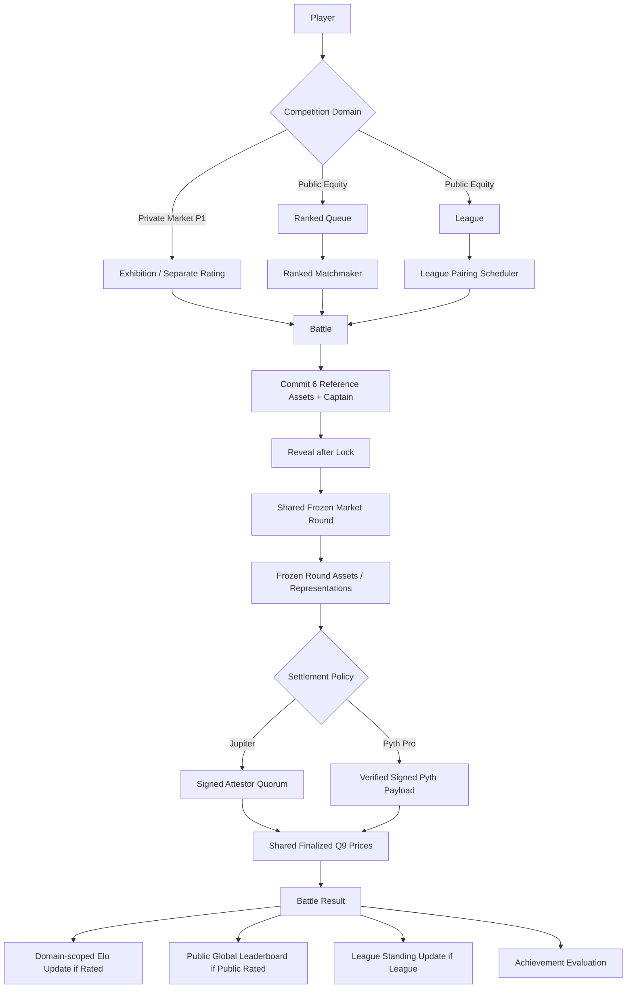
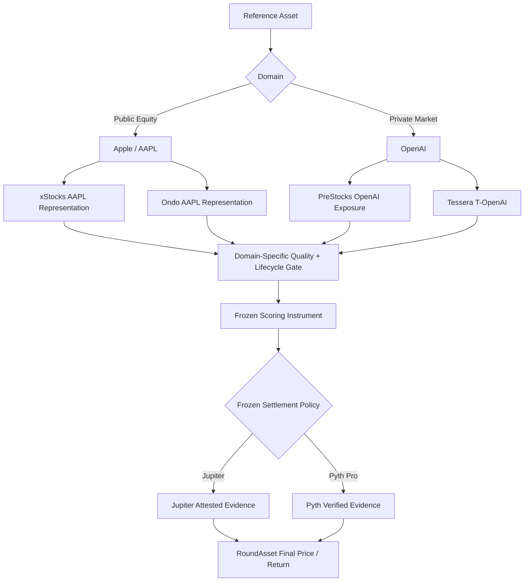
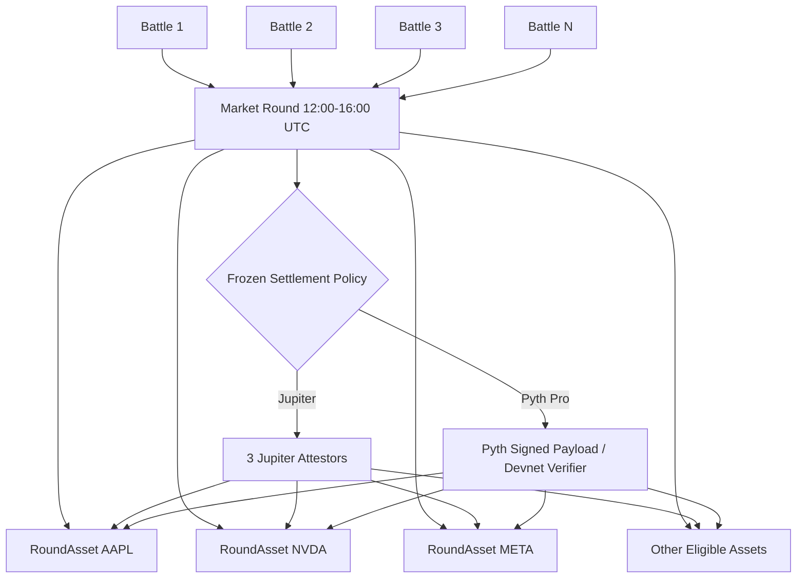
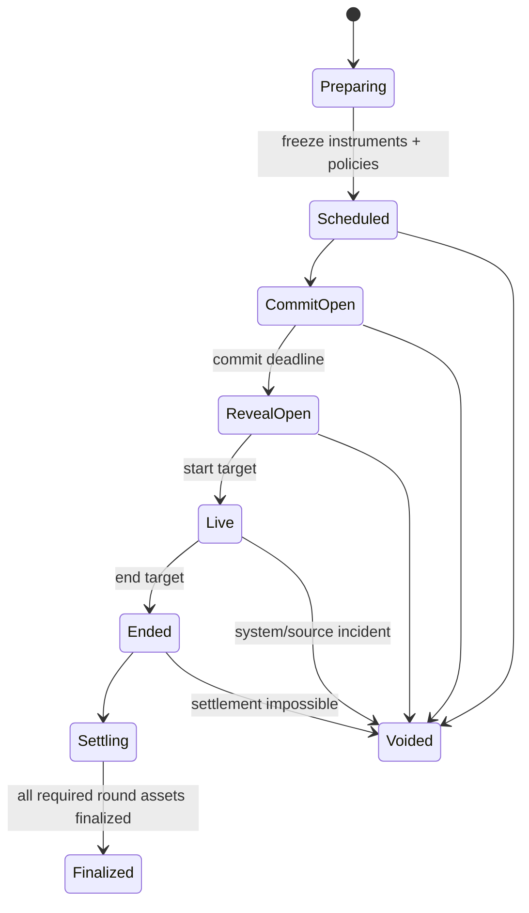
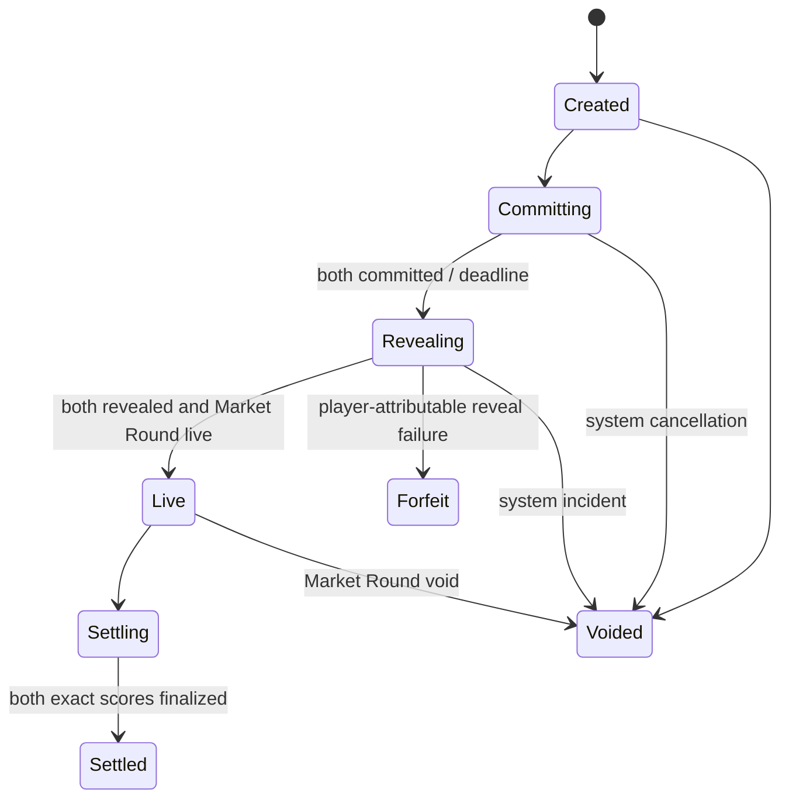
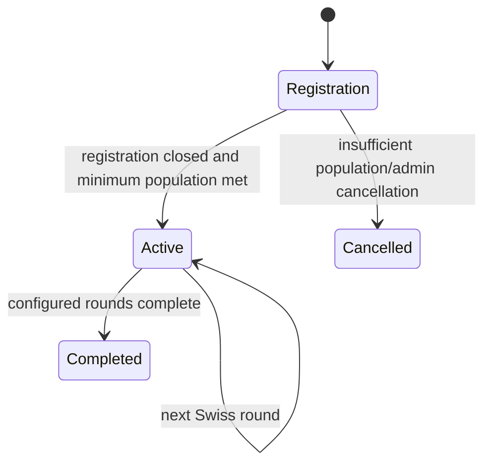

**Document status:** Canonical product, architecture, protocol, implementation, research, and audit specification  
**Version:** 2.1  
**Revision scope:** Zero-cost Stocklana sponsor-track revision; Solana Devnet deployment with real external market data; permanent free Jupiter/xStocks baseline; trial-gated `PYTH_PRO_VERIFIED_V1`; source-specific settlement-policy abstraction; private-market `ReferenceAsset`/representation model for PreStocks and Tessera; separate competition domains; updated diagrams, schemas, tests, implementation plan, sponsor strategy, research, and recursive audit. Battle, six-pick/captain scoring, commit-reveal, RatedSlot, Elo math, Swiss pairing, replay isolation, and free-to-play/no-wager invariants are preserved unless explicitly versioned below.  
**Research and architecture freeze date:** 2026-09-18  
**Stocklana submission deadline:** Friday, 2026-09-25 16:00 ET (20:00 UTC; Saturday, 2026-09-26 01:30 IST).  
**Internal safety cutoff:** 2026-09-25 20:00 IST target submission; feature freeze by 2026-09-24 23:59 IST. No risky architecture work after feature freeze.  
**Working product name:** `TickerSix`  
**Canonical tagline:** **Pick six. Battle the market. Climb the ranks.**  
**Product principle:** **Compete on market calls, not capital.**

> This file is the single source of truth. If another README, diagram, implementation note, issue, or presentation conflicts with this document, this document wins until it is explicitly versioned and amended. The companion `.mmd` architecture file is a convenience export only and is not authoritative.

---

## 0. Executive summary

TickerSix is a competitive 1v1 market game built for Solana's tokenized public- and private-market ecosystem. A player does not need to buy a security, hold a tokenized stock, risk capital, or wager money. The hackathon deployment target is **Solana Devnet**, while market observations are real external market data. The explicit infrastructure constraint is:

$$
\boxed{\text{Hackathon out-of-pocket infrastructure spend} = \$0}
$$

Every rated public-equity Battle gives both players the same decision budget:

- select exactly six eligible **Reference Assets**;
- choose exactly one of the six as captain;
- lock the lineup before the scoring window begins;
- receive a deterministic score from one frozen Solana **Scoring Instrument** per selected reference asset;
- beat the opponent to win;
- gain or lose public-equity Elo-style rating;
- optionally earn League Points, achievements, titles, and season progression.

The atomic game primitive remains a **1v1 Battle**. Ranked Matchmaking and Swiss-style League orchestration both create the same Battle type and consume the same Market Round, scoring function, settlement facts, rating rules, and anti-farming invariants. The six-pick/captain scoring formula, commit-reveal encoding, RatedSlot rule, Elo formula, Swiss pairing policy, replay isolation, and free-to-play/non-wagering model are unchanged from V2.0.

V2.1 changes the market and integration layer. Public Ranked remains the core product. It runs on non-overlapping, quality-gated Market Rounds and freezes exactly one authentic Solana tokenized representation per eligible public-equity Reference Asset before the queue opens. V2.1 additionally introduces a **Private Markets** domain for PreStocks/Tessera integrations, but private-market Battles are exhibition or separately rated until empirical evidence supports fair cross-domain comparison. Public and private instruments are never silently mixed into one global Elo ladder.

The permanent zero-cost settlement baseline remains **`JUPITER_TOKEN_SPOT_V1`**. Jupiter's free developer plan is suitable for the shared-round batched architecture at the currently published 1 request/second general limit. Three registered attestors independently sample the frozen eligible mint batch over bounded start/end observation windows, compute exact Q9 medians, sign canonical reports, and reach deterministic 2-of-3 compatible quorum. This path remains correctly labelled **attested market settlement**, not oracle verified.

V2.1 adds an optional **`PYTH_PRO_http://127.0.0.1:5173/VERIFIED_V1`** adapter for the Stocklana Pyth sponsor track. It is a hackathon enhancement, not a permanent free dependency. Pyth Pro currently offers a no-credit-card trial and produces cryptographically signed Solana payloads; Pyth also publishes a Solana Devnet verifier. A Pyth-backed Market Round is enabled only after Gate 0 proves trial access, required feed coverage, payload verification, freshness semantics, deterministic timestamp binding, exact Q9 conversion, and practical Devnet transaction cost/compute. If the trial expires or access is unavailable, future rounds may use Jupiter; an already-frozen Pyth round never falls back to Jupiter after outcomes begin.

The market model is generalized from `Underlying Asset` to **Reference Asset**. A Reference Asset is the economic thesis identity the player selects, such as Apple or OpenAI. A **Representation** describes the exact token/product that provides exposure to that reference asset. This distinction is necessary because xStocks, PreStocks and Tessera instruments do not all have the same legal/economic structure. A Market Round freezes the exact Representation/Scoring Instrument and its lifecycle/terms evidence before queue opening.

PreStocks and Tessera are V2.1 product integrations rather than settlement shortcuts. PreStocks expands the private-company universe; Tessera adds structured T-Token representations such as T-OpenAI and T-Kalshi. Their public APIs/metadata may power private-market cards and, only after Gate 0 validation, an exhibition Private Markets Cup. TickerSix must not call PreStocks/Tessera instruments ordinary shares when their own disclosures describe economic-exposure or loan-participation structures. Cross-representation basis is shown only when units and economic claims are demonstrably comparable; otherwise the UI reports `COMPARISON_UNAVAILABLE`.

Stocklana permits a project to choose up to three sponsor tracks. Under the zero-cost constraint, V2.1 targets **Pyth + PreStocks + Tessera** in addition to the main track. Meteora remains a technically interesting post-core experiment, but its bounty favors mainnet execution and generic stock-paired DBC work is not the strongest TickerSix wedge. ClawPump is excluded from the hackathon scope because its required token-launch path is wallet-paid, which violates the zero-spend constraint.

The authoritative competitive facts remain on Solana Devnet: Battle participants, lineup commitments and reveals, frozen Market Round configuration, frozen scoring instruments, source-specific settlement evidence, finalized Round Asset prices/returns, exact player scores, rated exposure, and final Battle result. High-frequency UI state remains offchain: queue state, live projections, rating materialization, seasonal leaderboard, League standings, achievements, notifications, raw API evidence, sponsor metadata, and analytics. Derived state must be reproducible from its authoritative inputs.

Dynamic eligibility remains mandatory. Exact issuer/provider identity, mint/token-program identity where applicable, source freshness, market quality, lifecycle state, corporate-action/multiplier state, and terms-version evidence are frozen before a round opens. Any ambiguity fails closed. Sponsor integration is never allowed to weaken eligibility thresholds merely to make more assets available.

Rated lineups continue to use commit-reveal because Solana state is public. The backend may store an encrypted recovery copy so reveal can be executed automatically after the commit deadline. Commitment integrity is onchain; pre-reveal confidentiality still assumes the recovery service does not leak the preimage. That residual remains explicit.

For Stocklana, economic rewards remain **out of scope**. The product may show `Rewards: Coming Soon`, but no token, cash payout, wager, yield, or guaranteed monetary benefit is promised.

### 0.1 What wins the hackathon

TickerSix's strongest wedge is now:

> **Verifiable competitive market intelligence: pick six, seal the call before the market window, settle every player on the same frozen market evidence, and build an auditable forecasting record without risking capital.**

The sponsor integrations strengthen that wedge rather than replacing it:

- Jupiter provides the permanent zero-cost Solana-native token-market baseline;
- xStocks public metadata strengthens mint identity, multiplier/corporate-action handling, and reference data;
- Pyth can cryptographically verify real financial data on Devnet during the hackathon trial;
- PreStocks expands the private-company reference universe;
- Tessera adds explicit structured pre-IPO representations such as T-OpenAI/T-Kalshi;
- Solana records pre-outcome commitments, frozen policies, final settlement evidence, results, and rated exposure.

The product must not claim that every stock itself trades 24/7, that every tokenized representation has equal liquidity, that Pyth is permanently free, that an indicative private-market mark is fair value, or that structurally different private-market tokens are interchangeable.

### 0.2 The P0 experience

```text
Open app
  -> sign in with wallet
  -> choose Public Ranked / official League
  -> receive opponent
  -> see the frozen eligible public-equity universe
  -> pick exactly 6 Reference Assets
  -> choose captain
  -> commit lineup
  -> automatic reveal after lock
  -> watch live PROJECTED battle
  -> frozen source-specific start/end evidence completes
  -> shared Round Assets finalize on Solana Devnet
  -> battle settles
  -> win/loss/draw shown
  -> Elo changes
  -> global leaderboard rank changes after placement
  -> League standing changes if applicable
  -> achievement may unlock
  -> inspect proof page
```

P1 adds a separate Private Markets surface using PreStocks/Tessera metadata and, only when its own Gate 0 quality checks pass, exhibition/separately-rated private-market Battles. It does not alter Public Ranked Elo.

### 0.3 Explicit non-goals for Stocklana V2.1

TickerSix V2.1 does not implement:

- real-money entry fees;
- player-funded prize pools;
- SOL or stablecoin staking;
- a tradable TickerSix game token;
- direct stock/tokenized-stock execution;
- leverage, shorts, derivatives, or margin;
- mandatory Mainnet deployment;
- paid production infrastructure as a hackathon requirement;
- ClawPump token launch or another wallet-paid sponsor flow under the zero-cost constraint;
- a generic stock-paired launchpad as the core product;
- raw single-pool AMM price or a single instantaneous DEX trade as settlement truth;
- silent price-source, provider, representation, or scoring-mint fallback after a Market Round is frozen;
- claiming Jupiter HTTP data is cryptographically oracle-verified;
- claiming Pyth Pro is a permanently free production dependency;
- claiming Pyth private-market indicative signals are fair value;
- claiming PreStocks/Tessera instruments are ordinary shares when provider terms say otherwise;
- combining public-equity, private-market and agent results into one global rating without validation;
- more than one global rated exposure per player per Market Round;
- overlapping rated Market Rounds for the same official schedule lane;
- monetary reward eligibility logic;
- a production-grade anti-Sybil system;
- snake drafts, waivers, or mid-round trading;
- complex NFT economies.

# 1. Research contract and evidence policy

This specification was produced as an evidence-gathering and architecture-design exercise. V2.1 preserves the V2.0 research record and adds the September 18 zero-cost/sponsor-track research pass. The research process covers primary/official documentation, open-source implementation evidence, academic literature where relevant, publicly observable commercial products, practitioner/community failure reports, and deliberate counter-evidence.

The research contract is:

| Dimension | Scope |
|---|---|
| Decision | Build the strongest feasible Stocklana consumer product from the TickerSix competitive-market idea without paying for hackathon infrastructure |
| Product horizon | Working submission by 2026-09-25 16:00 ET; internal target 2026-09-25 20:00 IST |
| Deployment | Solana Devnet for TickerSix program/state; real external market data |
| Cost | **$0 out-of-pocket hackathon infrastructure spend** |
| Sponsor strategy | Main track + up to three sponsor tracks; target `Pyth + PreStocks + Tessera` |
| Long-term horizon | Mainnet/paid production data only after funding, sponsorship, revenue, or explicit post-hackathon decision |
| Public market | 24/7-capable Solana tokenized-equity ecosystem, subject to per-round identity/liquidity/freshness/lifecycle gates |
| Private market | Separate PreStocks/Tessera domain; initially exhibition/separate rating until comparability and settlement evidence are validated |
| User | Market-interested players who want competition without putting capital at risk |
| Geography | Global product concept; legal restrictions of providers are not overridden by TickerSix |
| Chain | Solana Devnet for hackathon; Mainnet is post-hackathon/funding stage |
| Permanent free settlement baseline | `JUPITER_TOKEN_SPOT_V1` + xStocks public metadata/reference APIs |
| Optional hackathon verified source | `PYTH_PRO_VERIFIED_V1`, enabled only while authorized trial/access and feed/verification gates pass |
| Game primitive | 1v1 Battle |
| Primary modes | Public Ranked + official League; Private Markets is a separate domain |
| Economic model | Free-to-play, non-wagering |
| Source of truth | This file |

Current factual constraints that materially affect architecture:

- Solana's hackathon submission workflow permits a live demo on Devnet or Mainnet and allows selecting up to three sponsor tracks.
- Jupiter currently publishes a $0 free plan with unlimited monthly credits and a 1 request/second general API limit.
- Pyth Core update fees may be zero onchain, but Pyth API access is subscription-gated after the 2026 upgrade; Pyth Pro offers a limited free trial suitable for evaluation, not a permanent free dependency.
- Pyth Pro supports signed `solana` payloads and has an official Solana Devnet verifier deployment.
- xStocks public endpoints expose unauthenticated metadata/pricing/multiplier/corporate-action information and Solana xStocks use Token-2022 Scaled UI Amount semantics.
- ClawPump's free API tier does not make token launch free; launch payment is wallet-funded, so the bounty conflicts with the hard zero-spend constraint.

Claims based only on inference are labelled as such. Provider marketing statements are not promoted to protocol guarantees. Absence of a public competitor is never treated as proof that no competitor exists. Any provider pricing/access condition can change and is therefore a Gate-0 operational dependency, not a permanent invariant.

# 2. Product definition

## 2.1 One-sentence definition

**TickerSix is a ranked 1v1 market-picking game on Solana where players lock six eligible Reference Assets and one captain before the scoring window, battle opponents using subsequent real market performance, and build a persistent verifiable competitive record.**

## 2.2 User problem

People constantly make statements such as:

- "NVDA will outperform today."
- "Tesla will dump."
- "My six picks are better than yours."
- "I understand tech stocks better than you."
- "I called this before the move."

Normal brokerage apps optimize for execution and portfolio management. Social media preserves claims poorly and is easy to rewrite after the fact. Paper-trading apps often optimize for virtual capital, repeated trading, or broad portfolio simulation.

TickerSix reduces the problem to a comparable competitive unit:

```text
same number of picks
same captain rule
same scoring window
same frozen settlement policy
same scoring function
different market calls
```

A win represents one thing: within the rules of that battle, one player's locked market call outperformed the other's.

## 2.3 Why the user can care

The game supplies several progression loops:

```text
Battle result
  -> global rating
  -> rank tier
  -> global season leaderboard
  -> league record
  -> achievements
  -> titles
  -> future rewards
```

The reward in V2.1 is competitive status, not money.

## 2.4 Why Solana belongs

TickerSix does not claim that a database is incapable of running the game. Solana is used for the competitive facts whose public ordering and immutability matter:

1. a lineup commitment is publicly timestamped before the scoring window;
2. a reveal is verified against that immutable commitment;
3. each Market Round freezes authentic Solana scoring mints and a settlement-policy version before players lock;
4. registered attestor reports and evidence commitments can be persisted as public settlement facts;
5. final Round Asset prices, returns, exact Battle scores, and results are independently readable from chain state;
6. `RatedSlot` prevents multiple rated exposures to the same Market Round;
7. a wallet accumulates portable Battle history;
8. the game is built around Solana-native tokenized-equity markets that can continue outside traditional U.S. exchange hours.

The free-stage Jupiter policy still contains an explicit backend/attestor trust boundary because HTTP responses are not themselves authenticated oracle messages. Solana makes the submitted reports, frozen policy, instrument identity, and final result immutable; it does not manufacture authenticity that the external data source does not provide.

Queue state, live projections, Elo materialization, leaderboard views, Swiss-pairing computation, and analytics stay offchain because consensus adds little value there.

# 3. Competitive positioning

The broad idea is not novel. Existing products already demonstrate fantasy stocks, stock drafts, multipliers, leaderboards, virtual portfolios, and blockchain-based tokenized-stock contests.

Representative findings:

- Diamond Hands Fantasy uses stock rosters and role multipliers.
- StockRacer advertises "fantasy football for stocks" with Captain/Vice-Captain style multipliers.
- Conviction uses head-to-head fantasy-stock competition and persistent investor-style profiles.
- Tendies Cup demonstrates blockchain fantasy trading with tokenized-stock context.
- Hood League explores fantasy-market lineups on a blockchain environment.
- Solana has already hosted tokenized-equity competitions such as AI-agent trading challenges.

Therefore TickerSix must not pitch "fantasy stocks" or "captain 2x" as the innovation.

### 3.1 Differentiating wedge

The wedge is:

> **Ranked, precommitted 24/7 tokenized-equity battles with equal game constraints and auditable shared settlement.**

The intended memory in a judge's mind is:

> "That was the 24/7 Solana game where you pick six stocks, lock the call before the token market moves, and climb Elo when the shared market round settles."

### 3.2 Competitive thesis

| Capability | Common elsewhere | TickerSix emphasis |
|---|---:|---|
| Stock fantasy | Yes | Foundation, not novelty |
| Captain multiplier | Yes | Familiar game mechanic |
| Leaderboard | Yes | Necessary progression |
| Paper trading | Yes | Explicitly not the core model |
| 1v1 fixed decision budget | Less common | Core |
| Scheduled skill matchmaking | Less common in stock fantasy | Core |
| Swiss-style 100-player leagues | Less common | Core |
| Public pre-market commitment | Rare | Core integrity primitive |
| Canonical underlying UX with frozen tokenized scoring instrument | Important differentiation | Core |
| Exact issuer/mint identity + dynamic quality-gated universe | Important architecture property | Core |
| Public attested shared-market settlement with verified-oracle upgrade path | Core Solana justification | Core |
| One rated exposure per market round | Anti-farming property | Core |

---


### 3.3 Stocklana sponsor strategy under the zero-cost constraint

The submission should target at most three sponsor tracks. V2.1 selects:

| Track | Product fit | Cost fit | Role |
|---|---:|---:|---|
| Pyth | Very high | Hackathon trial only | Verified real market data + underlying/tokenized analytics |
| PreStocks | High | Public integration path | Private-company universe |
| Tessera | High | Public integration path | T-OpenAI/T-Kalshi representation intelligence |
| Meteora DBC | Medium | Devnet can be free, bounty favors Mainnet | Post-core/post-hackathon experiment |
| ClawPump | Medium-low | **Fails strict zero-spend launch requirement** | Excluded from V2.1 |

The sponsor count is not a product KPI. Main-track quality remains more important than forcing shallow integrations. Pyth/PreStocks/Tessera are retained because they strengthen existing TickerSix primitives: market evidence, asset universe, representation transparency, and proof.

### 3.4 Competition domains

V2.1 separates market structures that should not automatically share one skill rating:

```rust
pub enum CompetitionDomain {
    PublicEquity,
    PrivateMarket,
}
```

`PublicEquity` is the only globally rated domain at hackathon P0. `PrivateMarket` is exhibition by default and may receive a separate rating only after its own quality/availability study. A player may have ratings keyed by `(season, competition_domain, wallet)`; no result is silently transferred between domains.

# 4. Domain vocabulary

These terms are canonical and should be used consistently in code, UI, docs, and the paper.

**Reference Asset**  
The canonical economic thesis identity the player selects. For public markets this is usually a company/equity identity such as Apple/AAPL or Nvidia/NVDA. For private markets it may be a company such as OpenAI or Kalshi. A Reference Asset is not itself a claim that every supported Representation is legally an equity security or confers identical rights.

**Representation**  
A provider-specific token/product that provides economic exposure linked to a Reference Asset. Examples include xStocks, Ondo tokenized stocks, PreStocks products, and Tessera T-Tokens. Representations may differ in legal structure, token program, multiplier mechanics, lifecycle, redemption semantics, market structure, and rights.

**Scoring Instrument**  
The exact Representation frozen for one Reference Asset in one Market Round. For onchain Solana tokenized assets this includes the exact mint and token-program identity. A Market Round freezes at most one Scoring Instrument per Reference Asset before queue opening. The instrument cannot change mid-round.

**Representation Descriptor**  
The versioned identity and semantics record for one Representation, including provider, instrument-structure kind, exact mint where applicable, token program, decimals, lifecycle state, terms/metadata hashes, multiplier policy/version, and whether cross-representation comparison is permitted.

**Competition Domain**  
The market structure under which a Battle is interpreted. V2.1 defines `PublicEquity` and `PrivateMarket`. Public Ranked Elo does not automatically absorb Private Market results.

**Master Asset Registry**  
The versioned set of Reference Assets and approved Representations that TickerSix is willing to consider. Registry identity is based on exact provider-approved identity/mints and versioned metadata, never symbols discovered from arbitrary token search.

**Eligibility Snapshot**  
The canonical pre-round snapshot of approved instruments and quality/lifecycle evidence used to decide the eligible universe. Its policy version and hash are frozen into the Market Round.

**Market Quality Policy**  
Versioned rules covering representation identity, price availability, freshness, minimum market-quality evidence, source health, lifecycle state, corporate-action/multiplier safety, provider terms version, and any calibrated liquidity/quote-impact bounds.

**Settlement Policy**  
The immutable versioned method by which a Market Round obtains start/end prices. V2.1 supports `JUPITER_TOKEN_SPOT_V1` and conditionally `PYTH_PRO_VERIFIED_V1`. One rated Market Round uses one settlement source family; source switching is allowed only between rounds.

**Jupiter Attested Settlement**  
Settlement where TickerSix's registered attestors independently sample Jupiter, sign canonical reports, and Solana deterministically selects a compatible quorum. The source HTTP provenance itself is not cryptographically authenticated.

**Pyth Verified Settlement**  
Settlement where a Pyth Pro signed Solana payload is verified through the approved Pyth verifier path and TickerSix additionally validates the frozen feed identity, deterministic target timestamp semantics, price freshness, and confidence policy. This label is used only for rounds that actually used the verified adapter.

**Market Round**  
A non-overlapping scoring window shared by all Battles assigned to it. Each round freezes competition domain, registry version, settlement policy, quality policy, eligibility snapshot, and every Scoring Instrument before queue opening.

**Round Asset**  
The frozen Scoring Instrument, finalized start/end Q9 prices, source-specific evidence commitments, settlement-policy metadata, and computed return for one Reference Asset in one Market Round.

**Price Attestor / Price Attestation**  
Jupiter-adapter concepts only. A registered attestor samples the frozen source, computes a deterministic report and evidence root, and signs the canonical message. These terms are not reused to describe Pyth's cryptographically signed payload path.

**Pyth Price Evidence**  
Source-specific evidence for `PYTH_PRO_VERIFIED_V1`, including feed identity, payload/verifier evidence, returned timestamp, feed-update timestamp, mantissa/exponent, confidence and canonical Q9 normalization.

**Evidence Root**  
A hash/Merkle commitment over canonical offchain observations/evidence. For Jupiter it makes later substitution detectable but does not authenticate Jupiter HTTP provenance. For Pyth, the cryptographic source authenticity comes from the verified Pyth payload/verifier rather than from TickerSix's evidence hash.

**Cross-Representation Comparability**  
A versioned assertion that two Representations are economically/unit comparable enough to compute a basis metric. Default is `Unsupported`. TickerSix never derives an arbitrage/basis claim merely because two products reference the same company.

**Battle**  
The atomic 1v1 game.

**Rated Battle**  
A Battle created by the authorized official coordinator and permitted to affect the rating namespace for its Competition Domain.

**Rated Slot**  
An onchain per-player/per-Market-Round reservation guaranteeing at most one rated Battle for a player in a Market Round.

**Ranked Queue**  
The offchain queue used to create skill-proximate rated Battles.

**League**  
A multi-round competition. Every League round creates ordinary 1v1 Battles.

**Commitment**  
Hash of lineup, captain, player/Battle binding, registry version, and random salt.

**Reveal**  
The lineup preimage proving what was committed.

**Projected Score**  
A live offchain estimate. It is never authoritative.

**Final Score**  
The exact onchain score calculated from finalized shared Round Assets.

**Rating**  
Elo-style competitive rating scoped by Competition Domain.

**Global Leaderboard**  
Current-season ordering for the Public Equity rating namespace. It is a rebuildable offchain read model, not a separate competitive authority.

**League Points**  
Points used only inside one League.

**Achievement**  
A deterministic progression unlock based on eligible gameplay history.

**Reward**  
A future benefit. V2.1 Stocklana has no implemented economic reward.

# 5. Product modes

## 5.1 Battle is the primitive

Everything still reduces to the same Battle. The domain and settlement adapter change; the Battle/scoring semantics do not.



A Ranked Battle and League Battle differ only in opponent assignment and additional progression after settlement. The scoring formula, rated-exposure invariant, source freeze and final-result semantics are shared. `JUPITER_TOKEN_SPOT_V1` and `PYTH_PRO_VERIFIED_V1` are alternative evidence adapters for future rounds, never simultaneous fallback choices inside a frozen round.

## 5.2 Ranked Matchmaking

Purpose: "I want a competitive game without organizing people."

Flow:

1. Player enters the next eligible Ranked queue.
2. Backend authenticates wallet.
3. Backend rejects the queue request if a Rated Slot is already reserved by an overlapping League Battle.
4. Queue closes at the configured cutoff; the backend snapshots canonical ratings **at this cutoff**, not when the user originally joined.
5. A wallet is pairable only when every earlier rated event for that wallet is resolved/applied in Market Round sequence.
6. Matchmaker uses the cutoff rating snapshot and recent-opponent avoidance.
7. Authorized coordinator creates the onchain rated Battle and two Rated Slots.
8. Opponent identity may be hidden until both players commit, reducing selective dodging.
9. Both players commit and reveal.
10. Battle settles after the Market Round.
11. Elo updates in canonical Market Round sequence.

### 5.2.1 Ranked matching objective

Primary objective:

$$
\min \sum_{(i,j)\in P} |R_i-R_j|
$$

subject to:

- every matched player appears in exactly one pair;
- no pair contains the same wallet twice;
- recent rematches are avoided when a legal alternative exists;
- each player has no existing Rated Slot for the Market Round;
- a player with an overlapping rated League obligation is ineligible for Ranked that round;
- a player with an unresolved earlier rated result/rating event is ineligible until reconciliation completes.

A production optimizer could solve minimum-weight matching. V2.1 may use deterministic greedy nearest-neighbour pairing with a very large rematch penalty.

Recommended V2.1 cost:

$$
C(i,j) =
|R_i-R_j| +
\lambda_{repeat}\cdot I(\text{recent rematch}) +
\lambda_{reliability}\cdot P(i,j)
$$

Where:

- $\lambda_{repeat}$ is large enough that a non-repeat pairing is preferred even with a moderate rating gap;
- $P(i,j)$ is optional future reliability balancing;
- for V2.1, set reliability penalty to zero and use only rating + repeat penalty.

## 5.3 League Battles

Purpose: persistent competition among a larger field.

A League contains:

- league identity and metadata;
- membership;
- number of rounds;
- Market Round schedule;
- pairing policy version;
- standings derived from Battle results.

Default conceptual format:

```text
Players: up to 100
Rounds: configurable, commonly 5-10
Battle per player per league round: at most 1
Battle size: 1v1
Points: Win 3, Draw 1, Loss 0
Pairing: Swiss-style
Global Elo: changes for fully played rated battles
```

The player may use Ranked or League play. A wallet cannot consume two global rated exposures in the same Market Round.

## 5.4 Rated overlap policy

This is a hard invariant introduced to prevent rating multiplication.

> **A wallet may participate in at most one global-rated Battle per Market Round.**

Without this rule, one market call could be entered into many simultaneous leagues and produce many correlated Elo transfers from a single piece of evidence.

Implementation:

```text
RatedSlot PDA seeds:
["rated-slot", market_round_pubkey, player_pubkey]
```

`create_rated_battle` initializes two Rated Slots atomically. A second rated Battle involving either player in the same Market Round fails.

A player may still enter explicitly unrated exhibition/custom Battles in that Market Round in future versions. Rated Market Rounds themselves must not overlap for the same schedule lane in V2.1; the scheduler rejects overlapping rated windows.

## 5.5 League schedule conflicts

A player may join multiple rated Leagues only if their scheduled Market Rounds do not overlap.

V2.1 rule:

- backend checks schedule intersection at join time;
- joining is rejected if another active rated League already occupies any scheduled Market Round;
- the chain-level Rated Slot remains the final safety invariant even if the backend check fails.

---

# 6. League pairing system

TickerSix uses a simplified transparent Swiss-style pairing policy inspired by established Swiss tournament principles:

- declared number of rounds;
- pair players with similar League score;
- avoid repeat opponents;
- at most one bye when odd;
- do not repeatedly award a bye when another eligible player exists;
- pairing must be reproducible and explainable.

TickerSix has no chess colors, so color-balancing constraints do not apply.

## 6.1 Standings score

$$
LeaguePoints = 3W + D
$$

Where:

- $W$ = settled wins including permitted league forfeits;
- $D$ = draws;
- losses = 0 points.

## 6.2 Pairing groups

Before round $k$:

1. derive each active player's League Points;
2. group players by League Points descending;
3. within a score group, order deterministically using the pairing seed;
4. pair players while avoiding prior opponents;
5. if a score group is odd, float one player to the adjacent lower score group;
6. if total active population is odd, allocate one bye under the bye policy.

## 6.3 Repeat prevention

A pair is incompatible if the two players have already completed or been formally paired in an earlier round of the same League, unless no legal complete pairing exists.

The implementation should use backtracking rather than a purely greedy algorithm once population is large enough that greedy choices can dead-end.

V2.1 acceptable algorithm:

```text
pair_group(players):
    if players empty: success
    choose first player p
    candidates = compatible opponents sorted by:
        1. no previous meeting
        2. smallest league-point difference
        3. smallest initial-rating difference
        4. deterministic seeded hash
    for q in candidates:
        if pair_group(players - p - q) succeeds:
            emit p vs q
            return success
    return failure
```

At 100 players and small score groups, this is manageable. Add memoization if necessary.

## 6.4 Pairing seed

Pairings must not depend on an operator manually shuffling players.

V1 seed:

```text
seed = SHA256(
    "TICKERSIX_PAIRING_V1"
    || league_pubkey
    || league_round_number
    || deterministic_chain_entropy
)
```

`deterministic_chain_entropy` should be a finalized Solana blockhash/slot chosen by a deterministic rule after the round registration/pairing cutoff, not an arbitrary operator-selected block.

Recommended rule:

> use the first finalized slot observed whose block time is greater than or equal to the configured pairing cutoff, record the slot and blockhash in the pairing record.

This is not a cryptographic VRF and a block producer can theoretically influence block data. With no monetary V2.1 rewards, it is sufficient as an auditable shuffle source. A future reward-bearing version should use a stronger randomness primitive/VRF if randomization materially affects economic value.

## 6.5 Bye policy

If the active player count is odd:

1. choose from the lowest League Points group;
2. exclude anyone who already received a bye when another eligible player exists;
3. choose the lowest current League rank among remaining eligible players;
4. deterministic seeded hash breaks exact ties.

A bye gives:

- 3 League Points;
- no Elo gain or loss;
- no Battle achievement that requires defeating an opponent;
- no "win streak" increment unless product design later explicitly chooses otherwise. V2.1: byes do **not** increment competitive win streaks.

## 6.6 League tie-breakers

Final ordering:

1. League Points;
2. Buchholz-style Strength of Schedule;
3. head-to-head result if tied players actually met;
4. cumulative capped score margin;
5. deterministic final seed.

Strength of Schedule:

$$
SOS_i = \sum_{j \in O_i} LeaguePoints_j
$$

Where $O_i$ contains actual opponents, excluding byes.

Capped score margin per played Battle:

$$
Margin_i^{(k)}
=
\operatorname{clamp}\!\left(
Score_i^{(k)} - Score_{\mathrm{opp}}^{(k)},
-5\%,\,+5\%
\right)
$$

Cumulative margin:

$$
CM_i = \sum_k Margin_i^{(k)}
$$

The cap prevents one extraordinary volatile day from dominating a season tie-break.

---

# 7. Global Elo-style rating

The Elo formula is unchanged. V2.1 scopes rating by `CompetitionDomain`; only `PublicEquity` contributes to the hackathon global leaderboard. A future rated `PrivateMarket` domain would use the same versioned formula in a separate namespace.


## 7.1 Initial and provisional rating

Internal starting rating:

$$
R_0 = 1500
$$

First five fully played rated Battles are placement Battles. UI shows `Unranked` until five are complete.

## 7.2 Expected score

For Player A against B:

$$
E_A =
\frac{1}{
1 + 10^{(R_B-R_A)/400}
}
$$

and:

$$
E_B = 1 - E_A
$$

## 7.3 Actual score

$$
S_A =
\begin{cases}
1 & \text{A wins}\\
0.5 & \text{draw}\\
0 & \text{A loses}
\end{cases}
$$

## 7.4 Update

$$
R'_A =
R_A + \operatorname{round}\!\left(K_A(S_A-E_A)\right)
$$

Recommended K schedule:

$$
K(n)=
\begin{cases}
64 & n < 5\\
32 & 5 \le n < 30\\
24 & n \ge 30
\end{cases}
$$

where $n$ is the number of fully played rated Battles completed before the current one.

Use each player's own K. Rating conservation is not a protocol requirement.

Rating floor:

$$
R \ge 100
$$

## 7.5 Rank tiers

Display tiers are product metadata and may be tuned without changing the rating formula:

| Tier | Rating |
|---|---:|
| Unranked | fewer than 5 rated Battles |
| Bronze | < 1400 |
| Silver | 1400-1549 |
| Gold | 1550-1699 |
| Platinum | 1700-1849 |
| Diamond | 1850-1999 |
| Master | 2000-2199 |
| Grandmaster | >= 2200 |

## 7.6 Rating event-sourcing

Global rating is offchain in V2.1 but must be auditable and recomputable.

Every rating change stores:

```text
battle_pubkey
market_round_pubkey
player
opponent
rating_before
opponent_rating_snapshot
expected_score
actual_score
k_factor
delta
rating_after
rating_formula_version
created_at
```

Uniqueness:

```text
UNIQUE(battle_pubkey, player)
UNIQUE(market_round_pubkey, player) WHERE event_kind = 'played_rated_battle'
```

The second uniqueness mirrors the onchain Rated Slot invariant.

Rating application ordering is deterministic:

1. `MarketRound.round_id`/`round_sequence` orders official rated evidence;
2. a player has at most one rated Battle in each Market Round;
3. rating events for a player are applied strictly in increasing Market Round sequence;
4. a later event is not applied while an earlier event for that player is unresolved;
5. Ranked pairing snapshots current canonical rating and `rated_games` at queue close/pairing cutoff;
6. the coordinator-supplied onchain rating snapshot is audit metadata; a mismatch is logged/rejected by the rating worker rather than changing canonical rating math.

This avoids ambiguous Elo when the next 24/7 queue opens before the prior market window has finished settling.

## 7.7 Forfeit rating policy

A no-show must not become a free Elo farming mechanism for the opponent, but it also must not let a player selectively dodge strong opponents.

Rules:

**System/Oracle Void**
- no Elo effect for anyone.

**Opponent never receives a playable match because coordinator/system failed**
- no Elo effect.

**Player is successfully paired, has adequate commit window, and then fails to commit/reveal for a player-attributable reason**
- forfeiting player receives a unilateral rating penalty;
- opponent receives no Elo gain;
- league opponent receives forfeit League Points if applicable.

Recommended penalty:

$$
Penalty_{\mathrm{forfeit}}
=
\min\!\left(
16,
\max\!\left(4, \operatorname{round}\!\left(K_f \cdot E_{\mathrm{opp\_win\_vs\_forfeiter}}\right)\right)
\right)
$$

Simpler implementation acceptable for Stocklana:

```text
FORFEIT_ELO_PENALTY = 8
```

Use the simple constant in V2.1. It is easier to explain and test. Record `event_kind = FORFEIT_PENALTY` separately from played Elo events.

A forfeit does not count as a played rated Battle for K-factor experience or skill achievements.

## 7.8 Global seasonal leaderboard

TickerSix V2.1 exposes one **Public Equity Global Ranked Leaderboard** for the active season. League standings already serve as the leaderboard inside each League; they remain a separate progression system and do not modify global ordering.

The public global leaderboard introduces no new competitive state. It is a read model over the `PublicEquity` rating namespace and `rating_events` history. Private-market exhibition results never appear here; a future private rating uses a separate namespace.

Eligibility:

- a player appears in the ranked leaderboard only after completing the five placement Battles;
- `rated_games` counts fully played rated Battles under the existing rating rules;
- replay, unrated, voided, bye, and opponent-forfeit wins do not create placement games;
- a player-attributable forfeit penalty still changes current rating and therefore can change leaderboard position.

Displayed rank is determined only by current season rating among placement-complete players. Let $\mathcal{E}$ be the set of leaderboard-eligible players:

$$
Rank_i
=
1 + \left|\left\{j \in \mathcal{E} : R_j > R_i\right\}\right|,
\qquad i \in \mathcal{E}
$$

Players with the same rating share the same displayed rank. Wallet address ascending is used only as a stable secondary order for pagination; it does not break a rating tie competitively.

Recommended row fields:

```text
rank
wallet / display_name
rating
tier
rated_games
wins
draws
losses
peak_rating
selected_title
```

V2.1 intentionally does not add daily, weekly, asset-specific, profit, or capital-weighted Public Equity leaderboards. The product principle remains **compete on market calls, not capital**, and the single global season leaderboard keeps the progression loop understandable during the hackathon.

Leaderboard derivation must be reproducible from rating events. If the materialized `ratings` row or cached leaderboard disagrees with replayed rating history, reconciliation repairs the derived view; it never changes finalized Battle facts.

---

# 8. Market model

## 8.1 Reference Asset versus Representation versus Scoring Instrument

The player selects a **Reference Asset**. The Market Round, not the player, freezes one approved **Representation** as the **Scoring Instrument** for that Reference Asset.



The player never chooses a provider after seeing market movement. A start price from one Representation and an end price from another is forbidden. A Market Round may use only one settlement source family for its rated universe in V2.1.

Public-equity Battles measure performance of frozen tokenized-equity Scoring Instruments. They are not mathematically identical to cash-equity total return because wrapper basis, liquidity and provider mechanics can contribute to observed token price. The same frozen mapping applies to every player in a Market Round.

Private-market products have an additional semantic risk: two tokens referencing the same company may embody different legal/economic claims. TickerSix therefore treats `Reference Asset == OpenAI` as an identity relation, not proof that every OpenAI-linked product is fungible or directly price-comparable.

## 8.2 Master Asset Registry and Representation Descriptor

Conceptual registry:

```rust
pub enum CompetitionDomain {
    PublicEquity,
    PrivateMarket,
}

pub enum ProviderKind {
    XStocks,
    Ondo,
    BackpackSecurities,
    PreStocks,
    Tessera,
    OtherApproved,
}

pub enum InstrumentStructureKind {
    TokenizedPublicEquityExposure,
    TrackerCertificate,
    SpvEconomicExposure,
    LoanParticipationRight,
    Other,
}

pub enum LifecycleState {
    Active,
    CorporateActionPending,
    ConversionPending,
    RedemptionPending,
    Expiring,
    Suspended,
    Closed,
}

pub enum ComparabilityKind {
    Unsupported,
    ContextOnly,
    CanonicallyComparable,
}

pub struct RepresentationDescriptor {
    pub registry_version: u32,
    pub asset_id: u16,
    pub representation_id: u16,
    pub provider_kind: u8,
    pub structure_kind: u8,
    pub mint: Pubkey,              // default only when no Solana mint is applicable
    pub token_program: Pubkey,     // default only when no token program is applicable
    pub decimals: u8,
    pub lifecycle_state: u8,
    pub multiplier_policy_version: u16,
    pub comparability_kind: u8,
    pub terms_hash: [u8; 32],
    pub provider_metadata_hash: [u8; 32],
    pub enabled: bool,
}

pub struct AssetRegistryEntry {
    pub registry_version: u32,
    pub asset_id: u16,
    pub competition_domain: u8,
    pub symbol: [u8; 16],
    pub active: bool,
    pub bump: u8,
}
```

Hard identity rules:

- never discover the canonical instrument by ticker string alone;
- exact mint/token program must match a provider-approved or manually audited registry record when a Solana mint exists;
- provider/instrument structure/lifecycle/terms version are part of representation identity;
- a same-symbol unapproved mint is ineligible even when it has high apparent volume;
- material representation/lifecycle/multiplier changes require a new frozen round/registry snapshot, never in-place mid-round mutation;
- PreStocks/Tessera labels must reflect provider-described economic rights rather than implying shareholder ownership that the provider does not claim.

## 8.3 Dynamic per-round eligibility

The Master Registry can contain many Reference Assets. A Market Round exposes only those that pass the current versioned policy before queue opening.

Minimum policy dimensions:

```text
reference_identity_valid
representation_identity_valid
provider_terms_version_known
lifecycle_state == ACTIVE
price_source_available
price_source_fresh_enough
market_quality_thresholds_pass
no_suspicious-token signal used as a positive safety check where available
no corporate-action/multiplier/conversion/redemption ambiguity during protected window
instrument/source health acceptable
competition_domain matches Market Round
```

The exact numeric thresholds for liquidity, source age, confidence, quote-price impact, accepted observations, attestor spread and private-market availability are **Gate-0 calibration parameters**. They must not be invented merely to admit a sponsor asset.

The eligibility snapshot sorted by `asset_id` includes at minimum:

```text
asset_id
competition_domain
reference symbol/name
provider
instrument structure
exact scoring mint/token program when applicable
representation terms hash
provider metadata hash
lifecycle state
multiplier policy/version
settlement_policy_version
market_quality_policy_version
quality evidence fields
corporate-action/lifecycle check result
```

The canonical snapshot hash is stored in `MarketRound.eligibility_snapshot_hash`. The eligible bitmap and every `RoundAsset` identity are frozen before queue opening.

For Public Ranked:

```text
MIN_ELIGIBLE_ASSETS_FOR_RATED_ROUND >= 10
```

`LINEUP_SIZE = 6`, so ten or more eligible names preserve meaningful choice. Protocol absolute minimum remains six, but production/rated policy should not lower the target simply to satisfy a sponsor.

PrivateMarket is exhibition by default. If a future separately-rated private domain is enabled, it must define its own minimum-eligible policy and empirical fairness study rather than inheriting public-equity thresholds blindly.

## 8.4 24/7 Market Rounds

Public tokenized-equity rounds remain 24/7-capable and UTC-based. A four-hour scoring duration remains the initial candidate, not an empirical claim. Gate 0 compares at least 1h, 2h and 4h windows for volatility, stale-price rate, eligible-universe size and Battle readability.

Recommended candidate timing:

```text
eligibility freeze / queue open: T - 45m
queue close / rating snapshot:   T - 15m
commit deadline:                 T - 5m
reveal deadline:                 T - 30s
start target:                    T
end target:                      T + candidate duration
Jupiter start observation:       [T, T + 60s)
Jupiter end observation:         [E, E + 60s)
Pyth target timestamp:           deterministically derived from T/E policy
```

Hard invariant:

$$
T_{eligibility} < T_{queue} < T_{commit} < T_{reveal} < T_{start} < T_{end}
$$

Official rated Market Rounds remain non-overlapping and include enough settlement/rating buffer that the next pairing snapshot never depends on unresolved prior rating state.

## 8.5 Why 24/7 does not imply uniform quality

Tokenized equities may trade/transfer around the clock while traditional venues are closed, but liquidity and price discovery vary by ticker, provider, venue, day and hour. TickerSix therefore makes availability a per-round decision.

Correct product language:

> TickerSix can run around the clock using eligible Solana tokenized-equity markets.

Incorrect:

> Every stock has a deep 24/7 market.

## 8.6 Corporate actions, multipliers, and representation lifecycle

A stock split, reverse split, distribution, Token-2022 multiplier activation, provider conversion, redemption event, expiry, suspension or representation migration can create a discontinuity unrelated to the player's market call.

For every rated Market Round:

- inspect provider corporate-action/multiplier/lifecycle data before eligibility freeze;
- exclude an asset when a material change is scheduled inside the protected interval;
- hash/version the relevant terms and provider metadata;
- recheck before phase finalization;
- if a previously unknown material change occurs during the round, mark the Round Asset unavailable and void Battles that selected it rather than inventing an outcome-aware adjustment.

For xStocks specifically, Solana integrations must account for Token-2022 Scaled UI Amount/multiplier semantics and the provider's announced activation window. V2.1 does not implement synthetic total-return/corporate-action normalization during the hackathon.

Lifecycle model:

```mermaid
stateDiagram-v2
    [*] --> Active
    Active --> CorporateActionPending
    Active --> ConversionPending
    Active --> RedemptionPending
    Active --> Expiring
    Active --> Suspended
    CorporateActionPending --> Active
    ConversionPending --> Active
    ConversionPending --> Closed
    RedemptionPending --> Closed
    Expiring --> Closed
    Suspended --> Active
    Suspended --> Closed
```



## 8.7 Settlement source adapters

The market layer uses explicit immutable adapters:

```rust
pub enum SettlementSourceKind {
    JupiterTokenSpotV1,
    PythProVerifiedV1,
}
```

`JupiterTokenSpotV1` is the permanent zero-cost baseline.

`PythProVerifiedV1` is enabled only when:

- Pyth Pro trial/authorized access is active;
- exact feed identifiers for the required universe are tested;
- the returned `solana` payload verifies using the pinned Pyth verifier path on Solana Devnet;
- deterministic timestamp binding is implemented;
- `feedUpdateTimestamp` freshness semantics are enforced;
- confidence bounds are calibrated;
- exact mantissa/exponent to Q9 vectors pass;
- the round has enough eligible assets under the same source family.

A frozen Market Round uses exactly one settlement source family. No Jupiter-to-Pyth or Pyth-to-Jupiter mid-round fallback is allowed after price movement can be known.

PreStocks/Tessera public APIs are provider/reference-data adapters in V2.1, not automatically cryptographic rated-settlement adapters. Private-market scoring activation requires separate evidence and quality validation.

## 8.8 Cross-representation comparison

Two Representations referencing the same company are not assumed comparable.

Only if a versioned normalization policy proves equivalent economic units/claims may the system compute a normalized price:

$$
P^{norm}_{u,j} = \frac{P^{token}_{u,j}}{m_{u,j}}
$$

where $m_{u,j}$ is a provider-verified conversion into the canonical comparison unit.

Only then may TickerSix show:

$$
BasisBps_{u,j}
=
\operatorname{trunc}\!\left(
10^4\frac{P^{norm}_{u,j}-P^{ref}_u}{P^{ref}_u}

\right)
$$

If semantic/unit comparability is not proven:

```text
COMPARISON_UNAVAILABLE
```

This is the default for structurally different PreStocks/Tessera products.

# 9. Price evidence and settlement

## 9.1 Source-specific trust model

V2.1 has two public-equity settlement paths with different trust assumptions.

### `JUPITER_TOKEN_SPOT_V1`

> **Attested and auditable, not independently oracle-verifiable.**

TickerSix attestors sample Jupiter Price V3, hash retained evidence, sign canonical reports, and Solana verifies the registered signatures plus deterministic quorum algorithm. The chain cannot prove that arbitrary HTTP bytes were genuinely served by Jupiter.

### `PYTH_PRO_VERIFIED_V1`

> **Cryptographically verified Pyth payload plus TickerSix application-level feed/timestamp/freshness/confidence checks.**

Pyth Pro can return signed payloads in `solana` format. TickerSix must verify through the pinned Pyth verifier path and independently bind the payload to the exact feed and frozen target-time policy. The API key remains server-side. This path is enabled only while authorized Pyth access exists and Gate 0 has validated the exact implementation.

The two trust models must never share one generic UI label.

## 9.2 Jupiter sampling policy

For each start/end phase, each registered Jupiter attestor samples the entire eligible mint batch on a deterministic staggered schedule over the same bounded observation window.

Candidate:

```text
OBSERVATION_WINDOW_SECS = 60
ATTESTOR_COUNT           = 3
SAMPLE_INTERVAL_SECS     = 5 per attestor
stagger offsets          = approximately 0s, 1.67s, 3.33s
```

This is approximately $36$ aggregate HTTP requests/minute, or $0.6$ requests/second, while each request batches the eligible universe. It fits the currently published Jupiter free-plan 1-RPS general limit arithmetically, but Gate 0 must still verify actual endpoint behavior and terms.

For each observation record at minimum:

```rust
pub struct RawPriceObservation {
    pub asset_id: u16,
    pub scoring_mint: Pubkey,
    pub source_block_id: u64,
    pub observed_at_unix_ms: i64,
    pub price_q9: i64,
}
```

Repeated/stale `source_block_id` values do not become independent evidence merely because polling occurred repeatedly.

## 9.3 Exact Jupiter decimal conversion

If Jupiter supplies decimal price $p$, parse its base-10 representation exactly:

$$
P^{Q9}
=
\operatorname{trunc}\!\left(p\times10^9
\right)
$$

Scientific notation must be handled by the exact decimal parser. Reject overflow, non-finite, zero and negative values. Never round-trip through binary `f64`.

## 9.4 Jupiter per-attestor median

For accepted observations:

$$
O_a=\{p_{a,1},p_{a,2},\ldots,p_{a,n}\},
\qquad |O_a|\ge N_{min}
$$

For odd $n$:

$$
\operatorname{median}(O_a)=p_{(n+1)/2}
$$

For even $n$:

$$
\operatorname{median}(O_a)
=
\operatorname{trunc}\!\left(
\frac{p_{n/2}+p_{n/2+1}}{2}

\right)
$$

All intermediate math uses checked `i128`.

## 9.5 Jupiter canonical evidence root and signed report

A canonical sample leaf remains domain-separated:

```text
SHA256(
  "TICKERSIX_PRICE_SAMPLE_V1\0"
  || market_round
  || asset_id_le
  || phase
  || scoring_mint
  || source_block_id_le
  || observed_at_unix_ms_le
  || price_q9_le
)
```

The attestor report remains bound to program, Market Round, Round Asset, phase, scoring mint, settlement/quality policy versions, attestor-set version, median Q9 price, counts, block range, evidence root, observation window and creation timestamp. Native Solana Ed25519 verification plus exact Instructions-sysvar message inspection is mandatory. A client boolean such as `signature_verified=true` is never trusted.

## 9.6 Jupiter compatible quorum

For candidate attestor prices $P_a$ in a compatible set $C$:

$$
P_{min}=\min_{a\in C}P_a,
\qquad
P_{max}=\max_{a\in C}P_a
$$

$$
P_{mid}
=
\operatorname{trunc}\!\left(
\frac{P_{min}+P_{max}}{2}

\right)
$$

$$
SpreadBps(C)
=
\operatorname{trunc}\!\left(
\frac{(P_{max}-P_{min})\times10^4}{P_{mid}}

\right)
$$

Compatibility requires:

$$
SpreadBps(C)\le MaxAttestorSpreadBps
$$

After the report deadline, the program chooses maximum-cardinality compatible subsets, then minimum spread, then deterministic pubkey tie-break. Three selected prices use integer median; two use checked integer midpoint. No compatible quorum means unavailable.

## 9.7 Pyth Pro deterministic target policy

`PYTH_PRO_VERIFIED_V1` must not let the relayer choose a favorable historical timestamp after observing the market.

For each phase define a target before queue opening:

$$
T^{\mu s}_{target}=10^6\times T^{s}_{target}
$$

The policy records the expected target timestamp semantics and maximum accepted payload timestamp distance $\Delta T_{max}$. A payload is valid only when:

$$
|T_{payload}-T_{target}|\le \Delta T_{max}
$$

and its feed identity equals the frozen feed for the Round Asset.

Pyth Pro exposes `feedUpdateTimestamp`, which must be used to detect carried-forward/stale values. Define:

$$
FeedAge_{\mu s}=T_{payload}-T_{feedUpdate}
$$

Require:

$$
0\le FeedAge_{\mu s}\le FeedAge^{max}_{\mu s}
$$

The exact bounds are Gate-0 calibration parameters and may vary by market session/feed class.

## 9.8 Pyth confidence policy

Pyth price and confidence use the same exponent, so confidence in basis points can be computed from mantissas without floating point:

$$
ConfidenceBps
=
\operatorname{trunc}\!\left(
10^4\frac{|c|}{|p|}

\right)
$$

where $p$ is the price mantissa and $c$ is the confidence mantissa.

Require:

$$
ConfidenceBps\le ConfidenceBps_{max}
$$

with a calibrated immutable policy value. Non-positive price, invalid exponent, stale feed, wrong feed ID, failed verifier, wrong target timestamp, excessive confidence or malformed payload fail closed.

## 9.9 Exact Pyth mantissa/exponent to Q9 conversion

Pyth represents:

$$
P=p\times10^e
$$

TickerSix canonical price is Q9. Let:

$$
k=e+9
$$

Then:

$$
P^{Q9}=
\begin{cases}
 p\times10^k & k\ge0\\[4pt]
 \operatorname{trunc}\!\left(\dfrac{p}{10^{-k}}
\right) & k<0
\end{cases}
$$

All multiplication/powers/division use checked integer arithmetic. Cross-language golden vectors are mandatory.

## 9.10 Source-specific evidence accounts

`PriceAttestation` remains Jupiter-specific:

```rust
pub struct PriceAttestation {
    pub round_asset: Pubkey,
    pub phase: PricePhase,
    pub attestor: Pubkey,
    pub median_price_q9: i64,
    pub accepted_observation_count: u16,
    pub unique_source_block_count: u16,
    pub first_source_block_id: u64,
    pub last_source_block_id: u64,
    pub evidence_root: [u8; 32],
    pub report_created_at: i64,
    pub bump: u8,
}
```

Pyth uses a separate evidence record:

```rust
pub struct PythPriceEvidence {
    pub round_asset: Pubkey,
    pub phase: PricePhase,
    pub feed_id: u32,
    pub payload_timestamp_us: u64,
    pub feed_update_timestamp_us: u64,
    pub price_mantissa: i64,
    pub confidence_mantissa: u64,
    pub exponent: i16,
    pub normalized_price_q9: i64,
    pub payload_hash: [u8; 32],
    pub bump: u8,
}
```

Pyth Pro `priceFeedId` is an unsigned 32-bit identifier. The pinned generated client remains authoritative for wire serialization, while TickerSix validates the semantic value as `u32`.

Source-agnostic `RoundAsset`:

```rust
pub struct RoundAsset {
    pub market_round: Pubkey,
    pub asset_id: u16,
    pub representation_id: u16,
    pub scoring_mint: Pubkey,
    pub provider_kind: u8,
    pub settlement_source_kind: u8,
    pub settlement_policy_version: u16,
    pub market_quality_policy_version: u16,

    pub start_price_q9: i64,
    pub start_finalized: bool,
    pub start_evidence_kind: u8,
    pub start_evidence_commitment: [u8; 32],

    pub end_price_q9: i64,
    pub end_finalized: bool,
    pub end_evidence_kind: u8,
    pub end_evidence_commitment: [u8; 32],

    pub return_q9: i64,
    pub available: bool,
    pub bump: u8,
}
```

## 9.11 Source-specific finalization flow

```mermaid
sequenceDiagram
    participant C as Coordinator/Scheduler
    participant J as Jupiter Attestors
    participant PY as Pyth Pro API
    participant PV as Pyth Devnet Verifier
    participant P as TickerSix Program
    participant RA as RoundAsset

    C->>P: Freeze round + one settlement policy

    alt JUPITER_TOKEN_SPOT_V1
        J->>J: sample bounded window, dedupe, Q9 median, evidence root
        J-->>P: signed reports + Ed25519 verification instructions
        P->>P: validate frozen attestor policy and deterministic quorum
        P->>RA: finalize phase Q9 + Jupiter evidence commitment
    else PYTH_PRO_VERIFIED_V1
        C->>PY: request frozen feed at deterministic target timestamp
        PY-->>C: signed solana payload + timestamps/confidence
        C->>PV: submit/verify signed payload on Devnet
        PV-->>P: verified evidence path
        P->>P: check feed ID, target time, feed age, confidence, Q9 conversion
        P->>RA: finalize phase Q9 + Pyth evidence commitment
    end

    Note over P,RA: repeat for END phase; never switch source inside the frozen round
    P->>RA: compute immutable return_q9
```

## 9.12 Source-specific proof labels

For Jupiter:

```text
FINAL - ATTESTED SOLANA MARKET SETTLEMENT
```

For an actually verified Pyth Pro round:

```text
FINAL - PYTH VERIFIED ON SOLANA DEVNET
```

For replay/demo:

```text
REPLAY - FINALIZED HISTORICAL DEVNET ROUND
```

The UI/README must not collapse these trust models into one label.

# 10. Price and scoring formulas

## 10.1 Canonical settlement price scale

All finalized settlement adapters produce a strictly positive signed integer Q9 USD price:

```text
PRICE_SCALE_Q9  = 1_000_000_000
RETURN_SCALE_Q9 = 1_000_000_000
```

Jupiter decimal values use exact base-10 parsing. Pyth mantissa/exponent values use the exact integer normalization in Section 9. Battle scoring never depends on floating point.

## 10.2 Asset return

For finalized positive start/end Q9 prices $P_s$ and $P_e$:

$$
r_i^{Q9}
=
\operatorname{trunc}\!\left(
\frac{(P_e-P_s)\times10^9}{P_s}

\right)
$$

Use checked `i128` intermediate arithmetic and Rust signed integer division toward zero.

Display conversion:

$$
ReturnPercent_i
=
100\times\frac{r_i^{Q9}}{10^9}
$$

## 10.3 Captain weighting

Six assets use:

$$
w_i=
\begin{cases}
2 & \text{captain}\\
1 & \text{otherwise}
\end{cases}
$$

with:

$$
\sum_{i=1}^{6}w_i=7
$$

Battle lineup score:

$$
Score^{Q9}
=
\operatorname{trunc}\!\left(
\frac{\sum_{i=1}^{6}w_i r_i^{Q9}}{7}

\right)
$$

The six-pick/captain formula is unchanged from V2.0.

## 10.4 Winner

Use exact Q9, never displayed rounding:

$$
Result=
\begin{cases}
\text{A wins} & Score_A^{Q9}>Score_B^{Q9}\\
\text{Draw} & Score_A^{Q9}=Score_B^{Q9}\\
\text{B wins} & Score_A^{Q9}<Score_B^{Q9}
\end{cases}
$$

No epsilon tie threshold is used.

## 10.5 Display basis points

$$
Score_{bps}=\frac{Score^{Q9}}{100{,}000}
$$

because one basis point is $10^{-4}$ while Q9 uses $10^9$ scale. Exact Q9 remains authoritative.

## 10.6 Optional reference/token basis analytics

When and only when a tokenized Scoring Instrument price $P_{token}$ and a fresh semantically comparable underlying/reference price $P_{ref}$ represent compatible economic units:

$$
BasisBps
=
\operatorname{trunc}\!\left(
10^4\frac{P_{token}-P_{ref}}{P_{ref}}

\right)
$$

This is analytics only and never changes Battle score. If the market session is closed/stale or the economic claims are not comparable, do not compute the metric.

# 11. Commit-reveal protocol

Commit-reveal is mandatory for rated V2.1 Battles if the implementation spike is completed by the Phase-1 gate. If the recovery/reveal path proves unstable before the gate, the product must fall back to immutable direct locking rather than ship a broken reveal protocol. The architecture below is the target.

## 11.1 Canonical lineup

A lineup contains:

```text
exactly 6 unique asset_ids
sorted ascending for hashing
captain_asset_id that appears in the six
32-byte random salt
```

## 11.2 Commitment encoding

Do not hash JSON.

Canonical byte layout:

```text
domain = b"TICKERSIX_LINEUP_V1\0"
program_id               32 bytes
battle_pubkey             32 bytes
player_pubkey             32 bytes
registry_version          u32 little-endian
asset_id[0..6]            six u16 little-endian, sorted ascending
captain_asset_id          u16 little-endian
salt                      32 bytes
```

Commitment:

$$
C = SHA256(canonical\_bytes)
$$

The program reconstructs exactly this byte sequence.

## 11.3 Why bindings exist

`program_id` prevents cross-program replay.

`battle_pubkey` prevents reuse in another Battle.

`player_pubkey` prevents another participant claiming the commitment.

`registry_version` prevents asset-ID meaning from changing.

Sorted IDs remove ambiguous ordering.

Captain is encoded by asset ID, not lineup position.

Salt defeats dictionary enumeration of the small stock universe.

## 11.4 Automatic reveal

UX requirement: the user signs once to commit; the user must not be required to return during a 4.5-minute reveal window.

Flow:

1. browser generates 32 cryptographically secure random bytes;
2. browser canonicalizes the lineup and calculates commitment;
3. browser sends the reveal preimage to the backend through authenticated TLS;
4. backend encrypts the reveal payload at rest using a versioned application key;
5. player submits/approves the onchain commitment;
6. after `commit_deadline`, backend decrypts and sends `reveal_lineup`;
7. program accepts reveal only during the reveal window and only if the hash matches;
8. reveal is permissionless: any party with the correct preimage can submit it.

### Confidentiality limitation

The backend can theoretically leak plaintext before reveal because it receives the recovery preimage. The blockchain guarantees commitment integrity, not backend secrecy. V2.1 mitigations:

- encrypt recovery payloads at rest;
- restrict production access;
- never log plaintext lineups/salts;
- separate encryption key from database;
- delete recovery ciphertext after successful reveal and a short audit retention period;
- publish this trust boundary.

A future high-stakes version can use threshold/timed encryption or a stronger trust-minimized reveal service.

## 11.5 Lost/failed reveal

If the player committed but no valid reveal is available by deadline:

- Battle side is `RevealFailed`;
- the player forfeits if failure is player/recovery specific;
- if a platform-wide recovery outage affected the round, coordinator may mark affected Battles `SystemVoid` according to incident policy;
- never invent a lineup from UI cache after deadline.

---

# 12. Onchain architecture

## 12.1 Authority model

`admin_authority`
- initialize/upgrade protocol configuration;
- publish new registry version;
- configure coordinator;
- emergency pause.

`coordinator_authority`
- create official rated Market Rounds;
- create official rated Leagues;
- create rated Battles from Ranked/League pairing output;
- cancel a Battle before commitments under strict rules.

Price candidate submission and score settlement should be permissionless.

Player private keys are never held by the backend.

## 12.2 Canonical PDAs

```text
Config
["config"]

SettlementPolicy
["settlement-policy", policy_version_le]

JupiterSourceConfig
["jupiter-source-config", source_config_version_le]

PythProSourceConfig
["pyth-pro-source-config", source_config_version_le]

MarketQualityPolicy
["quality-policy", policy_version_le]

AttestorSet
["attestor-set", attestor_set_version_le]     // Jupiter only

AssetRegistryEntry
["asset", registry_version_le, asset_id_le]

RepresentationDescriptor
["representation", registry_version_le, asset_id_le, representation_id_le]

MarketRound
["market-round", round_id_le]

RoundAsset
["round-asset", market_round, asset_id_le]

PriceAttestation
["price-attestation", round_asset, phase_u8, attestor]    // Jupiter only

PythPriceEvidence
["pyth-price-evidence", round_asset, phase_u8]            // Pyth only

Battle
["battle", market_round, battle_id_le]

RatedSlot
["rated-slot", market_round, player]

League
["league", league_id_le]

LeagueMember
["league-member", league, player]
```

## 12.3 Config, source-specific SettlementPolicy, MarketQualityPolicy, and AttestorSet

`Config` selects defaults for **future** rounds only. Already-frozen rounds are never reinterpreted through mutable Config values.

```rust
pub struct Config {
    pub admin_authority: Pubkey,
    pub coordinator_authority: Pubkey,
    pub paused: bool,

    pub current_registry_version: u32,
    pub protocol_version: u16,
    pub current_settlement_policy_version: u16,
    pub current_market_quality_policy_version: u16,

    pub bump: u8,
}

pub enum SettlementSourceKind {
    JupiterTokenSpotV1,
    PythProVerifiedV1,
}

pub struct SettlementPolicy {
    pub version: u16,
    pub source_kind: u8,
    pub source_config: Pubkey,
    pub observation_window_secs: u16,
    pub canonical_policy_hash: [u8; 32],
    pub bump: u8,
}

pub struct JupiterSourceConfig {
    pub version: u16,
    pub attestor_set_version: u16,
    pub attestation_grace_secs: u16,
    pub sample_interval_secs: u16,
    pub max_attestor_spread_bps: u16,
    pub min_accepted_observations: u16,
    pub min_unique_source_blocks: u16,
    pub max_source_block_lag: u64,
    pub bump: u8,
}

pub struct PythProSourceConfig {
    pub version: u16,
    pub verifier_program: Pubkey,
    pub max_payload_timestamp_delta_us: u64,
    pub max_feed_age_us: u64,
    pub max_confidence_bps: u16,
    pub channel_kind: u8,
    pub canonical_feed_set_hash: [u8; 32],
    pub bump: u8,
}

pub struct MarketQualityPolicy {
    pub version: u16,
    pub competition_domain: u8,
    pub canonical_policy_hash: [u8; 32],
    pub min_eligible_assets: u16,
    pub bump: u8,
}

pub struct AttestorSet {
    pub version: u16,
    pub attestors: [Pubkey; 3],
    pub quorum: u8,
    pub bump: u8,
}
```

All policy/config accounts referenced by a frozen round are immutable once created. `SettlementPolicy.source_config` must point to the config type implied by `source_kind`; Pyth rounds do not require or pretend to have an `AttestorSet`.

Invariants:

- the V2.1 document remains inside protocol generation 2 because nothing has been deployed from V2.0; implementation must pin one actual serialized layout before first deployment;
- every immutable `SettlementPolicy` references exactly one source family/config;
- Jupiter source configs reference a valid immutable three-key/2-of-3 `AttestorSet`;
- Pyth source configs pin the verifier program and calibrated timestamp/freshness/confidence bounds;
- `MarketQualityPolicy` is domain-scoped;
- `canonical_policy_hash` commits to the complete machine/human-readable offchain policy;
- rotating Config defaults affects future rounds only;
- `paused` blocks new rounds/Battles/commits but preserves safe finalization/void paths for already-live state.

## 12.4 MarketRound

```rust
pub enum MarketRoundState {
    Preparing,
    Scheduled,
    CommitOpen,
    RevealOpen,
    Live,
    Ended,
    Settling,
    Finalized,
    Voided,
}

pub struct MarketRound {
    pub round_id: u64,
    pub registry_version: u32,
    pub competition_domain: u8,

    pub settlement_policy_version: u16,
    pub market_quality_policy_version: u16,
    pub market_quality_policy_hash: [u8; 32],

    pub eligibility_snapshot_hash: [u8; 32],
    pub eligibility_frozen_at: i64,

    pub queue_close_at: i64,
    pub commit_deadline: i64,
    pub reveal_deadline: i64,
    pub start_target_at: i64,
    pub end_target_at: i64,

    pub eligible_asset_bitmap: [u64; 4],

    pub state: MarketRoundState,
    pub is_replay: bool,
    pub bump: u8,
}
```

Hard timing invariant:

$$
T_{eligibility} < T_{queue} < T_{commit} < T_{reveal} < T_{start} < T_{end}
$$

Additional invariants:

- new round starts in `Preparing`;
- `RoundAsset` identity accounts may be added only while `Preparing`;
- `freeze_market_round` verifies immutable SettlementPolicy/source config, domain-scoped MarketQualityPolicy, minimum eligible count, unique asset IDs/representations/mints, and then transitions to `Scheduled`;
- Jupiter rounds additionally validate the referenced `AttestorSet` through `JupiterSourceConfig`;
- Pyth rounds validate pinned verifier/feed-set/source-policy configuration and never require an attestor set;
- rated queue/Battle creation requires a frozen round state, never `Preparing`;
- rated Public Equity Market Rounds cannot overlap within the official rated lane;
- rated `round_id` ordering remains the canonical rating-event ordering key;
- all eligible Round Assets are frozen before queue opening;
- source, quality, representation and eligibility policy data cannot change after freeze;
- replay rounds are never rated.

## 12.5 RatedSlot

```rust
pub struct RatedSlot {
    pub market_round: Pubkey,
    pub player: Pubkey,
    pub battle: Pubkey,
    pub bump: u8,
}
```

The existence of this account is the chain-level guarantee of one rated exposure per player per Market Round.

## 12.6 Battle

Conceptual shape:

```rust
pub enum BattleMode {
    Ranked,
    League,
    Exhibition,
}

pub enum SideStatus {
    AwaitingCommit,
    Committed,
    Revealed,
    ScoreFinalized,
    Forfeited,
}

pub enum BattleResult {
    Pending,
    PlayerA,
    PlayerB,
    Draw,
    ForfeitA,
    ForfeitB,
    Voided,
}

pub enum VoidReason {
    None,
    PriceUnavailable,
    RegistryFault,
    SystemIncident,
    InvalidRound,
    AdminEmergency,
}

pub struct BattleSide {
    pub player: Pubkey,

    pub commitment: [u8; 32],
    pub committed: bool,
    pub commit_slot: u64,

    pub asset_ids: [u16; 6],
    pub captain_asset_id: u16,
    pub revealed: bool,
    pub reveal_slot: u64,

    pub score_q9: i64,
    pub score_finalized: bool,

    pub status: SideStatus,
}

pub struct Battle {
    pub battle_id: u64,
    pub market_round: Pubkey,

    pub mode: BattleMode,
    pub rated: bool,

    pub league: Pubkey,         // Pubkey::default() unless League
    pub league_round_no: u16,

    // Pairing-time rating snapshots are audit metadata only.
    // The rating engine derives canonical pre-Battle state from ordered rating events
    // and rejects/flags a snapshot mismatch rather than trusting coordinator input.
    pub rating_a_before: i32,
    pub rating_b_before: i32,
    pub rating_formula_version: u16,

    pub a: BattleSide,
    pub b: BattleSide,

    pub result: BattleResult,
    pub void_reason: VoidReason,

    pub created_at: i64,
    pub finalized_at: i64,

    pub bump: u8,
}
```

`BattleSide.asset_ids` are zero/default until reveal.

## 12.7 League

```rust
pub enum LeagueState {
    Registration,
    Active,
    Completed,
    Cancelled,
}

pub struct League {
    pub league_id: u64,
    pub creator: Pubkey,             // coordinator for official rated league

    pub max_players: u16,
    pub joined_players: u16,

    pub total_rounds: u16,
    pub current_round: u16,

    pub pairing_policy_version: u16,
    pub rated: bool,

    pub registration_close_at: i64,
    pub state: LeagueState,

    pub bump: u8,
}
```

V2.1 official rated Leagues are coordinator-created. Future private Leagues should default to unrated.

## 12.8 LeagueMember

```rust
pub struct LeagueMember {
    pub league: Pubkey,
    pub player: Pubkey,
    pub joined_at: i64,
    pub active: bool,
    pub bye_count: u16,
    pub bump: u8,
}
```

Do not duplicate wins/losses/points onchain in V2.1. Standings are derived from finalized Battles to avoid divergent denormalized state.

## 12.9 Instruction set

### Administrative

```text
initialize_config
rotate_admin
rotate_coordinator
set_pause
create_registry_entry
create_representation_descriptor
freeze_registry_version
create_settlement_policy
create_jupiter_source_config
create_pyth_pro_source_config
create_market_quality_policy
create_attestor_set                 // Jupiter path only
create_market_round_draft
add_round_asset
freeze_market_round
create_official_league
```

### League

```text
join_league
leave_league_before_close
deactivate_league_member
```

### Battle coordination

```text
create_rated_battle
cancel_uncommitted_battle
create_unrated_battle               // Private Market/exhibition/P2
```

### Market Round lifecycle

```text
advance_market_round
```

### Player

```text
commit_lineup
```

### Permissionless reveal/settlement

```text
reveal_lineup
submit_price_attestation            // Jupiter only
finalize_jupiter_price_phase
submit_or_record_pyth_evidence       // exact CPI/account flow pinned during Gate 0
finalize_pyth_price_phase
settle_side_score
finalize_battle
finalize_forfeit
void_battle_if_price_unavailable
```

## 12.10 Critical instruction invariants

### `create_rated_battle`

Require:

- coordinator signer;
- frozen valid non-replay Market Round;
- `competition_domain == PublicEquity` for hackathon-rated global Elo unless a separately versioned private rating is explicitly enabled;
- rated mode is Ranked or official rated League;
- A != B;
- neither RatedSlot exists;
- League relationship valid if mode League;
- rating snapshots bounded valid integers;
- initializes Battle + two Rated Slots atomically.

### `commit_lineup`

Require player signer, deadline validity, pending Battle, side not already committed, nonzero commitment.

### `reveal_lineup`

Require reveal window, valid prior commit, exactly six unique IDs, all eligible in Market Round bitmap, captain among six, and exact canonical commitment reconstruction.

### `submit_price_attestation`

Jupiter only. Require frozen Jupiter settlement policy/source config, exact round/asset/phase/mint/policy binding, immutable AttestorSet through source config, native Ed25519 exact-message verification, unique registered attestor, structural/count/freshness validity, and unique PDA.

### `finalize_jupiter_price_phase`

Require Jupiter report deadline elapsed, configured quorum, deterministic compatible-cluster selection under frozen spread, phase not finalized, and program-derived price/evidence commitment.

### `submit_or_record_pyth_evidence` / `finalize_pyth_price_phase`

Pyth only. Exact CPI/account design must follow the pinned Pyth Pro Solana verifier integration discovered in Gate 0. At minimum require:

- frozen `PythProVerifiedV1` SettlementPolicy and immutable Pyth source config;
- verifier program exactly equals pinned approved program;
- cryptographic verification of the supplied signed Pyth payload through the approved verifier path;
- feed ID exactly equals the frozen Round Asset mapping;
- payload timestamp satisfies the predetermined target/tolerance policy;
- `feedUpdateTimestamp` satisfies frozen freshness bound;
- confidence satisfies frozen bound;
- exact mantissa/exponent to Q9 conversion performed/checked deterministically;
- one finalized evidence record per Round Asset/phase;
- no client-supplied unchecked `verified=true`/price truth.

### `settle_side_score`

Require revealed side, exactly six corresponding finalized RoundAssets, same Market Round, exact selected asset-ID set, no duplicates, all `available == true`, score not already finalized.

### `finalize_battle`

Require both sides score-finalized and result pending. Compare exact Q9.

### `finalize_forfeit`

Require reveal window expired and player-attributable reveal failure. Never use for protocol/source/system-wide outage.

# 13. Shared Market Round architecture

A major architecture property remains unchanged: market-data work scales primarily with the eligible asset universe, not Battle count.



Only one source branch is active for a given round. The diagram shows alternative source families, not simultaneous per-asset mixing.

Benefits remain:

- one canonical Scoring Instrument/result per eligible Reference Asset per round;
- lower chain writes than Battle-specific snapshots;
- every Battle receives the same shared market facts;
- easy replay/audit;
- Battle-specific keepers cannot select different prices;
- one external batch/request plan can cover the eligible universe;
- source upgrades do not change Battle/scoring semantics.

# 14. State machines

## 14.1 Market Round



## 14.2 Battle



## 14.3 League



---

# 15. Backend architecture

Recommended stack:

```text
Rust
Axum
Tokio
PostgreSQL
SQLx or equivalent compile-checked DB layer
SSE for client live events
@solana/kit / generated client where frontend TypeScript is appropriate
Jupiter free API client
xStocks public API client
optional Pyth Pro adapter behind the settlement interface
PreStocks/Tessera public-data adapters behind the representation interface
```

Redis is not required for Stocklana. P0 must not depend on paid hosting or paid RPC features.

## 15.1 Modules

```text
api/
auth/
round_scheduler/
market_quality/
asset_registry/
representations/
ranked_queue/
matchmaker/
leagues/
pairing/
market_data/
  jupiter/
  xstocks/
  pyth_pro/
  prestocks/
  tessera/
attestation/          # Jupiter specific
pyth_verification/    # Pyth specific
settlement/
rating/
leaderboards/
achievements/
indexer/
reconciler/
sse/
replay/
jobs/
db/
```

## 15.2 Backend jobs

**Round Scheduler**
- constructs candidate Market Rounds in UTC;
- selects Competition Domain and one immutable SettlementPolicy before queue opening;
- runs/finalizes the domain-specific eligibility snapshot;
- creates/finalizes eligible Round Assets with frozen Representation IDs/mints;
- creates the onchain Market Round.

**Representation/Quality Worker**
- refreshes xStocks public metadata, multipliers and corporate actions;
- refreshes approved PreStocks/Tessera public metadata for the private-market surface;
- canonicalizes provider terms/lifecycle evidence;
- excludes ambiguous/mutating representations before freeze.

**League Scheduler**
- unchanged: waits for prior League round resolution, maps next Market Round, generates Swiss pairings, creates rated Battles.

**Ranked Matchmaker**
- unchanged except rating namespace is `PublicEquity` at hackathon P0.

**Reveal Worker**
- unchanged: decrypts recovery payload after commit deadline and submits permissionless reveal idempotently.

**Jupiter Attestor Workers**
- three registered workers sample the frozen eligible mint batch on deterministic staggered schedules;
- parse exact decimals into Q9;
- enforce freshness/deduplication/quality rules;
- persist raw evidence and roots;
- independently compute medians and sign canonical reports.

**Pyth Evidence Worker**
- enabled only when authorized Pyth Pro access is active;
- obtains the exact frozen feed at the deterministic target timestamp/channel;
- requests signed `solana` payload format;
- persists payload hash and source metadata;
- submits/coordinates verification through the pinned Pyth Devnet verifier path;
- never changes target timestamp/feed after seeing outcome;
- fails closed on auth expiry, wrong feed, stale carry-forward, excessive confidence or verification failure.

**Price Finalization Worker**
- dispatches by the Market Round's frozen source kind;
- Jupiter: relay signed reports, wait deadline, invoke deterministic quorum finalization;
- Pyth: invoke source-specific verified finalization after verifier/application checks;
- never performs mid-round source fallback.

**Settlement Worker**
- settles each Battle side, finalizes result, retries idempotently.

**Chain Indexer / Rating / Achievement / Reconciler**
- preserve V2.0 semantics; rating materialization is domain-scoped and Public Equity is the only hackathon global leaderboard.

## 15.3 Job leadership

Multiple backend processes can accidentally run the same scheduled task. Every job is idempotent using PostgreSQL advisory locks, unique constraints, chain state gates and deterministic idempotency keys.

Example:

```text
advisory_lock(hash("price-phase", market_round_id, asset_id, phase, source_kind))
```

Never rely on "only one server instance will run this".

# 16. Authentication and application security

Backend-mutating APIs use wallet-signed authentication.

## 16.1 Sign-in challenge

Server generates:

```text
domain
wallet
nonce
issued_at
expires_at
chain = solana
statement = TickerSix authentication
```

Wallet signs a canonical message.

Server verifies:

- signature;
- exact wallet;
- nonce unused;
- expiry, e.g. 5 minutes;
- domain/environment;
- nonce is consumed once.

Server issues short-lived session token/cookie.

Do not use a bare wallet address from a request body as identity.

## 16.2 Security controls

- sanitize display names and user-controlled text;
- rate-limit auth, queue, and profile mutation endpoints;
- never log lineup salt/recovery plaintext;
- Jupiter/Pyth/provider credentials server-side only; Pyth trial token must never be shipped to the browser; public unauthenticated provider endpoints still go through typed backend adapters where practical;
- coordinator key outside repository;
- separate devnet and production keys;
- secrets injected at runtime;
- CORS allowlist;
- secure cookies where applicable;
- no private-key custody.

---

# 17. PostgreSQL canonical schema

The exact migration may rename columns, but these semantics/constraints remain. V2.1 removes the false assumption that every settlement policy owns an attestor set.

```sql
CREATE TABLE users (
    wallet TEXT PRIMARY KEY,
    display_name TEXT,
    avatar_url TEXT,
    created_at TIMESTAMPTZ NOT NULL DEFAULT now()
);

CREATE TABLE seasons (
    id BIGSERIAL PRIMARY KEY,
    name TEXT NOT NULL,
    starts_at TIMESTAMPTZ NOT NULL,
    ends_at TIMESTAMPTZ NOT NULL,
    status TEXT NOT NULL
);

CREATE TABLE ratings (
    season_id BIGINT NOT NULL REFERENCES seasons(id),
    competition_domain TEXT NOT NULL,
    wallet TEXT NOT NULL REFERENCES users(wallet),
    rating INTEGER NOT NULL DEFAULT 1500,
    rated_games INTEGER NOT NULL DEFAULT 0,
    peak_rating INTEGER NOT NULL DEFAULT 1500,
    updated_at TIMESTAMPTZ NOT NULL DEFAULT now(),
    PRIMARY KEY (season_id, competition_domain, wallet)
);

CREATE INDEX ratings_leaderboard_idx
    ON ratings (season_id, competition_domain, rating DESC, wallet ASC);

CREATE TABLE settlement_policies (
    version INTEGER PRIMARY KEY,
    chain_pubkey TEXT UNIQUE NOT NULL,
    source_kind TEXT NOT NULL,
    source_config_chain_pubkey TEXT NOT NULL,
    observation_window_secs INTEGER NOT NULL,
    canonical_policy_hash BYTEA NOT NULL
);

CREATE TABLE jupiter_source_configs (
    version INTEGER PRIMARY KEY,
    chain_pubkey TEXT UNIQUE NOT NULL,
    attestor_set_version INTEGER NOT NULL,
    attestation_grace_secs INTEGER NOT NULL,
    sample_interval_secs INTEGER NOT NULL,
    max_attestor_spread_bps INTEGER NOT NULL,
    min_accepted_observations INTEGER NOT NULL,
    min_unique_source_blocks INTEGER NOT NULL,
    max_source_block_lag BIGINT NOT NULL
);

CREATE TABLE pyth_pro_source_configs (
    version INTEGER PRIMARY KEY,
    chain_pubkey TEXT UNIQUE NOT NULL,
    verifier_program TEXT NOT NULL,
    max_payload_timestamp_delta_us BIGINT NOT NULL,
    max_feed_age_us BIGINT NOT NULL,
    max_confidence_bps INTEGER NOT NULL,
    channel_kind TEXT NOT NULL,
    canonical_feed_set_hash BYTEA NOT NULL
);

CREATE TABLE market_quality_policies (
    version INTEGER PRIMARY KEY,
    chain_pubkey TEXT UNIQUE NOT NULL,
    competition_domain TEXT NOT NULL,
    canonical_policy_hash BYTEA NOT NULL,
    min_eligible_assets INTEGER NOT NULL
);

CREATE TABLE attestor_sets (
    version INTEGER PRIMARY KEY,
    chain_pubkey TEXT UNIQUE NOT NULL,
    attestor_a TEXT NOT NULL,
    attestor_b TEXT NOT NULL,
    attestor_c TEXT NOT NULL,
    quorum INTEGER NOT NULL,
    CHECK (attestor_a <> attestor_b),
    CHECK (attestor_a <> attestor_c),
    CHECK (attestor_b <> attestor_c)
);

CREATE TABLE asset_registry_entries (
    registry_version INTEGER NOT NULL,
    asset_id INTEGER NOT NULL,
    competition_domain TEXT NOT NULL,
    symbol TEXT NOT NULL,
    display_name TEXT NOT NULL,
    active BOOLEAN NOT NULL,
    PRIMARY KEY (registry_version, asset_id)
);

CREATE TABLE representation_descriptors (
    registry_version INTEGER NOT NULL,
    asset_id INTEGER NOT NULL,
    representation_id INTEGER NOT NULL,
    provider_kind TEXT NOT NULL,
    structure_kind TEXT NOT NULL,
    mint TEXT,
    token_program TEXT,
    decimals INTEGER,
    lifecycle_state TEXT NOT NULL,
    multiplier_policy_version INTEGER NOT NULL DEFAULT 0,
    comparability_kind TEXT NOT NULL,
    terms_hash BYTEA NOT NULL,
    provider_metadata_hash BYTEA NOT NULL,
    enabled BOOLEAN NOT NULL,
    PRIMARY KEY (registry_version, asset_id, representation_id),
    FOREIGN KEY (registry_version, asset_id)
        REFERENCES asset_registry_entries(registry_version, asset_id)
);

CREATE TABLE market_rounds (
    id BIGSERIAL PRIMARY KEY,
    chain_pubkey TEXT UNIQUE,
    round_sequence BIGINT NOT NULL UNIQUE,
    registry_version INTEGER NOT NULL,
    competition_domain TEXT NOT NULL,
    settlement_policy_version INTEGER NOT NULL REFERENCES settlement_policies(version),
    market_quality_policy_version INTEGER NOT NULL REFERENCES market_quality_policies(version),
    eligibility_snapshot_hash BYTEA NOT NULL,
    eligibility_frozen_at TIMESTAMPTZ NOT NULL,
    queue_close_at TIMESTAMPTZ NOT NULL,
    commit_deadline TIMESTAMPTZ NOT NULL,
    reveal_deadline TIMESTAMPTZ NOT NULL,
    start_target_at TIMESTAMPTZ NOT NULL,
    end_target_at TIMESTAMPTZ NOT NULL,
    state TEXT NOT NULL,
    is_replay BOOLEAN NOT NULL DEFAULT FALSE,
    UNIQUE (start_target_at, competition_domain, is_replay)
);

CREATE TABLE round_assets (
    market_round_id BIGINT NOT NULL REFERENCES market_rounds(id),
    asset_id INTEGER NOT NULL,
    representation_id INTEGER NOT NULL,
    scoring_mint TEXT,
    provider_kind TEXT NOT NULL,
    settlement_source_kind TEXT NOT NULL,
    settlement_policy_version INTEGER NOT NULL,
    market_quality_policy_version INTEGER NOT NULL,
    start_price_q9 BIGINT,
    start_evidence_kind TEXT,
    start_evidence_commitment BYTEA,
    end_price_q9 BIGINT,
    end_evidence_kind TEXT,
    end_evidence_commitment BYTEA,
    return_q9 BIGINT,
    available BOOLEAN NOT NULL DEFAULT FALSE,
    PRIMARY KEY (market_round_id, asset_id),
    UNIQUE (market_round_id, representation_id)
);

CREATE TABLE price_attestation_evidence (
    market_round_id BIGINT NOT NULL REFERENCES market_rounds(id),
    asset_id INTEGER NOT NULL,
    phase TEXT NOT NULL,
    attestor TEXT NOT NULL,
    median_price_q9 BIGINT NOT NULL,
    accepted_observation_count INTEGER NOT NULL,
    unique_source_block_count INTEGER NOT NULL,
    first_source_block_id BIGINT NOT NULL,
    last_source_block_id BIGINT NOT NULL,
    evidence_root BYTEA NOT NULL,
    signed_report BYTEA NOT NULL,
    created_at TIMESTAMPTZ NOT NULL,
    PRIMARY KEY (market_round_id, asset_id, phase, attestor)
);

CREATE TABLE pyth_price_evidence (
    market_round_id BIGINT NOT NULL REFERENCES market_rounds(id),
    asset_id INTEGER NOT NULL,
    phase TEXT NOT NULL,
    feed_id BIGINT NOT NULL CHECK (feed_id BETWEEN 0 AND 4294967295),
    payload_timestamp_us NUMERIC(20,0) NOT NULL,
    feed_update_timestamp_us NUMERIC(20,0) NOT NULL,
    price_mantissa BIGINT NOT NULL,
    confidence_mantissa NUMERIC(20,0) NOT NULL,
    exponent INTEGER NOT NULL,
    normalized_price_q9 BIGINT NOT NULL,
    payload_hash BYTEA NOT NULL,
    verifier_signature TEXT,
    created_at TIMESTAMPTZ NOT NULL,
    PRIMARY KEY (market_round_id, asset_id, phase)
);

CREATE TABLE ranked_queue (
    market_round_id BIGINT NOT NULL REFERENCES market_rounds(id),
    wallet TEXT NOT NULL REFERENCES users(wallet),
    rating_snapshot INTEGER,
    rating_snapshot_at TIMESTAMPTZ,
    joined_at TIMESTAMPTZ NOT NULL DEFAULT now(),
    status TEXT NOT NULL,
    PRIMARY KEY (market_round_id, wallet)
);

CREATE TABLE leagues (
    id BIGSERIAL PRIMARY KEY,
    chain_pubkey TEXT UNIQUE,
    name TEXT NOT NULL,
    competition_domain TEXT NOT NULL DEFAULT 'PUBLIC_EQUITY',
    max_players INTEGER NOT NULL,
    total_rounds INTEGER NOT NULL,
    pairing_policy_version INTEGER NOT NULL,
    rated BOOLEAN NOT NULL,
    registration_close_at TIMESTAMPTZ NOT NULL,
    status TEXT NOT NULL
);

CREATE TABLE league_memberships (
    league_id BIGINT NOT NULL REFERENCES leagues(id),
    wallet TEXT NOT NULL REFERENCES users(wallet),
    joined_at TIMESTAMPTZ NOT NULL DEFAULT now(),
    active BOOLEAN NOT NULL DEFAULT TRUE,
    bye_count INTEGER NOT NULL DEFAULT 0,
    PRIMARY KEY (league_id, wallet)
);

CREATE TABLE league_round_schedule (
    league_id BIGINT NOT NULL REFERENCES leagues(id),
    league_round_no INTEGER NOT NULL,
    market_round_id BIGINT NOT NULL REFERENCES market_rounds(id),
    PRIMARY KEY (league_id, league_round_no),
    UNIQUE (league_id, market_round_id)
);

CREATE TABLE battles (
    chain_pubkey TEXT PRIMARY KEY,
    market_round_id BIGINT NOT NULL REFERENCES market_rounds(id),
    mode TEXT NOT NULL,
    rated BOOLEAN NOT NULL,
    league_id BIGINT REFERENCES leagues(id),
    league_round_no INTEGER,
    player_a TEXT NOT NULL,
    player_b TEXT NOT NULL,
    rating_a_before INTEGER,
    rating_b_before INTEGER,
    state TEXT NOT NULL,
    result TEXT,
    created_at TIMESTAMPTZ NOT NULL DEFAULT now(),
    CHECK (player_a <> player_b)
);

CREATE TABLE rated_exposures (
    market_round_id BIGINT NOT NULL REFERENCES market_rounds(id),
    wallet TEXT NOT NULL,
    battle_pubkey TEXT NOT NULL REFERENCES battles(chain_pubkey),
    PRIMARY KEY (market_round_id, wallet)
);

CREATE TABLE lineup_recovery (
    battle_pubkey TEXT NOT NULL REFERENCES battles(chain_pubkey),
    wallet TEXT NOT NULL,
    commitment BYTEA NOT NULL,
    ciphertext BYTEA NOT NULL,
    nonce BYTEA NOT NULL,
    key_version INTEGER NOT NULL,
    revealed_at TIMESTAMPTZ,
    purge_after TIMESTAMPTZ,
    PRIMARY KEY (battle_pubkey, wallet)
);

CREATE TABLE league_pairings (
    league_id BIGINT NOT NULL REFERENCES leagues(id),
    league_round_no INTEGER NOT NULL,
    battle_pubkey TEXT NOT NULL UNIQUE REFERENCES battles(chain_pubkey),
    player_a TEXT NOT NULL,
    player_b TEXT NOT NULL,
    pairing_seed BYTEA NOT NULL,
    seed_source_slot BIGINT,
    created_at TIMESTAMPTZ NOT NULL DEFAULT now(),
    PRIMARY KEY (league_id, league_round_no, player_a),
    UNIQUE (league_id, league_round_no, player_b)
);

CREATE TABLE league_pairing_participants (
    league_id BIGINT NOT NULL,
    league_round_no INTEGER NOT NULL,
    wallet TEXT NOT NULL REFERENCES users(wallet),
    battle_pubkey TEXT NOT NULL REFERENCES battles(chain_pubkey),
    side TEXT NOT NULL,
    PRIMARY KEY (league_id, league_round_no, wallet),
    UNIQUE (battle_pubkey, wallet)
);

CREATE TABLE rating_events (
    id BIGSERIAL PRIMARY KEY,
    season_id BIGINT NOT NULL REFERENCES seasons(id),
    competition_domain TEXT NOT NULL,
    market_round_id BIGINT NOT NULL REFERENCES market_rounds(id),
    battle_pubkey TEXT NOT NULL REFERENCES battles(chain_pubkey),
    wallet TEXT NOT NULL,
    opponent TEXT,
    event_kind TEXT NOT NULL,
    rating_before INTEGER NOT NULL,
    opponent_rating_snapshot INTEGER,
    expected_score DOUBLE PRECISION,
    actual_score DOUBLE PRECISION,
    k_factor INTEGER,
    delta INTEGER NOT NULL,
    rating_after INTEGER NOT NULL,
    formula_version INTEGER NOT NULL,
    created_at TIMESTAMPTZ NOT NULL DEFAULT now(),
    UNIQUE (battle_pubkey, wallet)
);

CREATE TABLE achievements (
    id INTEGER PRIMARY KEY,
    code TEXT UNIQUE NOT NULL,
    name TEXT NOT NULL,
    rarity TEXT NOT NULL,
    rule_version INTEGER NOT NULL,
    visible BOOLEAN NOT NULL,
    enabled BOOLEAN NOT NULL
);

CREATE TABLE player_achievements (
    wallet TEXT NOT NULL REFERENCES users(wallet),
    achievement_id INTEGER NOT NULL REFERENCES achievements(id),
    scope_type TEXT NOT NULL,
    scope_id TEXT NOT NULL,
    unlocked_at TIMESTAMPTZ NOT NULL DEFAULT now(),
    evidence JSONB NOT NULL,
    PRIMARY KEY (wallet, achievement_id, scope_type, scope_id)
);
```

### 17.1 Required additional constraints in application/DB migration

- `settlement_policies.source_kind` determines which source-config table must contain the referenced `source_config_chain_pubkey`;
- Jupiter rounds require the matching Jupiter source config/AttestorSet; Pyth rounds do not;
- every rated Round Asset's representation/source/policies are frozen before queue opening;
- no `(market_round_id, asset_id)` maps to multiple representations;
- one Market Round uses one settlement source family;
- private/exhibition Battles cannot create Public Equity rating events;
- `ratings`/leaderboards are scoped by `competition_domain`;
- representation lifecycle/terms hashes are frozen into eligibility evidence;
- Jupiter attestor evidence is unique by round/asset/phase/attestor;
- Pyth evidence is unique by round/asset/phase;
- all existing V2.0 pairing, rating ordering, replay, recovery and idempotency constraints remain.

# 18. HTTP/API surface

This is a buildable V2.1 API, not a mandatory public standard.

## 18.1 Auth

```text
POST /v1/auth/challenge
POST /v1/auth/verify
POST /v1/auth/logout
```

## 18.2 Config/assets/representations

```text
GET /v1/config
GET /v1/assets?domain=PUBLIC_EQUITY|PRIVATE_MARKET
GET /v1/assets/:id/representations
GET /v1/market-rounds/next?domain=PUBLIC_EQUITY
GET /v1/market-rounds/:id
GET /v1/market-rounds/:id/assets
GET /v1/market-rounds/:id/settlement-policy
GET /v1/market-rounds/:id/source-health
```

## 18.3 Ranked

```text
POST   /v1/ranked/queue
DELETE /v1/ranked/queue
GET    /v1/ranked/status
```

Hackathon P0 Ranked is Public Equity only.

## 18.4 Battles

```text
GET  /v1/battles/:pubkey
POST /v1/battles/:pubkey/lineup/prepare
POST /v1/battles/:pubkey/lineup/recovery
GET  /v1/battles/:pubkey/proof
```

`lineup/prepare` takes six asset IDs + captain and returns canonical sorted IDs, salt policy, commitment, exact transaction inputs and deadlines. The client generates the salt; backend never substitutes a lineup after confirmation.

## 18.5 Leagues

```text
GET  /v1/leagues
GET  /v1/leagues/:id
POST /v1/leagues/:id/join
POST /v1/leagues/:id/leave
GET  /v1/leagues/:id/standings
GET  /v1/leagues/:id/rounds
```

## 18.6 Private Markets

```text
GET /v1/private-markets/assets
GET /v1/private-markets/assets/:id
GET /v1/private-markets/assets/:id/representations
GET /v1/private-markets/comparisons/:asset_id
```

These endpoints expose provider-described metadata/market context. `comparisons` returns `COMPARISON_UNAVAILABLE` unless a versioned comparability policy permits numeric basis calculation. If private exhibition Battles are enabled, their endpoints reuse the ordinary Battle API with `competition_domain=PRIVATE_MARKET` and `rated=false` by default.

## 18.7 Profiles

```text
GET /v1/profiles/:wallet
GET /v1/profiles/:wallet/history
GET /v1/profiles/:wallet/achievements
GET /v1/profiles/:wallet/ratings
```

## 18.8 Live SSE

```text
GET /v1/stream/battles/:pubkey
```

Projected/final events must include `settlement_source_kind` and explicit projected/final status.

## 18.9 Global leaderboard

```text
GET /v1/leaderboards/global
GET /v1/leaderboards/global/me
```

This is the Public Equity active-season leaderboard. Equal ratings share displayed rank. A future private leaderboard is a different endpoint/namespace and is not merged into global public rating.

# 19. Live projected scoring

The UI should feel live, but projected score is explicitly non-authoritative.

Backend projection source is allowed to differ from the final settlement source only when the UI labels it clearly. Recommended behavior:

- Jupiter projection rounds: use cached Jupiter prices for frozen scoring mints and exact Q9 math;
- Pyth-verified rounds: prefer Pyth Pro live values while trial access is healthy; Jupiter may be shown as a separately labelled comparison/reference but never silently substituted as the final source;
- every projection reuses the exact return/captain formulas;
- no projected value is fed into authoritative finalization.

UI while live:

```text
PROJECTED - LIVE MARKET DATA
Source: PYTH PRO
```

or:

```text
PROJECTED - LIVE TOKEN MARKET
Source: JUPITER
```

After finalization:

```text
FINAL - ATTESTED SOLANA MARKET SETTLEMENT
```

or:

```text
FINAL - PYTH VERIFIED ON SOLANA DEVNET
```

If projection disagrees with finalized onchain facts, chain result wins and discrepancy is logged with source-policy/version context. All non-public credentials remain server-side.

# 20. Achievements and titles

Achievements are viable in the hackathon. Economic rewards are not.

## 20.1 Achievement authority

V2.1 achievements are stored in Postgres and derived from authoritative Battle/League/rating history.

Only official rated, non-replay, non-void Battles qualify for competitive achievements unless an achievement explicitly says otherwise.

Private/exhibition matches never unlock high-value competitive achievements.

## 20.2 Initial achievement set

| Code | Name | Rarity | Exact rule |
|---|---|---|---|
| FIRST_BLOOD | First Blood | Common | first fully played rated Battle win |
| HAT_TRICK | Hat Trick | Uncommon | 3 consecutive fully played rated wins |
| UNSTOPPABLE | Unstoppable | Rare | 5 consecutive fully played rated wins |
| GIANT_SLAYER | Giant Slayer | Rare | win where opponent pre-Battle rating >= own pre-Battle rating + 200 |
| PERFECT_CAPTAIN | Perfect Captain | Uncommon | captain return is >= every other return in own lineup and Battle is settled |
| GREEN_SIX | Green Six | Rare | all six asset returns > 0 in a settled rated Battle |
| PHOTO_FINISH | Photo Finish | Uncommon | win margin > 0 and <= 10 bps |
| LANDSLIDE | Landslide | Uncommon | win margin >= 300 bps |
| LEAGUE_PODIUM | Podium | Rare | finish rank 1-3 in official League with >= 16 participants |
| LEAGUE_CHAMPION | League Champion | Epic | rank 1 in official League with >= 16 participants |
| PERFECT_LEAGUE | Perfect League | Legendary | official League >=5 played rounds, zero losses/draws/forfeits, champion |
| VETERAN_25 | Battle Tested | Common | 25 fully played rated Battles |
| CENTURY_100 | Centurion | Epic | 100 fully played rated Battles |
| DIAMOND | Diamond | Epic | rating reaches >=1850 |
| MASTER | Master | Legendary | rating reaches >=2000 |

Do not implement achievements that require high-frequency historical live-position telemetry, such as "was losing for 80% of the day", during the hackathon unless the data model has been explicitly added.

## 20.3 Win streak semantics

A streak:

- increments on a fully played rated win;
- resets on fully played loss or draw;
- does not increment on bye;
- does not increment on opponent forfeit;
- player-attributable own forfeit resets the streak;
- system void has no effect.

## 20.4 Titles

Titles are cosmetic text unlocks. Example mapping:

```text
FIRST_BLOOD -> "Contender"
GIANT_SLAYER -> "Giant Slayer"
LEAGUE_CHAMPION -> "League Champion"
PERFECT_LEAGUE -> "Undefeated"
MASTER -> "Market Master"
```

Player chooses one unlocked title for display.

## 20.5 Onchain achievements later

If needed, add:

```text
AchievementReceipt PDA:
["achievement", player, achievement_id, scope_hash]
```

or a versioned bitset profile.

Do not put this in P0 because it adds transactions without improving the core judge demo.

---

# 21. Rewards policy

Hackathon UI may contain:

```text
REWARDS
Coming Soon
```

It must not state or imply:

- guaranteed cash;
- guaranteed token distribution;
- a player-funded prize pool;
- SOL/USDC staking;
- yield;
- financial return for participation.

Future possibilities, subject to legal/product review:

- cosmetic profile frames;
- season titles;
- access to special leagues;
- sponsor-funded merchandise;
- partner perks;
- non-transferable badges;
- compliant sponsor-funded prizes.

A reward-bearing version needs a new anti-Sybil, abuse, tax, jurisdiction, and gaming-law review. It is not a switch that should be enabled on the V2.1 architecture without that work.

---

# 22. Frontend UX

## 22.1 Home

```text
TICKERSIX

Pick six. Battle the market. Climb the ranks.

[ PUBLIC RANKED ]   [ PRIVATE MARKETS ]

Your Public Rating
Gold · 1584
Global Rank · #42

[ PLAY RANKED ]

LEAGUES
Stocklana Open     Round 3/5     #18 / 100
```

The Private Markets tab is visually separate and never makes the user think its exhibition results affect Public Ranked Elo.

## 22.2 Ranked queue

Keep the existing scheduled-round UX. Add source/domain transparency:

```text
NEXT PUBLIC RANKED ROUND

Round              12:00-16:00 UTC
Queue closes       11:45 UTC
Lineups lock       11:55 UTC
Scoring begins     12:00 UTC
Settlement         PYTH VERIFIED / JUPITER ATTESTED
Network            SOLANA DEVNET

Rating             1584
Tier               Gold

[ JOIN QUEUE ]
```

Never show misleading instant matchmaking.

## 22.3 Match found

Before both commits, opponent identity may remain hidden. After both commits show wallet/display identity and rating exactly as V2.0.

## 22.4 Roster builder

Must display:

- exactly six slots;
- search/filter;
- canonical Reference Asset/company identity;
- the round-frozen provider/Scoring Instrument as transparent metadata;
- current eligibility;
- captain selection;
- lock deadline;
- source/quality status when useful.

The user does not choose a provider after the round is frozen.

## 22.5 Live Battle

```text
PROJECTED · PYTH PRO

ADITYA                 +1.82%
QUANTKID               +1.13%

Your lineup
NVDA x2                 +3.20%
AAPL                    +0.70%
META                    -0.40%
...
```

Optional market-integrity drawer may show tokenized-vs-underlying basis only when both prices are fresh and semantically comparable.

## 22.6 Final result

```text
FINAL - PYTH VERIFIED ON SOLANA DEVNET

YOU WIN

+17 Elo
1584 -> 1601
Global Rank #42 -> #37

[ VIEW PROOF ]
[ NEXT ROUND ]
```

Jupiter rounds instead render `FINAL - ATTESTED SOLANA MARKET SETTLEMENT`.

## 22.7 Proof view

Show source-independent competitive proof:

- Battle/Market Round pubkeys;
- competition domain;
- player wallets;
- commit/reveal transactions/timestamps;
- six picks/captain;
- frozen Representation/Scoring Instrument/provider;
- settlement policy/source version;
- start/end Q9 prices;
- exact score Q9/result;
- settlement transaction.

Then render source-specific evidence.

For Jupiter:

- selected signed attestor reports;
- evidence roots;
- observation counts/block ranges;
- explicit statement that HTTP provenance is attested, not oracle-verified.

For Pyth:

- feed ID;
- target/payload/feed-update timestamps;
- price/confidence/exponent;
- Q9 normalization;
- payload hash;
- verifier/program evidence/signature;
- explicit `PYTH VERIFIED ON SOLANA DEVNET` label.

## 22.8 Global leaderboard

Keep the existing Public Ranked seasonal leaderboard semantics. Add an explicit `PUBLIC EQUITY · SEASON 1` header. Private-market exhibition results do not appear here.

## 22.9 Private Markets surface

Private-market cards should expose structure rather than pretending every product is an ordinary stock:

```text
OPENAI
Private Market

Provider representations
- PreStocks OpenAI exposure
- Tessera T-OpenAI

T-OpenAI structure
Loan participation right

Lifecycle
ACTIVE

Comparison
UNAVAILABLE unless normalization policy proves comparability
```

The strongest UX contribution is transparency about what each representation actually is, its lifecycle, and which data is used. Provider legal/product restrictions must not be hidden behind a game-like ticker card.

# 23. Full system architecture

```mermaid
flowchart TB
    subgraph CLIENT["Next.js / React Client"]
        UI[Game UI]
        WALLET[Wallet Standard]
        SSECLIENT[SSE Client]
    end

    subgraph BACKEND["Rust / Axum Backend"]
        API[HTTP API + Wallet Auth]
        ROUNDQ[Round Scheduler + Quality/Lifecycle Gate]
        MATCH[Ranked Matchmaker]
        LEAGUE[League Scheduler / Swiss Pairing]
        REP[Representation Registry Worker]
        A1[Jupiter Attestor A]
        A2[Jupiter Attestor B]
        A3[Jupiter Attestor C]
        PYWORK[Pyth Evidence Worker]
        FINALIZER[Source-Specific Finalization Worker]
        REVEAL[Reveal Worker]
        SETTLE[Settlement Worker]
        RATING[Domain-Scoped Elo Engine]
        ACH[Achievement Engine]
        INDEX[Chain Indexer + Reconciler]
        LIVE[Live Projection Engine]
        REPLAY[Replay Service]
    end

    DB[(PostgreSQL / Evidence Store)]

    subgraph EXTERNAL["Real Market / Provider Evidence"]
        JUP[Jupiter Free API]
        XSTOCKS[xStocks Public API]
        PYTH[Pyth Pro Trial API]
        PRE[PreStocks Public API/Data]
        TES[Tessera Public API/Data]
    end

    subgraph SOLANA["Solana Devnet"]
        PROGRAM[TickerSix Anchor Program]
        PYVER[Pyth Pro Verifier]
        CONFIG[Config / Policy PDAs]
        REGISTRY[Asset + Representation PDAs]
        ROUND[MarketRound PDA]
        ROUNDASSET[RoundAsset PDAs]
        ATTEST[PriceAttestation PDAs]
        PYE[PythPriceEvidence PDAs]
        BATTLE[Battle PDAs]
        SLOT[RatedSlot PDAs]
        LACCOUNT[League PDAs]
        MEMBER[LeagueMember PDAs]
    end

    UI --> WALLET
    UI --> API
    SSECLIENT --> LIVE

    API --> DB
    ROUNDQ --> DB
    MATCH --> DB
    LEAGUE --> DB
    REP --> DB
    RATING --> DB
    ACH --> DB
    INDEX --> DB
    REPLAY --> DB

    REP --> XSTOCKS
    REP --> PRE
    REP --> TES
    ROUNDQ --> JUP
    ROUNDQ --> XSTOCKS
    LIVE --> JUP
    LIVE --> PYTH
    A1 --> JUP
    A2 --> JUP
    A3 --> JUP
    PYWORK --> PYTH

    WALLET --> PROGRAM
    MATCH --> PROGRAM
    LEAGUE --> PROGRAM
    REVEAL --> PROGRAM
    FINALIZER --> PROGRAM
    SETTLE --> PROGRAM
    INDEX --> PROGRAM
    PYWORK --> PYVER
    PYVER --> PROGRAM

    PROGRAM --> CONFIG
    PROGRAM --> REGISTRY
    PROGRAM --> ROUND
    PROGRAM --> ROUNDASSET
    PROGRAM --> ATTEST
    PROGRAM --> PYE
    PROGRAM --> BATTLE
    PROGRAM --> SLOT
    PROGRAM --> LACCOUNT
    PROGRAM --> MEMBER
```



The dashed conceptual isolation rule is stronger than any diagram edge: **PreStocks/Tessera data and optional Pyth trial availability must not make Public Ranked dependent on paid infrastructure.** Jupiter + xStocks remain the permanent zero-cost baseline.

# 24. Source-of-truth hierarchy

When data disagrees:

| Data | Authority |
|---|---|
| Reference Asset identity | Versioned Master Asset Registry |
| Representation/provider/instrument structure | Frozen versioned Representation Descriptor + provider evidence hash |
| Round Scoring Instrument | Frozen onchain `RoundAsset` |
| Round eligibility set | `MarketRound` eligible bitmap + eligibility snapshot hash |
| Settlement/quality policy | Immutable versioned Solana policy/config accounts frozen by MarketRound |
| Jupiter raw samples | Offchain retained evidence; audit data, not chain-authenticated source truth |
| Jupiter signed attestor report | Native Ed25519 verification + onchain `PriceAttestation` |
| Pyth source authenticity | Pinned Pyth signed payload/verifier path plus TickerSix feed/timestamp/freshness/confidence checks |
| Pyth evidence record | Onchain/source-specific `PythPriceEvidence` + payload hash/verifier evidence |
| Finalized phase price / return | Solana `RoundAsset` |
| Battle participants | Solana `Battle` |
| Lineup commitment/reveal | Solana `Battle` |
| Final exact score/result | Solana `Battle` |
| Rated exposure | Solana `RatedSlot` |
| League membership | Solana `LeagueMember` |
| Queue | PostgreSQL |
| Pairing computation | Backend algorithm + recorded seed; onchain Battle is final assignment |
| Public global rating | PostgreSQL event-sourced derivation from finalized Public Equity rated Battles |
| Public global leaderboard | Derived current-season Public Equity rating read model |
| Private-market exhibition results | Finalized Battle facts, no Public Elo authority |
| League standings | Derived from finalized Battles |
| Achievements | Derived DB state from finalized eligible history |
| Live projected score | Ephemeral backend value |
| xStocks multiplier/corporate-action metadata | Provider public data snapshot + onchain token metadata where applicable |
| PreStocks/Tessera metadata | Provider public source snapshot used for representation/lifecycle context |
| UI cache | Never authoritative |

For Jupiter, the chain proves registered attestors signed accepted reports, not that Jupiter served the underlying HTTP bytes. For Pyth, source authenticity depends on the approved Pyth cryptographic verification path plus TickerSix's application-level feed/time/freshness rules. These trust models remain visibly different.

# 25. Failure semantics

Every abnormal path must have a deterministic category. Sponsor/API availability never changes a player result by operator discretion.

## 25.1 Player no-show

Player does not commit/reveal despite functioning platform:

**Ranked**
- Battle result for competitive record: player forfeit;
- forfeiter receives `FORFEIT_ELO_PENALTY`;
- opponent receives no Elo gain;
- opponent's win streak does not increment;
- UI distinguishes a forfeit win from a played win.

**League**
- forfeiter: 0 League Points;
- opponent: 3 League Points;
- no Elo gain for opponent;
- forfeiter receives forfeit Elo penalty;
- no skill achievements.

## 25.2 Both no-show

- both receive 0 League Points where applicable;
- both receive forfeit penalty;
- no skill Battle win;
- League pairing counts as consumed for repeat-avoidance.

## 25.3 Price settlement unavailable for one selected asset

If any selected asset lacks a finalized start/end phase because source evidence, source-specific verification, quality policy, attestor quorum, feed freshness/confidence, or source availability is insufficient:

- Battle is `Voided(PriceUnavailable)`;
- no Elo;
- no League Points;
- no achievements;
- never silently score five assets;
- never replace the failed asset with another Representation after lock.

## 25.4 Broad Jupiter/attestor outage

If Jupiter/source access or enough attestors fail:

- affected Jupiter phase/round fails closed;
- no player penalty;
- preserve incident evidence;
- League may reschedule under explicit policy;
- do not switch the already-frozen round to Pyth.

## 25.5 Pyth access/trial/API/verifier outage

If Pyth Pro authentication expires, API access fails, the signed payload cannot be obtained, verifier interaction fails, feed freshness/confidence policy fails, or required feed coverage disappears:

- the frozen Pyth Round Asset/round fails closed according to ordinary source-unavailable semantics;
- no player penalty;
- no mid-round Jupiter fallback;
- preserve payload/API/verifier evidence where available;
- future Market Rounds may explicitly select Jupiter by a new frozen SettlementPolicy.

Pyth trial expiration is an operational event, not a reason to mutate old rounds.

## 25.6 Provider metadata/lifecycle failure

If xStocks/PreStocks/Tessera metadata becomes unavailable or contradictory before freeze:

- affected Representation is ineligible;
- if the Public Ranked universe falls below its minimum, the round does not open;
- Private Market features degrade to read-only/unavailable rather than fabricating terms.

If a material lifecycle/terms/multiplier event is discovered after freeze:

- affected Round Asset becomes unavailable when the event can make return semantics ambiguous;
- selected Battles void;
- never invent a retroactive economic normalization after seeing outcomes.

## 25.7 Database outage

Final competitive state is onchain. No chain result is overwritten by stale DB state; index/reconcile after recovery and resume rating/standings idempotently.

## 25.8 Coordinator outage before pairing

No Battle means no Elo. Queue remains unconsumed or round is cancelled. Never create backdated rated Battles after commit deadline.

## 25.9 Reveal worker outage

Retry before reveal deadline. If service-wide failure causes missed reveal, system-void affected Battles rather than penalizing players.

## 25.10 Solana Devnet congestion/outage

Workers retry with bounded backoff and fresh blockhashes. A commitment counts only when required confirmation occurs before deadline. During hackathon demo, widespread Devnet outage may trigger system-void/replay fallback but must never be disguised as Mainnet production reliability.

UI states remain:

```text
Signing
Submitted
Confirmed
Locked
```

Do not show `Locked` on mere wallet signature.

## 25.11 Jupiter attestor disagreement

No compatible quorum under the frozen spread bound means unavailable. Operator cannot select a report or widen the threshold after seeing prices.

## 25.12 Pyth payload/application disagreement

A cryptographically valid Pyth payload can still be application-invalid. Wrong feed ID, wrong target time, carried-forward/stale value, excessive confidence or invalid Q9 conversion all fail closed. Cryptographic verification is necessary but not sufficient for TickerSix settlement validity.

## 25.13 Scoring-instrument quality deterioration after queue freeze

If a representation becomes stale, suspicious, delisted, paused, illiquid or lifecycle-ambiguous before valid start evidence can be established:

- fail the Round Asset closed;
- never substitute another provider/mint;
- void affected selected Battles;
- whole-round cancellation before start is allowed only under a versioned uniform pre-start policy.

# 26. Abuse and threat model

| Threat | Consequence | Mitigation |
|---|---|---|
| Copy opponent lineup | forced ties / griefing | commit-reveal |
| Modify lineup after market move | unfair win | immutable commitment + deadline |
| Reuse commitment across Battle/player | replay/identity confusion | hash binds Battle + player + registry |
| Fake ticker/mint | false market identity | exact provider-approved Representation identity; never ticker discovery |
| Provider/representation swapped after movement | outcome selection | Representation + settlement policy frozen before queue |
| Quality policy changed after outcome | selective settlement | immutable versioned policy, future rounds only |
| Jupiter HTTP provenance falsely called oracle proof | trust misrepresentation | explicit `attested` label |
| One bad Jupiter print | distorted score | bounded multi-sample medians + quality rules |
| Repeated stale Jupiter block | false evidence count | unique source-block/freshness requirement |
| One malicious Jupiter attestor | false price | 2-of-3 compatible quorum |
| All project attestors collude | false Jupiter price | explicit residual trust; Pyth verified alternative for supported rounds |
| Forged/replayed attestor report | false price | native Ed25519 exact-message verification + round/phase bindings |
| Operator chooses favorable attestor subset | cherry-pick | program selects deterministic compatible quorum |
| Pyth relayer chooses favorable timestamp | outcome cherry-pick | deterministic target timestamp frozen before queue + bounded tolerance |
| Cryptographically valid but stale Pyth carry-forward | stale settlement | enforce `feedUpdateTimestamp` age bound |
| Pyth publisher disagreement/noisy price | noisy settlement | calibrated confidence-bps bound |
| Pyth API key exposed | data-account abuse | server-side only, rotate secret |
| Pyth trial expires mid-build | unavailable verified path | feature gate + permanent Jupiter baseline; no frozen-round fallback |
| Pyth pricing becomes unaffordable post-hackathon | vendor lock-in | Pyth is optional adapter, not permanent P0 dependency |
| Provider API terms/schema change | operational failure | typed adapters, Gate-0 smoke tests, versioned evidence |
| xStocks multiplier/corporate-action ignored | artificial return | Token-2022/provider multiplier lifecycle checks + protected window |
| Private-market token mislabelled as ordinary share | misleading product semantics | structure kind + provider terms + UI disclosure |
| PreStocks/Tessera same-company tokens treated fungibly | invalid basis/arbitrage claim | comparability defaults to `Unsupported` |
| Private/public Battles share one Elo | incomparable evidence contaminates ranking | Competition Domain scoped ratings |
| Private-market quality threshold weakened for sponsor | low-quality/manipulable round | calibrated domain policy; sponsor does not override gate |
| Mid-round source fallback | operator optionality | one frozen source family; failure voids |
| Raw AMM/DBC pool used as competitive settlement | manipulable result | prohibited canonical source |
| Float conversion drift | inconsistent score | exact Q9/checked integer math/golden vectors |
| Display rounding changes winner | inconsistent result | exact Q9 authority |
| Multiple rated Battles same round | rating multiplication | RatedSlot PDA |
| Overlapping official rated rounds | correlated rating farming | non-overlapping schedule lane |
| Player-selected opponent/alt farming | inflated Elo | coordinator-created official matches only |
| Selective no-show | dodge | unilateral forfeit penalty |
| Opponent farms no-show alt | inflation | opponent receives no Elo on forfeit |
| Swiss operator bias | favoritism | deterministic policy + recorded seed/input hash |
| Worker split brain | duplicate state | advisory locks + unique constraints + chain state |
| DB rating double apply | wrong rating | unique event + transactional locking |
| Queue spoof | forced match | wallet-signed auth |
| Recovery DB breach | lineup secrecy loss | encryption, access isolation, no logs, purge |
| Registry/admin rotation rewrites old round | score mutation | immutable policy/config versions frozen per round |
| Replay contaminates rating | fake progression | replay never rated |
| Sponsor integration creates economic reward pressure | changed threat model | no token/reward/wager in V2.1 |
| Sybil future reward farming | economic loss | rewards out of scope; future anti-Sybil review |

The zero-cost constraint itself is an architectural threat surface: a free tier/trial can change without notice. Every paid/trial provider is therefore behind an adapter and must have a documented degraded mode that preserves correctness, even when availability is lost.

# 27. Anti-Sybil boundary

TickerSix V2.1 does not claim Sybil resistance.

Why this is acceptable now:

- no player-funded wager;
- no implemented monetary reward;
- official matchmaker controls rated opponent assignment;
- one wallet cannot select a rated opponent;
- one rated exposure per Market Round.

Why this is not enough for future rewards:

A well-funded adversary can create many wallets, enter Leagues, collude, and attempt to influence pairings/standings.

Before monetary/sponsor rewards with material value, add a dedicated design covering some combination of:

- verified account/personhood;
- reward-eligibility tenure;
- minimum independently matched history;
- collusion graph detection;
- device/risk signals consistent with privacy/legal policy;
- sponsor-specific KYC if required;
- manual fraud review for top prizes;
- explicit terms.

Do not reuse V2.1's "wallet = person" assumption for money.

---

# 28. Matchmaking algorithm in detail

## 28.1 Input

For Market Round $M$:

```text
eligible queued wallets
rating snapshot
last N rated opponents
league reservation status
account status
```

## 28.2 Filter

Remove:

- suspended/cooldown accounts;
- wallet with onchain/DB Rated Slot for M;
- wallet with rated League Battle scheduled for M;
- queue entry cancelled before cutoff.

## 28.3 Pairing

V2.1 deterministic nearest-compatible:

```pseudo
players = sort_by_rating_then_seed(eligible)

while players not empty:
    p = pop_lowest_rating(players)

    candidates = players sorted by:
        has_recently_played(p, q) ? 1 : 0
        abs(p.rating - q.rating)
        deterministic_hash(seed, p, q)

    q = first candidate
    pair(p, q)
    remove(q)
```

If one player remains:

- if another match can be rearranged through local backtracking, do so;
- otherwise player is unmatched, receives no penalty, and retains priority for next round.

Do not assign a Ranked bye as a win.

## 28.4 Recent opponent window

V2.1:

```text
RECENT_REMATCH_WINDOW = 5 rated Battles
```

A rematch is allowed only when necessary to form a complete reasonable pairing.

---

# 29. League pairing auditability

For every League round, persist:

```json
{
  "league_id": 7,
  "round": 4,
  "policy_version": 1,
  "seed_source_slot": 123456789,
  "seed": "...",
  "standings_input_hash": "...",
  "pairs": [
    ["walletA", "walletB"],
    ["walletC", "walletD"]
  ],
  "bye": "walletX"
}
```

`standings_input_hash` is SHA-256 over a canonical sorted snapshot of member IDs, League Points, prior opponents, and bye count.

This makes it possible to reproduce pairing decisions from the recorded state.

The onchain program does not attempt to implement Swiss matching in V2.1; it only ensures the coordinator is the only authority that can create a rated League Battle.

---

# 30. Observability

## 30.1 Metrics

Backend/settlement:

```text
ranked_queue_depth
ranked_matches_created_total
ranked_unmatched_total
match_rating_gap_histogram
league_pairing_duration_ms
league_repeat_pairings_total
battle_commit_success_rate
battle_reveal_success_rate
reveal_worker_failures_total
market_quality_rejections_total{domain,reason}
representation_lifecycle_rejections_total{provider,reason}
settlement_round_total{source_kind}
settlement_failure_total{source_kind,reason}
battle_settlement_delay_seconds
battle_void_total{reason}
forfeit_total
rating_event_failures_total
rating_reconciliation_mismatch_total
sse_connected_clients
sse_publish_lag_ms
```

Jupiter-specific:

```text
jupiter_request_rate
jupiter_401_429_total
price_sample_age_seconds
price_attestation_reports_total{attestor,phase}
price_attestor_spread_bps
price_quorum_failures_total
jupiter_unique_source_blocks
```

Pyth-specific:

```text
pyth_api_auth_failures_total
pyth_payload_verification_failures_total
pyth_payload_target_delta_us
pyth_feed_age_us
pyth_confidence_bps
pyth_feed_unavailable_total{feed}
pyth_trial_access_health
```

Provider-specific:

```text
xstocks_api_health
xstocks_multiplier_pending_total
prestocks_api_health
tessera_api_health
private_representation_unavailable_total{provider,reason}
```

Product:

```text
landing_to_auth_conversion
auth_to_queue_conversion
match_to_commit_conversion
commit_to_reveal_success
battle_completion_rate
next_round_queue_rate
league_join_to_first_battle_rate
private_markets_view_rate
proof_view_rate
```

## 30.2 Structured log context

Include where applicable:

```text
request_id
wallet
competition_domain
market_round_id
battle_pubkey
league_id
league_round_no
asset_id
representation_id
settlement_source_kind
job_name
attempt
chain_signature
```

Never log salts, recovery plaintext or Pyth API keys.

## 30.3 Alerts

At minimum log/prominently surface:

- Jupiter 401/429/schema drift;
- insufficient Jupiter observations or quorum/spread failure;
- Pyth auth/trial failure;
- Pyth verifier failure;
- Pyth target timestamp/feed-age/confidence rejection;
- provider lifecycle/terms mismatch;
- reveal failure-rate spike;
- chain write retry exhaustion;
- settlement lag;
- rating reconciliation mismatch;
- coordinator Devnet wallet low balance;
- DB connection exhaustion.

# 31. Testing strategy

## 31.1 Pure Rust/math tests

Preserve all V2.0 scoring, commitment and Elo tests. Add:

**Pyth Q9**
- exponent makes $k=e+9$ positive/zero/negative;
- truncation toward zero;
- max/min supported mantissa;
- overflow rejection;
- non-positive price rejection;
- confidence-bps integer calculation;
- payload/feed-age arithmetic bounds.

**Representation model**
- invalid provider/mint/token-program identity;
- lifecycle not `Active` rejected;
- pending multiplier inside protected window rejected;
- different representations of one Reference Asset cannot become two lineup picks;
- comparison unavailable unless comparability policy is explicit.

## 31.2 Property-based tests

Preserve V2.0 properties:

```text
if all end prices == start prices, score == 0
if every asset return increases by same delta, player score increases by same delta
captain contributes exactly twice normal weight
permutation of same six assets with same captain does not change score
commitment invariant to input ordering after canonical sort
no accepted lineup has duplicate asset ids
winner comparison is antisymmetric
```

Additional:

```text
source adapter normalization cannot change generic return formula
one frozen Market Round has exactly one settlement source family
private-domain event never mutates Public Equity rating
Pyth Q9 normalization is deterministic for all generated supported exponents
```

## 31.3 Pairing property tests

Unchanged V2.0 Swiss/Ranked properties. Run Public Equity rated pairing only. Private exhibition does not reserve a global public rating slot unless explicitly configured as rated under a separate domain.

## 31.4 Solana/LiteSVM tests

Preserve existing config, registry, freeze, RatedSlot, commit/reveal, scoring, forfeit, void and pause tests. Replace the old universal-attestor assumption with source-specific suites.

**Generic policy/freeze**
- immutable SettlementPolicy/source configs;
- wrong source-config type rejected;
- rotating Config cannot change frozen round;
- MarketQualityPolicy domain mismatch rejected;
- one source family per round;
- representation/lifecycle/terms hash frozen;
- duplicate asset/representation/mint rejection.

**Jupiter**
- wrong/duplicate attestor;
- malformed report message;
- Ed25519 instruction absent/wrong-message/wrong-key;
- wrong round/asset/phase;
- non-positive price;
- early attestation/finalization;
- 2 compatible reports finalize;
- 3 compatible reports median;
- one outlier cannot control final price;
- no compatible quorum fails closed;
- evidence commitment deterministic/immutable.

**Pyth**
- wrong verifier program rejected;
- unverified/malformed payload rejected;
- wrong feed ID rejected;
- payload timestamp outside frozen tolerance rejected;
- stale `feedUpdateTimestamp` rejected;
- excessive confidence rejected;
- exact exponent/Q9 normalization vectors;
- duplicate phase evidence rejected;
- finalized evidence immutable;
- Pyth round never accepts Jupiter attestation finalization path.

## 31.5 Backend integration tests

Preserve wallet/queue/pairing/rating/reconciliation/reveal tests. Add:

- Jupiter free-tier scheduler remains <= configured 1 RPS budget;
- Pyth API secret never appears in client bundle/log fixture;
- Pyth trial/auth 401 fails closed;
- Pyth source disabled cleanly when env/config absent;
- Pyth timestamp request uses frozen target, not `now()`;
- xStocks public endpoint fixture parsing;
- xStocks multiplier pending activation excludes protected interval;
- PreStocks/Tessera schema smoke fixtures;
- provider schema drift produces unavailable/typed error rather than silently zeroing fields;
- Private Market event cannot update Public Equity rating/leaderboard;
- permanent baseline works with Pyth disabled.

## 31.6 E2E Playwright

Public golden path:

```text
wallet A login
wallet B login
queue
match
select six
choose captain
commit
automatic reveal
projected score renders
Devnet Market Round settles
source-specific proof renders
final result renders
rating changes
achievement appears
```

Run at least one Jupiter golden path and, if Gate 0 passes, one Pyth-verified path.

Private-market UI path:

```text
open Private Markets
inspect OpenAI reference asset
inspect PreStocks/Tessera representation structure
see comparison unavailable unless allowed
confirm no Public Elo mutation
```

## 31.7 Failure injection

Simulate all prior V2.0 failures plus:

- Pyth 401/403/trial expiration;
- Pyth malformed/invalid signature/verifier rejection;
- stale Pyth carried-forward equity price;
- Pyth high confidence interval;
- missing Pyth feed;
- xStocks multiplier activation;
- PreStocks/Tessera endpoint unavailable/schema changed;
- one sponsor integration disabled entirely while Public Ranked still works.

# 32. Performance and scale targets

Stocklana does not require hyperscale. The architecture demonstrates that market-data work scales with the eligible asset universe rather than Battle count.

For a 100-player League plus 50 Ranked Battles in one Public Market Round:

```text
100 League members
50 League Battles
50 Ranked Battles
20-30 candidate registry assets
>=10 dynamically eligible Public Equity assets desired
1 shared Market Round
1 frozen RoundAsset per eligible Reference Asset
one frozen settlement source family
Jupiter path: 3 attestors, batched source requests
Pyth path: source-specific signed payload verification per required evidence set
commit/reveal and score writes scale with players/Battles, not market-data sampling
```

Suggested service targets remain:

| Metric | Target |
|---|---:|
| Pair 100-player League | < 1 second local/backend target |
| Ranked batch 1,000 queued players | < 2 seconds target |
| REST p95 excluding chain/provider | < 250 ms |
| Live projection interval | 2-5 seconds |
| Jupiter source-call budget | <= active free-plan configured limit |
| Pyth source-call budget | <= trial/account limit; measured, not assumed |
| Settlement effect | exactly-once effect, at-least-once execution |
| Result reproducibility | 100% from finalized chain facts |
| Public Ranked availability with Pyth disabled | 100% of intended baseline behavior |

These are targets until benchmarked.

# 33. Time correctness and round scheduling

Core scheduling is UTC-based and does not depend on a U.S. exchange calendar.

Rules:

1. store all timestamps as UTC instants;
2. official rated Public Market Rounds use non-overlapping absolute intervals;
3. every deadline is stored directly in `MarketRound`;
4. contract compares Unix timestamps only;
5. queue/commit/reveal deadlines are derived before round creation and never recomputed from local timezone inside the program;
6. UI may render local time but shows UTC/explicit timezone when ambiguity matters;
7. eligibility freeze precedes queue close;
8. source target/window definitions are absolute and source-specific;
9. settlement submission deadlines/tolerances cannot be widened after seeing data;
10. Pyth `feedUpdateTimestamp` is not treated as equal to payload timestamp without checking;
11. session-aware underlying equity analytics never label a carried-forward closed-market value as live;
12. source changes happen only between future Market Rounds.

# 34. Market-data operational integration

## 34.1 Jupiter permanent zero-cost baseline

Current revalidated assumptions as of 2026-09-18:

- Jupiter publishes a Free developer plan at $0/month;
- general API limit is currently 1 request/second;
- free-plan credits are listed as unlimited;
- TickerSix batches the round universe rather than querying per user/Battle;
- exact endpoint schema/practical rate behavior still requires Gate-0 smoke testing;
- credentials remain server-side;
- TickerSix persists its own settlement evidence.

If free-plan terms materially change, create a new source-policy version and do not silently alter active rounds.

## 34.2 xStocks public identity/lifecycle layer

xStocks public endpoints currently require no authentication and expose public asset metadata, price data, multiplier values/history, proof-of-reserves/oracle/corporate-action information. On Solana, xStocks use SPL Token-2022 Scaled UI semantics for multipliers.

V2.1 uses this layer for:

- authentic Solana mint/token-program identity;
- multiplier/corporate-action checks;
- representation status;
- public reference/quality analytics;
- Gate-0 discovery of stronger verification paths.

Do not treat provider public price data as automatic rated-settlement truth unless a specific SettlementPolicy is designed/audited for it.

## 34.3 Pyth Pro hackathon adapter

Pyth Pro is **not** a permanent free dependency. Current docs provide a free evaluation trial with no credit card and Pyth materials advertise a 14-day trial. Production API access is commercial.

Pyth Pro supports:

- REST latest/specific-timestamp queries;
- authenticated server-side access;
- `solana` signed payload format for onchain verification;
- `feedUpdateTimestamp`, confidence and market-session semantics;
- official Solana Devnet verifier deployment.

Gate 0 must prove:

```text
trial token active
required stock/xStock feed IDs found
>=10 eligible names if Pyth is used for Public Ranked
specific timestamp query semantics understood
solana payload verifies on Devnet
feedUpdateTimestamp freshness implemented
confidence policy calibrated
Q9 vectors pass
transaction compute/bytes/lamports measured
```

If the universe is too small or the verifier path is not reliable, Pyth remains a sponsor/demo analytics integration and Public Ranked stays on Jupiter.

## 34.4 PreStocks integration

PreStocks currently exposes a broad pre-IPO product set including OpenAI, Anthropic, Anduril, Kalshi, Polymarket and Neuralink. Its own disclosures say the tokens provide economic exposure rather than ordinary shareholder rights.

V2.1 uses PreStocks for:

- private Reference Asset discovery;
- provider/product metadata;
- private-market price/mark context when the public API schema proves stable;
- an optional Private Markets Cup only after availability/quality measurement.

Never imply the referenced private company issued or endorsed the token unless provider evidence actually says so.

## 34.5 Tessera integration

Tessera publicly describes T-OpenAI/T-Kalshi as tokenized loan participation rights providing economic exposure linked to private-company valuations, not ordinary equity. V2.1 uses Tessera to expose representation structure/lifecycle and private-market context.

Tessera-only gameplay cannot supply a six-asset lineup from the two bounty-specific names, so Tessera is an alternate/context representation inside the broader private-market surface, not a reason to weaken `LINEUP_SIZE = 6`.

## 34.6 Meteora and ClawPump decision

Meteora DBC remains a future experiment, not a selected V2.1 sponsor track. Devnet prototyping can be free, but the bounty explicitly favors working Mainnet code and a generic stock-paired launchpad does not strengthen TickerSix enough to displace Pyth/PreStocks/Tessera.

ClawPump is excluded under the strict zero-cost constraint. Its free API tier still documents wallet-paid token launch, and the sponsor bounty requires a token with stock-paired liquidity. Reconsider only if sponsor credits make the full required launch path genuinely zero-cost and the core product is already stable.

# 35. Replay/demo mode

The final hackathon demo must survive market closures, provider quality degradation, Pyth trial/account issues and Devnet timing.

Preferred approach:

1. run at least one real Solana Devnet round using real external market data;
2. for Pyth sponsor evidence, record at least one actually verified Pyth-backed Devnet round if Gate 0 passes;
3. retain its Market Round, Representations, source-specific evidence, Round Assets and Battles;
4. replay the already-finalized projection timeline in the frontend;
5. end on the actual onchain final result/proof.

`is_replay=true` rounds:

- cannot be rated;
- cannot update Elo;
- cannot unlock competitive achievements;
- are visibly labelled `REPLAY`;
- must retain the original source/proof metadata rather than re-fetching a different price source.

# 36. Stocklana V2.1 implementation plan

Submission deadline: **Friday 2026-09-25 16:00 ET = Saturday 2026-09-26 01:30 IST**. Internal target submission: **2026-09-25 20:00 IST**. Feature freeze: **2026-09-24 23:59 IST**.

## Phase 0 — Sep 18: zero-cost/source kill-switch spikes

Before broad V2.1 integration:

- pin repository toolchain and preserve V2.0 core tests;
- obtain/verify Jupiter free key and batched Price V3 behavior <= 1 RPS;
- smoke-test xStocks unauthenticated asset/price/multiplier/corporate-action endpoints;
- use Pyth Playground/demo capability where possible before starting trial;
- activate Pyth Pro trial only when adapter spike is ready;
- enumerate required public-equity/xStock Pyth feeds and exact IDs;
- verify `solana` payload on Solana Devnet with pinned verifier;
- test deterministic target timestamp + `feedUpdateTimestamp` + confidence semantics;
- record Pyth transaction CU/bytes/lamports/latency;
- smoke-test PreStocks and Tessera public APIs and save fixtures;
- create initial Representation Descriptor fixtures;
- confirm ClawPump/Meteora remain out of selected sponsor scope;
- run all legacy scoring/commit/Elo/League tests unchanged.

**Gate 0A: permanent baseline**

Do not proceed if Jupiter/xStocks cannot support the intended zero-cost public baseline.

**Gate 0B: Pyth activation**

`PYTH_PRO_VERIFIED_V1` may enter Public Ranked only if:

- authorized trial access works;
- exact required feed set is known;
- target/freshness/confidence policy is implemented;
- signed payload verifies on Devnet;
- Q9 vectors pass;
- enough eligible assets exist under Pyth for the rated product target.

Otherwise keep Public Ranked on Jupiter and use Pyth in a clearly labelled sponsor analytics/proof demo only.

## Phase 1 — Sep 18-19: core protocol regression + source abstraction

Implement/refactor:

- source-agnostic SettlementPolicy;
- JupiterSourceConfig + existing AttestorSet path;
- optional PythProSourceConfig/evidence path behind feature gate;
- Reference Asset + Representation Descriptor model;
- MarketRound domain/source freeze;
- source-agnostic RoundAsset evidence commitments;
- preserve Battle/RatedSlot/commit-reveal/League math exactly;
- source-specific unit/LiteSVM tests.

**Gate 1:** legacy Jupiter golden path remains green after abstraction; fake/mismatched source config cannot freeze/finalize a round.

## Phase 2 — Sep 19-20: settlement + proof

Complete Jupiter end-to-end first. Then, if Gate 0B passed, complete Pyth verified start/end settlement and proof rendering.

**Gate 2:** `create round -> freeze -> Battle -> commit -> reveal -> source-specific settlement -> score -> result -> proof` is green for Jupiter and independently green for Pyth when enabled.

This remains the most important gate.

## Phase 3 — Sep 20-21: Ranked backend + League regression

Preserve wallet auth, Public Equity rating namespace, seasonal leaderboard, scheduler/queue, nearest-rating matching, forfeit semantics, SSE, League pairing and 100-player simulation.

## Phase 4 — Sep 21-22: consumer UX + Pyth market-integrity surface

Implement polished Public Ranked flow, source-aware labels/proof, optional underlying-vs-tokenized basis analytics only when comparable/fresh, mobile layout and replay path.

## Phase 5 — Sep 22-23: PreStocks/Tessera Private Markets

Add:

- Private Markets navigation;
- Reference Asset/Representation cards;
- provider structure/lifecycle disclosure;
- OpenAI/Kalshi Tessera integration;
- broader PreStocks universe;
- optional private exhibition Battles only if stable price/availability data and >=6 usable assets exist;
- no Public Elo crossover.

**Gate 5:** sponsor APIs can disappear without breaking Public Ranked.

## Phase 6 — Sep 23: achievements/hardening

Preserve achievements, no-show paths, reconciliation, failure injection, evidence retention and observability. No economic rewards.

## Phase 7 — Sep 24: beta/evidence/feature freeze

- real user Battles across multiple windows if possible;
- 8-20 testers target;
- one recorded Jupiter proof round;
- one recorded Pyth proof round if enabled;
- Private Market sponsor screenshots/demo path;
- 100-player League simulation;
- fix all P0/P1 bugs;
- no new sponsor scope after 23:59 IST.

## Phase 8 — Sep 25: regression/submission only

- full regression suite;
- deployed Devnet app/source health;
- README/trust/cost wording audit;
- repository cleanup and attribution;
- 90-180 second pitch video + optional technical walkthrough;
- verify logged-out links;
- submit by internal 20:00 IST target;
- no risky architecture change.

# 37. P0/P1/P2 scope freeze

## P0: submission cannot ship without

- wallet authentication;
- versioned Reference Asset Registry + Representation descriptors;
- dynamic frozen per-round Public Equity eligible universe;
- Market Round;
- Battle;
- six picks;
- captain;
- immutable lock/commit + reveal/safe direct-lock fallback;
- permanent zero-cost `JUPITER_TOKEN_SPOT_V1` settlement with signed threshold attestations;
- exact deterministic Q9 score/winner;
- Ranked queue;
- Public Equity rating update;
- Public global seasonal leaderboard;
- one official League + Swiss standings;
- live projected score;
- source-aware proof page;
- mobile-usable UI;
- replay/demo;
- zero-cost Devnet deployment.

## P1: sponsor-strengthening after P0 is stable

- `PYTH_PRO_VERIFIED_V1` if Gate 0B passes;
- Pyth proof and market-integrity panel;
- PreStocks private-market universe/data adapter;
- Tessera T-OpenAI/T-Kalshi representation cards;
- Private Markets UI;
- automatic commit-reveal recovery;
- 10-15 achievements/titles;
- enhanced observability and proof/share assets.

Private Market Battles remain exhibition/unrated unless separate-domain quality/rating activation is explicitly validated.

## P2/post-hackathon or only if every P0/P1 gate is green

- separately-rated Private Market season after empirical study;
- private custom leagues;
- creator leagues/divisions/tournaments;
- Glicko/TrueSkill experimentation;
- paid/production Pyth plan only after funding/revenue/sponsorship decision;
- Mainnet deployment;
- Meteora DBC experiments;
- ClawPump only if launch economics are funded externally and product fit is proven;
- corporate-action-aware multi-day total return;
- onchain achievement receipts;
- compliant sponsor rewards;
- production anti-Sybil;
- embedded/passkey onboarding.

# 38. Demo plan

## 38.1 90-120 second primary demo

```text
0-10s
"Pick six. Pick a captain. Lock the call before the market window. Beat another player on real market movement without risking capital."

10-25s
Show Public Ranked round on Solana Devnet, source label, eligible universe, opponent/rating.

25-40s
Pick six Reference Assets, choose captain, commit.

40-52s
Show Devnet commitment transaction and explain pre-outcome integrity.

52-72s
Show live projected Battle and frozen tokenized Scoring Instruments.
If using Pyth round, show tokenized feed + optional fresh underlying reference/basis panel.

72-100s
Show source-specific proof:
- Pyth verified payload on Devnet OR Jupiter attestor quorum
- start/end Q9
- exact score
- winner
- Elo/global rank

100-120s
Open Private Markets:
OpenAI -> PreStocks / Tessera T-OpenAI representation structure
Kalshi -> Tessera T-Kalshi
state explicitly that private-market products are separate from Public Elo and comparisons fail closed when not semantically comparable.
```

If Pyth Gate 0B fails, do not fake a verified round. Use the Jupiter proof as the authoritative demo and show Pyth as an optional disabled/experimental adapter only if truthful.

## 38.2 Technical judge drill-down

**Why chain?**  
Immutable pre-outcome commitments, frozen representation/source policy, source-specific settlement evidence, shared Round Assets, RatedSlot and public Battle history.

**Why Devnet?**  
Stocklana explicitly permits Devnet demos. The hackathon goal is to prove product/protocol behavior at $0 infrastructure cost; Mainnet execution is a post-hackathon/funding stage.

**Why Jupiter?**  
Permanent $0 Solana-native baseline that fits shared batched settlement. Its HTTP provenance is not falsely called oracle verification.

**Why Pyth?**  
When the trial adapter passes Gate 0, signed financial-data payloads can be verified on Solana Devnet and become central settlement evidence. Pyth remains optional so the product does not die when a commercial trial ends.

**Why PreStocks/Tessera?**  
They expand TickerSix from public tokenized equities into transparent private-market representation intelligence without changing the six-pick game primitive.

**Why not all five bounties?**  
Submission supports up to three sponsor tracks. ClawPump violates the zero-spend launch constraint; Meteora is lower product fit and its bounty favors Mainnet execution. Integration depth beats badge count.

**Why one rated Battle per Market Round?**  
One market call should create one unit of rating evidence, not correlated repeated Elo transfers.

**Why separate private/public rating?**  
Different liquidity/volatility/legal structures may not measure the same forecasting skill. V2.1 refuses to pretend equivalence without evidence.

# 39. Submission/README narrative

Recommended short description:

> TickerSix is a verifiable 1v1 market-intelligence game on Solana. Players pick six market names, choose a 2x captain, seal the lineup before a shared scoring window, and battle on real market performance without risking capital. The hackathon build runs on Solana Devnet with real external market data: a permanent zero-cost Jupiter/xStocks baseline, optional Pyth-verified rounds, and private-market representation intelligence from PreStocks and Tessera. Every round freezes its exact representations and settlement policy before lock, and exact results are publicly auditable.

Recommended technical trust statement:

> TickerSix separates settlement trust by source. `JUPITER_TOKEN_SPOT_V1` uses signed threshold attestations over retained Jupiter observations and is labelled attested, not oracle verified. `PYTH_PRO_VERIFIED_V1` is enabled only when an authorized Pyth trial/access path and the pinned Solana verifier succeed; the program additionally binds feed identity, target time, freshness and confidence. The Pyth adapter is optional so the permanent $0 product baseline does not depend on a paid data subscription.

Responsible-product statement:

> TickerSix is a free competitive market simulation. No purchase of a security is required, private-market representations may carry different legal/economic rights, and game results are not investment advice.

Do not say `Pyth verified` unless the active round actually used the verified adapter. Do not say every stock trades deeply 24/7. Do not call PreStocks/Tessera products ordinary company shares when provider disclosures say otherwise.

# 40. Paper/research scaffold

The same system can support technical/research work, but hackathon claims must remain narrower than unperformed experiments.

## 40.1 Possible paper title

**TickerSix: Source-Explicit Competitive Market Forecasting over Tokenized Public and Private Assets on Solana**

Alternative:

**Design and Evaluation of a Verifiable Ranked Market Game with Shared Settlement, Commit-Reveal Integrity, and Source-Specific Oracle Trust**

## 40.2 Research questions

**RQ1.** Can a competitive market game preserve verifiable pre-outcome commitments and deterministic settlement while keeping high-frequency UX offchain?

**RQ2.** What state/market-data savings result from shared Market Round settlement versus Battle-specific snapshots?

**RQ3.** How do Jupiter attested settlement and Pyth verified settlement differ in availability, latency, cost, trust and failure semantics for overlapping tokenized-stock names?

**RQ4.** How often can a quality-gated public tokenized-equity universe support at least ten eligible names across regular, extended, overnight and weekend windows?

**RQ5.** How strongly do short-horizon wrapper basis, liquidity and volatility affect observed Battle outcomes?

**RQ6.** Does separating public/private competition domains improve interpretation of rating evidence compared with one mixed Elo ladder?

**RQ7.** How effective are RatedSlot and official matchmaking at preventing simple rating multiplication/farming paths?

**RQ8.** How closely does Swiss pairing satisfy score proximity/no-repeat/full-pairing constraints at 100-1,000 simulated players?

**RQ9.** What availability/failure rates result from Jupiter attestor thresholds and Pyth freshness/confidence thresholds?

**RQ10.** Can representation-structure/lifecycle disclosures improve user understanding of private-market token semantics? Claim results only if a user study is actually performed.

## 40.3 System metrics

Onchain/source:

```text
compute units per instruction
transaction bytes
lamports/fee
account bytes
commit/reveal latency
settlement latency
source request count
Jupiter attestor spread/quorum failure
Pyth verifier latency/feed age/confidence/rejection
Battle finalization latency
void rate
```

Backend/product/fairness preserve V2.0 metrics and add domain/source labels.

## 40.4 Baselines for evaluation

Architecture baseline: per-Battle price snapshots vs TickerSix shared Round Assets.

Trust baseline: Jupiter attested vs Pyth verified for overlapping feed coverage, without pretending either is universally superior on availability/cost.

Gameplay integrity baseline: direct public lineup vs commit-reveal.

Pairing baseline: random vs Swiss-style.

Rating baseline: unrestricted same-round rated Battles vs one RatedSlot.

Domain baseline: one mixed public/private rating vs domain-separated rating, only if enough data exists.

## 40.5 Paper structure

```text
Abstract
1. Introduction
2. Background
   2.1 Solana Tokenized Public Equities
   2.2 Private-Market Onchain Representations
   2.3 Market Data / Oracle Trust Models
   2.4 Commit-Reveal
   2.5 Elo and Swiss Pairing
3. Threat Model and Design Goals
4. Representation and Market-Round Architecture
5. Source-Specific Settlement
6. Scoring and Competitive State
7. Onchain Protocol
8. Matchmaking and League Engine
9. Security / Failure Semantics
10. Implementation
11. Evaluation
12. Limitations
13. Related Work
14. Conclusion
```

## 40.6 Claims to avoid

Do not claim:

- first fantasy-stock/blockchain stock competition;
- trustless when backend/provider assumptions remain;
- Sybil-resistant;
- proves investing skill;
- user preference/education benefit without data;
- zero manipulation risk;
- all equities are 24/7;
- Pyth is permanently free;
- private-market indicative marks are fair value;
- different provider tokens referencing one company are fungible/comparable without evidence.

Use precise claims such as:

> The design makes lineup integrity and final score independently auditable under the settlement source, representation, coordinator and provider assumptions stated for each Market Round.

# 41. Strict architecture audit: findings and closures

**V2.1 note:** Audits A-AQ are preserved as the V2.0 regression record. Where their terminology or future-Pyth assumptions conflict with current V2.1, Audits AR-BD and Sections 8-12/34 supersede them; the underlying integrity closure remains preserved.


This section preserves prior V1 closures and records new loopholes introduced or exposed by the 24/7 migration.

## Audit A — Rating multiplication

**Finding:** Multiple official rated Battles in one Market Round multiply one correlated market call into several Elo transfers.  
**Closure:** `RatedSlot` remains authoritative: one rated Battle per wallet/Market Round. Official rated Market Rounds are also non-overlapping.  
**Status:** Closed for V2.

## Audit B — Player-selected Elo farming

**Closure:** Only coordinator-created official Ranked/League Battles may be rated; private/exhibition Battles are unrated.  
**Status:** Closed.

## Audit C — Forfeit farming versus dodging

**Closure:** Opponent gets no Elo from a forfeit; forfeiter gets a separate unilateral penalty. System/source voids never penalize players.  
**Status:** Closed.

## Audit D — Public-lineup copying

**Closure:** Battle/player/registry-bound commit-reveal with random salt and encrypted recovery.  
**Residual:** Recovery service can see plaintext before reveal.  
**Status:** Integrity closed; confidentiality trust explicit.

## Audit E — Reveal liveness

**Closure:** Permissionless reveal with encrypted recovery worker; service-wide failure produces system void rather than player penalty.  
**Status:** Closed subject to tests.

## Audit F — Counterfeit ticker / fake stock token

**Finding:** Solana can contain same-symbol counterfeits with fabricated apparent price/volume.  
**Closure:** Never resolve by ticker string. Rated instruments use exact issuer-approved/audited mint addresses frozen before queue opening.  
**Status:** Closed.

## Audit G — Wrapper selection after seeing price movement

**Finding:** If the coordinator can choose xStocks/Ondo/Backpack after start, it can cherry-pick basis/performance.  
**Closure:** one exact `scoring_mint`, issuer, source-policy version, and quality-policy version are immutable in `RoundAsset` before queue open.  
**Status:** Closed.

## Audit H — Static 20-30 asset universe falsely implies 24/7 liquidity

**Finding:** Real tokenized-equity liquidity is highly concentrated and time-dependent.  
**Closure:** Master Registry is broad; each Market Round uses a deterministic versioned quality gate and frozen eligibility snapshot. Product targets >=10 eligible names and fails closed.  
**Status:** Closed architecturally; thresholds require Phase-0 measurement.

## Audit I — One instantaneous Jupiter/DEX print controls outcome

**Finding:** Price V3 is trade-derived; a single thin-market print can be noisy/manipulable.  
**Closure:** bounded multi-sample observation windows, dedupe/freshness rules, per-attestor medians, threshold consensus.  
**Status:** Strongly mitigated.

## Audit J — Repeated stale `blockId` inflates sample count

**Finding:** Polling the same last trade 12 times is not 12 independent market observations.  
**Closure:** record unique source block IDs; policy requires calibrated unique/fresh evidence.  
**Status:** Closed.

## Audit K — HTTP evidence hash falsely treated as source authentication

**Finding:** A hash proves bytes were not changed after commitment; it does not prove Jupiter served them.  
**Closure:** documentation/UI call the policy `attested`, not `oracle verified`; evidence root is described only as an audit commitment.  
**Residual:** source provenance is trusted through attestor operation/Jupiter.  
**Status:** Trust boundary explicit.

## Audit L — Single backend process fabricates market prices

**Finding:** One compromised worker/key could otherwise write any result.  
**Closure:** three registered Ed25519 attestors; at least two compatible reports; any relayer may submit; program derives final price from reports.  
**Residual:** same project may control all three attestors, so malicious common-operator collusion remains possible.  
**Status:** Single-process/key failure closed; common-operator trust explicit.

## Audit M — Forged/replayed attestor signature

**Closure:** native Ed25519 program verification plus TickerSix inspection of exact message bytes/key in Instructions sysvar; report message binds program, round, RoundAsset, phase, scoring mint, policy versions, window, and evidence root.  
**Status:** Closed if implemented/tested exactly.

## Audit N — Attestor reports differ slightly

**Finding:** Staggered independent sampling need not produce identical medians. Requiring exact equality would cause unnecessary voids; accepting arbitrary values would enable manipulation.  
**Closure:** frozen calibrated max-spread bound and deterministic compatible-cluster selection; three-report median or two-report midpoint.  
**Status:** Closed algorithmically; spread threshold must be measured.

## Audit O — Operator chooses favorable pair of attestors

**Closure:** finalizer cannot specify the winning subset. Program considers all valid reports after deadline and applies deterministic maximum-cardinality/minimum-spread/tie-break rules.  
**Status:** Closed within bounded spread policy.

## Audit P — Rate-limit architecture exceeds free budget

**Finding:** Three attestors at 2-second cadence would exceed a 1-RPS shared free plan.  
**Closure:** batched eligible universe + 5-second per-attestor cadence + deterministic staggering gives ~0.6 aggregate RPS during observation windows; Phase 0 verifies actual gateway behavior.  
**Status:** Closed by design pending operational validation.

## Audit Q — Provider schema/rate-plan changes silently break settlement

**Closure:** source adapter is versioned; schema/rate-limit checks are Phase-0 gates; source errors fail closed; policy version bumps on material behavior change.  
**Status:** Closed operationally.

## Audit R — Mid-round fallback to another source/venue

**Finding:** Switching to Backpack/Pyth/Ondo after seeing outcomes grants operator optionality.  
**Closure:** source adapter and scoring mint frozen before queue; failure means unavailable/void, not fallback.  
**Status:** Closed.

## Audit S — Corporate-action/multiplier discontinuity

**Closure:** pre-freeze issuer checks + post-round recheck; unknown material adjustment makes asset unavailable; no retroactive outcome-aware correction.  
**Status:** Closed for V2 scope.

## Audit T — Floating-point parser drift

**Finding:** Jupiter JSON decimals routed through `f64` can differ across languages and large/small values.  
**Closure:** exact base-10 parsing into Q9 with truncation; checked i128; cross-language golden vectors.  
**Status:** Closed.

## Audit U — Old SQL assumes one round per market date

**Finding:** `UNIQUE(market_date,is_replay)` prevents 24/7 multiple rounds/day.  
**Closure:** V2 uses `round_sequence` and unique `start_target_at`; date is presentation metadata only if retained.  
**Status:** Closed.

## Audit V — Old RoundAsset hard-binds Pyth feed ID

**Closure:** source-agnostic RoundAsset freezes scoring mint/source/policy and Q9 phase prices; Pyth becomes an adapter.  
**Status:** Closed.

## Audit W — UI globally says `PYTH VERIFIED`

**Closure:** proof/final labels depend on the actual active source policy. `JUPITER_TOKEN_SPOT_V1` says attested market settlement.  
**Status:** Closed.

## Audit X — Pyth regular-session feed silently used as 24/7 source

**Closure:** session-aware Pyth and proprietary 24/7 Pyth Index adapters are distinct policy kinds; activation requires exact product validation.  
**Status:** Closed.

## Audit Y — Duplicate/incorrect RoundAsset accounts during score calculation

**Closure:** settle side verifies exact selected asset-ID set, uniqueness, same Market Round, finalized/available state.  
**Status:** Closed.

## Audit Z — Display rounding changes winner

**Closure:** exact Q9 decides result.  
**Status:** Closed.

## Audit AA — Pairing operator bias

**Closure:** deterministic Swiss policy + recorded seed + standings-input hash.  
**Residual:** coordinator can deviate but deviation is detectable; V2 does not execute Swiss onchain.  
**Status:** Auditable residual accepted for free V2.

## Audit AB — Repeat League opponents / odd population

**Closure:** backtracking no-repeat solver + deterministic bye policy.  
**Status:** Closed subject to property tests.

## Audit AC — DB rating double apply / scheduler split brain

**Closure:** unique rating events, row locks, advisory locks, chain state gates, idempotent jobs.  
**Status:** Closed.

## Audit AD — Matchmaking/League rated conflict

**Closure:** DB reservation plus authoritative onchain RatedSlot.  
**Status:** Closed.

## Audit AE — Replay contaminates progression

**Closure:** replay cannot be rated; rating/achievement engines reject replay.  
**Status:** Closed.

## Audit AF — Monetary rewards change threat model

**Closure:** no economic rewards/wagers in Stocklana V2.  
**Status:** Closed by scope.

## Audit AG — Sybil resistance

**Finding:** wallets are not people.  
**Closure:** no monetary reward and coordinator-controlled matchmaking reduce incentive/impact; future rewards require dedicated anti-Sybil design.  
**Status:** Explicit future boundary, not claimed solved.

## Audit AH — Quality thresholds selected after seeing desired eligible names

**Finding:** arbitrary thresholds can become an outcome/roster-selection lever.  
**Closure:** thresholds are calibrated from pre-launch data, versioned, published, and frozen before rated round creation; changes affect future rounds only.  
**Status:** Closed procedurally; calibration evidence required.

## Audit AI — Eligibility snapshot can be mutated offchain

**Closure:** canonical eligibility snapshot hash stored in Market Round plus onchain eligible bitmap/individual frozen RoundAssets.  
**Status:** Closed for competitive consequences.

## Audit AJ — One asset failure silently scores five picks

**Closure:** never reduce lineup size; if a selected Round Asset cannot settle, Battle voids.  
**Status:** Closed.

## Audit AK — Attestor/evidence retention disappears before dispute

**Closure:** define retention through proof/audit window; purge only after the configured retention horizon. Chain preserves report/evidence roots permanently.  
**Status:** Closed operationally.

## Audit AL — Same operator controls coordinator and all attestors

**Finding:** a fully malicious operator can still manipulate a free-stage system despite multiple keys.  
**Mitigation:** immutable pre-round config, public signed reports/evidence, separation of hot keys/processes, deterministic program rules, no economic rewards, and future verified-oracle adapter.  
**Residual:** malicious common-operator source fabrication cannot be cryptographically eliminated with unauthenticated Jupiter HTTP data.  
**Status:** Explicit accepted trust assumption for free Stocklana V2, not misrepresented as trustless.


## Audit AM — Attestor/policy rotation rewrites an old settling round

**Finding:** If old Market Rounds read mutable attestor keys or thresholds directly from `Config`, an admin rotation could invalidate old reports or authorize new keys after outcomes are known.  
**Closure:** immutable versioned `AttestorSet`, `PricePolicy`, and `MarketQualityPolicy` PDAs; each Market Round freezes exact versions/hashes; `Config` only selects defaults for future rounds.  
**Status:** Closed.

## Audit AN — Round assets added after players see the eligible universe

**Finding:** Multi-transaction creation of a Market Round could leave a window where scoring mints are appended/replaced after queueing begins.  
**Closure:** explicit `Preparing` state; `add_round_asset` only in `Preparing`; `freeze_market_round` validates identities/policies/minimum universe and atomically transitions to `Scheduled`; queue/Battle creation rejects `Preparing`.  
**Status:** Closed.


## Audit AO — Adjacent 24/7 rounds race Elo/League state

**Finding:** If the next round pairs players before the previous round's rating/League result is finalized, two Battles can be created from ambiguous/stale competitive state and rating events can become order-dependent.  
**Closure:** official rated rounds are non-overlapping and include a settlement/rating buffer before the next pairing snapshot; Ranked ratings are snapshotted at queue close, not join; unresolved prior player events block later rated pairing; rating events apply strictly by Market Round sequence; League next-round pairing waits for prior League standings to resolve.  
**Status:** Closed.

## Audit AP — League player can appear once as A and once as B in DB

**Finding:** separate uniqueness constraints on `player_a` and `player_b` do not prevent the same wallet appearing across opposite columns in two pairing rows.  
**Closure:** normalized `league_pairing_participants` table with primary key `(league_id, league_round_no, wallet)` plus transactional pairing creation. Onchain RatedSlot remains final safety for rated Battles.  
**Status:** Closed.

## Audit AQ — Played and forfeit Elo events can both exist

**Finding:** uniqueness on `(battle, player, event_kind)` allows contradictory `PLAYED` and `FORFEIT_PENALTY` events for the same Battle/player if a bug races workers.  
**Closure:** V2 permits exactly one rating-affecting event per `(battle_pubkey, wallet)`; Battle result/state determines the mutually exclusive event kind.  
**Status:** Closed.


## Audit AR — V2.0 source abstraction still hardwired Jupiter attestors

**Finding:** `PriceSourceKind` was generic, but `PricePolicy`, `MarketRound`, SQL, instructions and proof flow required `AttestorSet` fields for every source. A Pyth adapter would therefore have been forced into Jupiter semantics.  
**Closure:** V2.1 replaces universal `PricePolicy + attestor_set_version` with source-specific immutable `SettlementPolicy` + `source_config`. Jupiter owns the attestor path; Pyth owns verifier/feed/time/confidence rules.  
**Status:** Closed architecturally; serialized account layout must be frozen before first deployment.

## Audit AS — Pyth Core/Pro/Indices conflation

**Finding:** V2.0 treated "Pyth" largely as one future source family, but Core API access, Pro signed payloads and Pyth Indices have different products/semantics/pricing.  
**Closure:** V2.1 hackathon adapter is explicitly `PYTH_PRO_VERIFIED_V1`; private-market indices, if shown, are context only and never silently used as rated fair-value settlement.  
**Status:** Closed semantically.

## Audit AT — Pyth appears free because onchain update fee is zero

**Finding:** zero onchain update fee does not imply zero API/data subscription cost. Current Pyth API access is commercial after the 2026 upgrade.  
**Closure:** Pyth Pro is a trial-gated sponsor adapter, not a permanent free dependency; Jupiter/xStocks remain baseline.  
**Status:** Closed by architecture/cost policy.

## Audit AU — Pyth relayer timestamp optionality

**Finding:** a relayer able to choose a favorable historical timestamp after movement could bias a supposedly verified source.  
**Closure:** exact target timestamp/tolerance is frozen before queue and payload timestamp is application-validated.  
**Status:** Closed algorithmically; exact API semantics require Gate 0.

## Audit AV — Pyth payload is valid but carried forward/stale

**Finding:** cryptographic validity alone does not prove the price was freshly generated for the target market moment.  
**Closure:** enforce `feedUpdateTimestamp` age and confidence bounds in immutable source policy.  
**Status:** Closed conceptually; thresholds require calibration.

## Audit AW — Different source families mixed per asset in one rated round

**Finding:** AAPL on Pyth and NVDA on Jupiter could give players different settlement-assurance profiles depending on lineup.  
**Closure:** one frozen settlement source family per Market Round in V2.1.  
**Status:** Closed.

## Audit AX — Private-market instruments treated as ordinary shares

**Finding:** PreStocks and Tessera disclose economic-exposure structures that may not confer ordinary shareholder rights.  
**Closure:** generalized `ReferenceAsset -> RepresentationDescriptor`; structure/lifecycle/terms are explicit and UI language follows provider semantics.  
**Status:** Closed semantically.

## Audit AY — Same-company private tokens assumed fungible/comparable

**Finding:** two products referencing OpenAI can have different claims, units, fees, lifecycle and redemption economics.  
**Closure:** comparability defaults to `Unsupported`; numeric basis requires explicit versioned normalization evidence.  
**Status:** Closed by fail-closed policy.

## Audit AZ — Public/private markets share one Elo

**Finding:** heterogeneous liquidity/volatility/price formation can contaminate a single skill rating.  
**Closure:** Competition Domain scopes rating. Public Equity is hackathon-rated; Private Market is exhibition by default.  
**Status:** Closed for V2.1.

## Audit BA — Sponsor track count drives architecture sprawl

**Finding:** trying to integrate all five bounties conflicts with Stocklana's "one wedge excellent" criterion and the platform allows only up to three sponsor tracks.  
**Closure:** target Pyth + PreStocks + Tessera; keep Main Track primary.  
**Status:** Closed by scope.

## Audit BB — ClawPump free API mistaken for free bounty path

**Finding:** free API access does not make token launch free; documented launch payment is wallet-funded.  
**Closure:** ClawPump excluded under strict zero-spend constraint.  
**Status:** Closed by scope unless sponsor-funded credits change the condition.

## Audit BC — Meteora devnet availability mistaken for strong bounty fit

**Finding:** Devnet can satisfy zero-cost prototyping, but the bounty explicitly values working Mainnet code and generic stock-paired DBC work is not TickerSix's strongest differentiator.  
**Closure:** Meteora moved to P2/post-core instead of displacing one of the three higher-fit sponsor tracks.  
**Status:** Closed by prioritization.

## Audit BD — Sponsor/provider outage breaks the core game

**Finding:** a trial or public API can disappear near judging.  
**Closure:** all sponsor integrations are isolated adapters; Public Ranked permanent baseline remains Jupiter/xStocks and replay preserves a real finalized proof round.  
**Status:** Closed architecturally; live provider availability remains operational risk.

# 42. Final recursive re-audit result

V2.1 preserves the seventeen V2.0 audit passes and adds a distinct ten-pass September 18 sponsor/cost/source re-audit. The old closures remain valid unless explicitly superseded by Audits AR-BD.

V2.0 pass summary remains historically useful:

| Pass | Primary lens | Material result preserved |
|---:|---|---|
| 1 | V1 -> 24/7 migration | static/regular-session assumptions invalidated |
| 2 | Market identity | exact provider-approved mint identity |
| 3 | Microstructure | raw last-trade settlement rejected |
| 4 | Source authenticity | Jupiter HTTP not oracle-authenticated |
| 5 | Settlement authority | threshold attestors |
| 6 | Independent sampling | compatible-spread quorum |
| 7 | Cost/rate limits | free-budget batching/staggering |
| 8 | Persistence | 24/7 round schema and source abstraction |
| 9 | Corporate actions | pre/post checks and freshness |
| 10 | UI/proof | source-specific trust labels |
| 11 | Rating/League | RatedSlot/Elo/Swiss regression |
| 12 | Failure semantics | fail-closed source/quality paths |
| 13 | Testability | exact decimal/signature/quorum tests |
| 14 | Deployment | calibration gates |
| 15 | Mechanical/source audit | stale assumptions classified |
| 16 | Governance | immutable policy versions/freeze |
| 17 | Competitive ordering | prior-round readiness and rating order |

V2.1 additional recursive passes:

| Pass | Lens | New material result |
|---:|---|---|
| 18 | Hackathon/rules refresh | deadline moved to Sep 25 ET / Sep 26 IST; up to three sponsor tracks; Devnet accepted |
| 19 | Zero-cost constraint | permanent dependency budget set to $0 |
| 20 | Pyth product/pricing audit | Pyth API is commercial; Pro trial is temporary; zero onchain fee != free data |
| 21 | Pyth Solana verification | signed `solana` payload + Devnet verifier path promoted to conditional sponsor adapter |
| 22 | Source-abstraction adversarial audit | universal attestor fields found to be Jupiter-hardwired and refactored |
| 23 | Public issuer lifecycle | xStocks Token-2022 multiplier/metadata expanded representation model |
| 24 | Private-market semantics | PreStocks/Tessera structures require Reference Asset/Representation separation |
| 25 | Competitive fairness | public/private rating namespaces separated |
| 26 | Sponsor opportunity-cost audit | Pyth/PreStocks/Tessera selected; ClawPump/Meteora deprioritized |
| 27 | Final regression/source audit | core Battle/scoring/commit/Elo/Swiss invariants rechecked unchanged |

Current residual assumptions:

1. **Jupiter correctness/availability.** HTTP provenance remains externally trusted through attestors.
2. **Common Jupiter attestor operator.** Three project keys do not stop deliberate same-operator collusion.
3. **Pyth access is temporary/commercial.** Hackathon trial may expire/change; core must survive without it.
4. **Pyth Gate-0 details.** Exact selected feeds, verifier CPI/account flow, timestamp behavior, compute/fees and confidence thresholds must be measured.
5. **Market-quality calibration.** Liquidity/freshness/spread/confidence thresholds remain empirical.
6. **Token-wrapper basis.** Public tokenized-instrument performance can include wrapper/liquidity effects.
7. **Private-market comparability.** Same-company products are not assumed fungible or fair-value comparable.
8. **Provider lifecycle/terms trust.** PreStocks/Tessera/xStocks metadata is external and may change.
9. **Coordinator trust.** Ranked/Swiss assignment stays offchain but auditable/bounded by RatedSlot.
10. **Reveal confidentiality.** Recovery service can access lineup preimages.
11. **Sybil resistance.** Not solved for future economic rewards.
12. **Devnet reliability.** Hackathon deployment proves protocol behavior, not Mainnet SLA.
13. **Legal/product restrictions.** Free-to-play avoids direct trading but does not override provider/jurisdiction restrictions.
14. **Product-market fit.** Requires real user evidence.
15. **Competitor collision.** Public discovery remains incomplete.

No known material architecture loophole inside the **declared V2.1 hackathon scope** is intentionally left without a response. This statement does not claim trustlessness, permanent free data, production readiness, or legal clearance.

# 43. Research-driven design decisions

## 43.1 Fantasy competition is validated but not novel

Existing fantasy-stock products make the interaction understandable. TickerSix competes on integrity, equal decision budget, persistent rating and source-explicit settlement rather than claiming category invention.

## 43.2 Social/fantasy competition literature

Competition, achievement and social participation are directionally relevant motivations, but transfer from fantasy sports to market games remains an inference requiring user testing.

## 43.3 Gamification risk

TickerSix deliberately separates gameplay from execution and avoids direct "you won, now buy" prompts. The product is a market-forecasting competition, not a trading funnel.

## 43.4 Swiss-style pairing

FIDE-style principles remain a useful mature precedent for declared rounds, score proximity, repeat avoidance and byes. TickerSix does not claim an official chess implementation.

## 43.5 Elo

Elo-style paired comparison remains appropriate for the 1v1 primitive. Glicko/TrueSkill are future studies. V2.1 changes rating namespace, not Elo math.

## 43.6 24/7 tokenized-equity activity

Around-the-clock token transfer/trading does not mean uniform liquidity. Dynamic quality gating remains fundamental.

## 43.7 Zero-cost permanent baseline

Jupiter is retained because its current free plan fits batched shared-round pricing, while xStocks public endpoints strengthen identity/multiplier/corporate-action handling without authentication. This baseline is intentionally independent of Pyth's commercial data subscription.

## 43.8 Pyth as verified sponsor adapter, not permanent dependency

Pyth provides a stronger source-authenticity model when signed payload verification succeeds, but current API access is commercial after the 2026 upgrade. The no-credit-card/14-day trial is appropriate for evaluation/hackathon integration, not a claim of permanent free production access.

## 43.9 Reference Asset over Underlying Asset

Public equities, SPV-linked exposure and loan-participation rights cannot all be accurately described as ordinary underlying shares. `ReferenceAsset -> Representation` preserves the player's intuitive company thesis while making legal/economic structure explicit.

## 43.10 Separate competition domains

Short-horizon returns across materially different liquidity/price-formation regimes should not automatically feed one Elo ladder. Public Equity is rated; Private Market is exhibition/separate namespace until validated.

## 43.11 Sponsor selection is an opportunity-cost decision

The official platform allows up to three sponsor tracks. Pyth, PreStocks and Tessera strengthen existing TickerSix primitives. ClawPump conflicts with strict zero-spend token-launch requirements; Meteora is lower-fit under the available time/track budget.

## 43.12 Source abstraction over vendor lock-in

Battle semantics depend only on finalized Q9 Round Asset prices. Settlement source changes only between future rounds via immutable policies. The permanent product baseline must remain functional with `PYTH_ENABLED=false`.

# 44. Environment/toolchain freeze

Pin exact versions only after compilation/integration spikes. Do not copy old Solana/Pyth/Meteora examples blindly.

Recommended freeze:

```text
Rust: stable toolchain compatible with pinned Anchor release
Solana CLI: current validated 4.x line
Anchor: exact version proven by program + LiteSVM tests
Frontend: Next.js + React + TypeScript
Solana JS: @solana/kit / Wallet Standard path validated in repo
Backend: Rust + Axum + Tokio
DB: PostgreSQL
Permanent market data: Jupiter HTTP + xStocks public API
Optional sponsor data: Pyth Pro trial adapter, PreStocks, Tessera
Jupiter attestation: native Solana Ed25519 verification + Instructions sysvar
Pyth verification: pin exact current Pyth Pro Solana SDK/verifier integration after Gate 0
Testing: Rust unit + proptest + LiteSVM + Playwright
Deployment: Solana Devnet + free hosting/database tier if needed
```

The lockfile and successfully compiled integration spike are authoritative for exact package versions. An optional sponsor SDK must never force an untested dependency upgrade into the core build.

# 45. Repository layout

Recommended:

```text
tickersix/
├── Anchor.toml
├── Cargo.toml
├── programs/
│   └── tickersix/
│       └── src/
│           ├── lib.rs
│           ├── error.rs
│           ├── state/
│           │   ├── config.rs
│           │   ├── asset.rs
│           │   ├── representation.rs
│           │   ├── settlement_policy.rs
│           │   ├── round.rs
│           │   ├── price_attestation.rs
│           │   ├── pyth_evidence.rs
│           │   ├── battle.rs
│           │   └── league.rs
│           ├── instructions/
│           │   ├── admin/
│           │   ├── round/
│           │   ├── battle/
│           │   ├── league/
│           │   ├── settlement/
│           │   ├── attestation/
│           │   └── pyth/
│           └── math/
│               ├── decimal_q9.rs
│               ├── pyth_q9.rs
│               ├── price.rs
│               ├── score.rs
│               └── commitment.rs
├── backend/
│   ├── Cargo.toml
│   ├── migrations/
│   └── src/
│       ├── main.rs
│       ├── api/
│       ├── auth/
│       ├── db/
│       ├── round_scheduler/
│       ├── market_quality/
│       ├── representations/
│       ├── market_data/
│       │   ├── jupiter/
│       │   ├── xstocks/
│       │   ├── pyth_pro/
│       │   ├── prestocks/
│       │   └── tessera/
│       ├── attestation/
│       ├── pyth_verification/
│       ├── matchmaker/
│       ├── leagues/
│       ├── settlement/
│       ├── rating/
│       ├── leaderboards/
│       ├── achievements/
│       ├── indexer/
│       └── jobs/
├── web/
│   ├── package.json
│   └── src/
│       ├── app/
│       ├── components/
│       ├── features/
│       │   ├── ranked/
│       │   ├── battle/
│       │   ├── league/
│       │   ├── leaderboard/
│       │   ├── private_markets/
│       │   ├── market_integrity/
│       │   ├── profile/
│       │   └── proof/
│       └── lib/
├── shared/
│   └── protocol/
├── scripts/
│   ├── seed-registry/
│   ├── record-market-data/
│   ├── calibrate-quality-policy/
│   ├── discover-pyth-feeds/
│   ├── pyth-devnet-spike/
│   ├── provider-api-smoke/
│   ├── create-round/
│   └── simulate-league/
├── docs/
│   └── source-of-truth.md
└── .github/workflows/
```

Keep commitment, exact decimal/Q9 conversion, Pyth normalization, scoring, Jupiter attestation encoding and source-policy fixtures mirrored with golden vectors across languages where applicable.

# 46. Golden test vectors

Checked-in fixtures must cover commitment/scoring plus both settlement adapters.

Existing lineup/score vectors remain valid because the commitment domain and six-pick/captain math did not change.

Add Jupiter vectors for exact decimal parsing, sample ordering, evidence leaves, signed report bytes, compatible quorum and selected evidence commitment.

Add Pyth normalization vectors:

```json
{
  "source": "PYTH_PRO_VERIFIED_V1",
  "feed_id": "...",
  "payload_timestamp_us": 0,
  "feed_update_timestamp_us": 0,
  "price_mantissa": 12276250,
  "confidence_mantissa": 1500,
  "exponent": -5,
  "expected_price_q9": 122762500000,
  "expected_confidence_bps": 1
}
```

The `expected_confidence_bps` fixture must follow exact integer truncation of the chosen values; do not copy placeholder numbers without verifying them in the test generator.

Run identical applicable vectors in:

- onchain Rust unit/LiteSVM tests;
- backend Rust;
- frontend TypeScript for display-only normalization where used.

Cross-language serialization/math mismatch is a release blocker.

# 47. Deployment checklist

Before public demo/submission:

- [ ] exact Anchor/Solana clients locked;
- [ ] Devnet program ID recorded;
- [ ] upgrade authority secured;
- [ ] coordinator Devnet wallet funded from faucet;
- [ ] no Mainnet deployment required for P0;
- [ ] Jupiter free API key configured server-side and 1-RPS budget verified;
- [ ] xStocks public API/multiplier fixtures verified;
- [ ] authentic provider-approved scoring mints manually checked;
- [ ] Representation Descriptor terms/lifecycle hashes created;
- [ ] Public quality thresholds calibrated/versioned;
- [ ] >=10 Public Equity eligible assets achieved in target demo window or rated Pyth mode disabled;
- [ ] Jupiter three-attestor path green;
- [ ] Ed25519 exact-message tests green;
- [ ] if Pyth enabled: trial active, feed set frozen, Devnet verifier green, target/freshness/confidence/Q9 tests green;
- [ ] Pyth adapter can be disabled without breaking Public Ranked;
- [ ] PreStocks public API fixture green;
- [ ] Tessera public token-details fixture green;
- [ ] Private Market results cannot mutate Public Elo;
- [ ] UTC schedule/local rendering verified;
- [ ] full E2E Jupiter path green;
- [ ] full E2E Pyth path green if submitted for Pyth track;
- [ ] replay path green with retained real proof;
- [ ] 100-player League simulation green;
- [ ] no plaintext reveal/API-secret logs;
- [ ] DB migrations/backups applied;
- [ ] mobile responsive;
- [ ] proof page renders source-specific evidence correctly;
- [ ] README states Devnet, real market data, $0 hackathon infrastructure target and no investment advice;
- [ ] Pyth wording says trial/optional, not permanently free;
- [ ] private-market structure disclosures accurate;
- [ ] sponsor tracks selected: Pyth + PreStocks + Tessera (unless Gate-0 evidence forces a change);
- [ ] submission links tested logged-out;
- [ ] backup video stored locally;
- [ ] submit by 2026-09-25 20:00 IST internal target.

# 48. Open-source and attribution policy

Stocklana permits open-source components if disclosed.

README should explicitly attribute when shipped:

- Solana / Anchor;
- Jupiter Developer Platform;
- xStocks / Backed public data;
- Pyth Network / Pyth Pro verifier/data;
- PreStocks;
- Tessera;
- wallet/client packages;
- UI component library;
- any copied/adapted pairing/reference code.

Do not imply that provider/oracle infrastructure was built by TickerSix. Do not imply paid Pyth data is permanently free. Do not imply a referenced company issued/endorsed a PreStocks/Tessera representation unless the provider evidence supports that statement.

# 49. Legal/responsible-product boundary

TickerSix V2.1 is designed as a free social/competitive game.

For India, current central online-gaming rules distinguish permitted social/e-sports categories from prohibited online money gaming and became effective in 2026. This is one reason not to add stake-funded prizes during the hackathon.

This document is technical/product research, not legal advice.

V2.1 must include clear language:

```text
TickerSix is a competitive market simulation/game.
No purchase of a security is required.
Game results are not investment advice.
Past game performance does not establish future investment performance.
```

Avoid UI that converts a winning pick directly into a buy prompt.

---

# 50. Complete invariants list

These must become code assertions/tests where applicable.

## Identity and representation
- wallet auth challenge cannot be replayed;
- no Battle has identical A/B wallet;
- each lineup selects six unique Reference Asset IDs, not six provider tokens;
- rated Scoring Instrument identity uses exact approved Representation identity/mint/token program where applicable;
- provider/instrument structure/lifecycle/terms version are frozen before queue;
- same-company alternative Representations do not become duplicate independent picks.

## Rated exposure/domain
- max one rated Battle per wallet per Market Round;
- hackathon Public global rating consumes only `PublicEquity` rated Battles;
- PrivateMarket is exhibition/unrated by default;
- official rated Public Rounds do not overlap;
- later rated pairing waits for earlier player rating events;
- replay cannot be rated.

## Registry and round freeze
- registry version immutable;
- asset ID unique inside registry version;
- Representation Descriptor immutable within frozen registry version;
- each eligible Round Asset has one Scoring Instrument;
- no duplicate representation/mint mapping in a round;
- Market Round binds competition domain + SettlementPolicy + MarketQualityPolicy + eligibility snapshot;
- source config type must match source kind;
- Jupiter source config binds immutable AttestorSet;
- Pyth source config binds verifier/feed-set/time/freshness/confidence policy;
- RoundAsset identity added only in `Preparing`;
- queue/Battle creation requires frozen round;
- source/provider/representation cannot change after freeze.

## Timing
- eligibility freeze < queue close < commit < reveal < start < end;
- commit/reveal windows enforced;
- source target/window rules immutable after freeze;
- Pyth target timestamp is predetermined, never selected after movement;
- Pyth feed-update age checked independently from payload timestamp.

## Lineup
- exactly six unique asset IDs;
- all six eligible;
- captain belongs to six;
- commitment encoding unchanged/canonical.

## Settlement evidence
- all adapters output positive canonical Q9;
- no binary float in settlement normalization;
- one source family per Market Round;
- no source fallback after freeze;
- Jupiter: unique/fresh block evidence, exact attestor message, Ed25519 verification, registered set, deterministic quorum/spread/finalization;
- Pyth: pinned verifier, exact feed ID, target-time tolerance, feed freshness, confidence bound, exact Q9 conversion, one phase evidence record;
- finalized phase immutable.

## Score
- exactly six matching finalized RoundAssets;
- same Market Round;
- no duplicates;
- every selected RoundAsset available;
- checked integer math;
- exact Q9 decides winner;
- captain weight remains exactly 2 and total lineup weight 7;
- double settlement impossible.

## League
- official rated League created by coordinator;
- member/capacity/no-repeat/bye rules unchanged;
- standings derive from finalized Battles.

## Rating/leaderboard
- played Elo only for finalized rated non-replay Battle in the proper domain;
- one mutually exclusive rating event per Battle/player;
- rating events ordered by Market Round sequence;
- pairing rating snapshot at queue close;
- coordinator snapshot not rating authority;
- opponent gets no Elo from forfeit;
- Public global leaderboard derives from Public Equity current-season rating/placement only.

## Private-market safety
- provider structure/rights displayed accurately;
- cross-representation comparison defaults to unavailable;
- lifecycle/multiplier/conversion/redemption ambiguity fails closed;
- sponsor requirements never lower quality thresholds.

## Achievements/economics
- competitive achievement consumes only eligible finalized evidence;
- replay/unrated does not grant competitive achievement;
- no wager, stake, TickerSix tradable token or monetary reward logic in V2.1.

## Cost/deployment
- P0 functions with `PYTH_ENABLED=false`;
- hackathon deployment targets Solana Devnet;
- no feature requires paid infrastructure under the declared V2.1 scope.

# 51. Future architecture roadmap

## V2.1 Stocklana
- Solana Devnet production-like demo;
- permanent Jupiter/xStocks zero-cost baseline;
- optional Pyth Pro verified trial adapter;
- PreStocks/Tessera private-market representation surface;
- Public Equity rated domain + Private Market exhibition domain.

## V2.2
- stronger Pyth integration if sponsored/funded;
- separately-rated Private Market season only after empirical market-quality/fairness study;
- richer representation/lifecycle monitoring;
- proof/share cards and onboarding polish.

## V2.5
- Mainnet deployment after funding/operational budget decision;
- paid/contracted production market-data SLA where justified;
- stronger independent Jupiter-attestor operation if Jupiter path remains important;
- cross-source anomaly monitoring and automatic pre-round suspension;
- onchain rating checkpoint/achievement receipts.

## V3
- production anti-Sybil;
- compliant sponsor reward system;
- stronger threshold/timed lineup secrecy;
- creator/custom competition;
- Glicko/TrueSkill experimentation;
- Meteora/ClawPump or other economic integrations only when they have independent product justification and funded transaction/data costs;
- permissionless/trust-minimized coordination where economically justified.

# 52. Evidence and bibliography

Original V2.0 sources accessed/rechecked around 2026-09-13. V2.1 sources below were rechecked 2026-09-18.

## Solana / current developer infrastructure

1. Solana, **Actions and Blinks**  
   https://solana.com/docs/tools/actions

2. Solana, **Kit client**  
   https://solana.com/docs/frontend/client

3. Anchor, **Installation**  
   https://www.anchor-lang.com/docs/installation

4. Solana Foundation, **Solana Ecosystem Roundup: August 2026**  
   https://solana.com/news/solana-ecosystem-roundup-august-2026

5. Solana Foundation, **Solana Ecosystem Roundup: July 2026**  
   https://solana.com/news/solana-ecosystem-roundup-july-2026

6. Solana Foundation, **The Sun Rises in Seoul and Trades on Solana: \$SKHY is Now Live**  
   https://solana.com/news/skhy-is-now-live

## Pyth

7. Pyth, **How to Use Real-Time Data in Solana Programs**  
   https://docs.pyth.network/price-feeds/core/use-real-time-data/pull-integration/solana

8. Pyth, **Best Practices**  
   https://docs.pyth.network/price-feeds/core/best-practices

9. Pyth, **Market Hours**  
   https://docs.pyth.network/price-feeds/pro/market-hours

10. Pyth, **Use Historical Price Data (Benchmarks)**  
    https://docs.pyth.network/price-feeds/core/use-historical-price-data

11. Pyth, **Payload Reference**  
    https://docs.pyth.network/price-feeds/pro/payload-reference

12. `pyth-solana-receiver-sdk` 2.0.0 documentation  
    https://docs.rs/crate/pyth-solana-receiver-sdk/latest

13. Pyth, **Hermes**  
    https://docs.pyth.network/price-feeds/core/how-pyth-works/hermes

## Tokenized equities

14. xStocks, **For Developers**  
    https://docs.xstocks.fi/developers

15. xStocks, **How xStocks Handles Dividends & Stock Splits**  
    https://docs.xstocks.fi/developers/multipliers

## Pairing/rating

16. FIDE Handbook, **Basic Rules for Swiss Systems**  
    https://handbook.fide.com/

17. Mark Glickman, work discussing Elo/paired-comparison rating models  
    https://www.glicko.net/

## Academic/game design evidence

18. Ruihley, B. J. & Hardin, R. L. (2011), **Beyond touchdowns, homeruns, and three-pointers: an examination of fantasy sport participation motivation**. International Journal of Sport Management and Marketing. DOI: 10.1504/IJSMM.2011.044792.

19. Chapkovski, P., Khapko, M., & Zoican, M. (2024), **Trading Gamification and Investor Behavior**. Management Science. DOI: 10.1287/mnsc.2022.02650.

## India gaming regulation

20. Ministry of Electronics and Information Technology, **Promotion and Regulation of Online Gaming Act, 2025 and Rules, 2026**  
    https://www.meity.gov.in/

21. Press Information Bureau, **Promotion and Regulation of Online Gaming Rules, 2026**  
    https://www.pib.gov.in/


## 24/7 tokenized-equity market and market-data sources

22. Jupiter Developer Platform, **Pricing / Rate Limits**  
    https://developers.jup.ag/pricing

23. Jupiter Developer Platform, **Price API / Price V3 integration documentation**  
    https://developers.jup.ag/docs/price

24. Jupiter Developer Platform, **How Jupiter Prices a Token**  
    https://developers.jup.ag/blog/how-jupiter-prices-a-token

25. Jupiter Developer Platform, **April 2026 Changelog — Stocks tag**  
    https://developers.jup.ag/changelog/2026-04

26. xStocks, **Migrating v1 to v2 / Oracle Data Changelog**  
    https://docs.xstocks.fi/changelog

27. Backpack Exchange, **Public API / Stock Price and Venue/External Market Data**  
    https://docs.backpack.exchange/

28. Pyth, **24/7 Finance Needs 24/7 Price Infrastructure — Pyth Indices**  
    https://www.pyth.network/blog/24-7-finance-needs-24-7-price-infrastructure-introducing-pyth-indices

29. Pyth, **24/7 Indices Expansion: Amazon, Meta, Samsung, and More**  
    https://www.pyth.network/blog/pyth-24-7-indices-expansion-amazon-meta-samsung-and-more

30. Allium, **The State of the Solana Real-World Asset Ecosystem: August 2026**  
    https://www.allium.so/reports/solana-rwa-ecosystem

31. Bitquery Research, **The Stock Market That Took a Holiday**  
    https://www.bitquery.io/investigations/solana-tokenized-stocks-xstocks

## Research note

Commercial competitor pages and community reports are useful for product discovery but should be treated as evidence of feature existence/user discussion, not independent proof of market size or product-market fit. Jupiter/xStocks/Backpack/Pyth behavior is version-sensitive; implementation must validate the exact current APIs and policies being shipped. Allium/Bitquery market studies are evidence about observed historical windows, not guarantees of future liquidity.

---


## V2.1 September 18 primary/current sources

### Hackathon rules / deployment

- Solana Hackathons, **How It Works** — up to three sponsor tracks; live demo may be Devnet or Mainnet.  
  https://hackathons.solana.com/how-it-works

### Jupiter

- Jupiter Developer Platform, **Pricing** — Free plan `$0`, unlimited monthly credits, general API 1 RPS at research date.  
  https://developers.jup.ag/pricing

### Pyth

- Pyth, **Pyth Terminal** — free Pyth Pro API trial with no credit card.  
  https://docs.pyth.network/price-feeds/pro/pyth-terminal
- Pyth, **Pyth Pro REST API** — authenticated latest/specific-timestamp queries and `solana` format.  
  https://docs.pyth.network/price-feeds/pro/api/rest
- Pyth, **Payload Reference** — `feedUpdateTimestamp`, confidence, exponent, market session, `solana` Ed25519 payload format.  
  https://docs.pyth.network/price-feeds/pro/payload-reference
- Pyth, **Pyth Pro Contract Addresses** — Solana Mainnet/Devnet/Testnet verifier program.  
  https://docs.pyth.network/price-feeds/pro/contract-addresses
- Pyth, **The Pyth Core Upgrade** — API subscription requirement/commercial pricing context after 2026 upgrade.  
  https://www.pyth.network/blog/the-pyth-core-upgrade
- Pyth, **Pyth Pro and Pyth Indices Bring 24/7 Pricing to Stellar's RWA Ecosystem** — references 14-day free trial.  
  https://www.pyth.network/blog/pyth-pro-and-pyth-indices-bring-24-7-pricing-to-stellar-s-4b-rwa-ecosystem

### xStocks

- xStocks, **For Developers** — public unauthenticated metadata/pricing/multiplier/corporate-action APIs; Solana Token-2022 Scaled UI semantics.  
  https://docs.xstocks.fi/developers
- xStocks, **Multipliers** — pending multiplier activation and recommended pause window.  
  https://docs.xstocks.fi/developers/multipliers

### PreStocks

- PreStocks, **Tokenized Pre-IPO Stocks** — OpenAI/Anthropic/Anduril/Kalshi/Polymarket/Neuralink examples and economic-exposure disclaimer.  
  https://prestocks.com/
- PreStocks API (hackathon-provided endpoint):  
  https://prestocks.com/api/prestocks

### Tessera

- Tessera, **How T-Tokens Are Actually Structured** — loan participation rights, dedicated issuer entities and segregated portfolios.  
  https://blog.tessera.pe/posts/how-t-tokens-are-actually-structured
- Tessera, **T-OpenAI Goes Live Today** — T-OpenAI economic-exposure/non-equity semantics.  
  https://blog.tessera.pe/posts/t-openai-goes-live-today
- Tessera public token-details API (hackathon-provided endpoint):  
  https://rest-api.tessera.pe/v1/public/token-details

### ClawPump / zero-cost exclusion evidence

- ClawPump, **Partner API REST reference** — free API tier but token launch payment is wallet-paid; self-funded launch flow/cost discovery.  
  https://www.clawpump.tech/developers

# 53. Adversarial judge audit — V2.0 baseline 125 + V2.1 supplement

**Interpretation rule:** Questions 1-125 are the preserved V2.0 baseline. They are not silently rewritten because they document what was audited. For deadline, sponsor, Reference Asset, Pyth product/cost, source-abstraction and private-market questions, the V2.1 supplement (126-150) and current architecture sections supersede any old wording.


Status key: **A** = answered by architecture/evidence; **P** = partially answered and requires calibration/runtime evidence; **X** = not answerable from public evidence. No decision-critical question is left with an undefined architecture response.

| # | Question | Status | Resolution |
|---:|---|:---:|---|
| 1 | Is the traditional U.S. equity market itself 24/7? | A | No; V2 scores eligible tokenized instruments, not a fictional always-open cash exchange. |
| 2 | Can Solana tokenized-equity markets trade outside U.S. hours? | A | Yes, subject to instrument/venue liquidity. |
| 3 | Does 24/7 availability imply 24/7 quality? | A | No; dynamic quality gate is mandatory. |
| 4 | Does the player choose an issuer? | A | No; player chooses underlying, round freezes instrument. |
| 5 | Can two issuers represent the same underlying? | A | Yes; only one exact mint is frozen per round. |
| 6 | Can start/end use different representations? | A | Forbidden. |
| 7 | Can a same-symbol counterfeit enter via search? | A | No; exact approved mint registry. |
| 8 | Is ticker string an identity root? | A | No. |
| 9 | Is the issuer/mint mutable after queue open? | A | No. |
| 10 | Is the eligible universe static? | A | No; per-round freeze. |
| 11 | Must a rated round have at least six eligible assets? | A | Yes; product target >=10. |
| 12 | What exact minimum liquidity is safe? | P | Phase-0 calibration required. |
| 13 | What exact max source age is safe? | P | Phase-0 calibration required. |
| 14 | What minimum unique source updates are required? | P | Phase-0 calibration required. |
| 15 | What max attestor spread is acceptable? | P | Phase-0 calibration required. |
| 16 | Is Jupiter free-stage cost compatible? | A | Published free tier exists; actual shipped limit verified in Gate 0. |
| 17 | Can the eligible universe be batched? | A | Architecture requires batched calls; implementation validates current endpoint limit. |
| 18 | Does Price V3 cryptographically sign TickerSix payloads? | A | No; architecture does not claim this. |
| 19 | Does an evidence hash prove Jupiter provenance? | A | No. |
| 20 | Why retain evidence root? | A | Detect later substitution and enable audit. |
| 21 | Can one backend key write arbitrary price? | A | Not alone; threshold attestation required. |
| 22 | Are three same-project attestors Byzantine independent? | A | No; common-operator trust remains explicit. |
| 23 | What does three-attestor design buy? | A | single-key/process fault containment and auditability. |
| 24 | Can a relayer forge reports or an admin rotate keys for an old round? | A | Ed25519 exact-message verification plus immutable versioned AttestorSet prevents both. |
| 25 | Can a report be replayed into another round? | A | Message binds program/round/RoundAsset/phase/mint/versions/window. |
| 26 | Can one attestor submit twice? | A | PDA uniqueness rejects duplicate phase report. |
| 27 | Must attestors return exactly same median? | A | No; spread-bounded compatible quorum. |
| 28 | Who chooses compatible reports? | A | Program deterministic algorithm, not finalizer. |
| 29 | What if all three are compatible? | A | Integer median. |
| 30 | What if only two compatible reports exist? | A | Checked integer midpoint. |
| 31 | What if no compatible quorum exists? | A | Phase unavailable. |
| 32 | Can operator widen spread or rotate PricePolicy after seeing outcome? | A | No; immutable policy version is frozen before queue. |
| 33 | Can operator change quality thresholds or append RoundAssets mid-round? | A | No; immutable quality-policy hash and `Preparing -> Scheduled` freeze. |
| 34 | Can an old stale price be polled repeatedly? | A | It may be polled, but unique-block/freshness rule prevents false evidence count. |
| 35 | Should one last trade settle a Battle? | A | No; bounded observation median. |
| 36 | Is a raw AMM spot price sufficient? | A | No for canonical V2. |
| 37 | Is a raw DEX TWAP automatically safe? | A | No. |
| 38 | Is Ondo display-price API a V2 oracle? | A | No. |
| 39 | Are equity perps the V2 canonical market? | A | No. |
| 40 | Is Sunrise itself treated as price oracle? | A | No. |
| 41 | Is Backpack useful? | A | Yes as reference/calibration adapter, not silent fallback. |
| 42 | Can xStocks oracle metadata become stronger source later? | P | Requires exact Solana verification/freshness spike. |
| 43 | Can Pyth regular-session feed be used 24/7? | A | No. |
| 44 | Can Pyth dedicated 24/7 indices be future adapter? | A | Yes after exact coverage/access/verification validation. |
| 45 | Can price source change mid-round? | A | No. |
| 46 | Can source change next round? | A | Yes with version bump/freeze. |
| 47 | Can one asset fail while others settle? | A | Yes; Battles selecting failed asset void. |
| 48 | Do we silently score five assets? | A | Never. |
| 49 | Can whole round be cancelled before start? | A | Only under uniform versioned pre-start policy. |
| 50 | What happens if source dies after start? | A | fail closed; no fallback. |
| 51 | What if one attestor dies? | A | 2-of-3 can still settle. |
| 52 | What if two attestors die? | A | no quorum; unavailable. |
| 53 | What if one attestor is an outlier? | A | compatible pair can settle within bound. |
| 54 | Can one malicious report move two-report midpoint? | A | only within frozen spread bound if paired with honest report. |
| 55 | Does common operator remain capable of collusion? | A | Yes; explicit residual. |
| 56 | Is that acceptable with money rewards? | A | No; reward-bearing version requires stronger oracle/security review. |
| 57 | Is it acceptable for free hackathon game? | A | Accepted scope assumption with disclosure. |
| 58 | Can API key appear in browser? | A | No. |
| 59 | Can raw evidence contain secrets? | A | Source payloads no player secret; auth headers must not be logged. |
| 60 | Does live projected score affect final score? | A | No. |
| 61 | Can live and final differ? | A | Yes; final chain facts win. |
| 62 | Is decimal parsing through f64 allowed? | A | No. |
| 63 | How are decimal prices represented? | A | exact base-10 -> Q9. |
| 64 | How is even median rounded? | A | truncation toward zero. |
| 65 | How is return rounded? | A | signed integer truncation toward zero. |
| 66 | Can integer overflow silently wrap? | A | checked i128. |
| 67 | Does UI rounding affect winner? | A | No. |
| 68 | Does captain weighting change? | A | No, 2x. |
| 69 | Does six-pick constraint change? | A | No. |
| 70 | Does commit-reveal change? | A | No. |
| 71 | Does commitment bind market round indirectly? | A | Battle pubkey is round-bound and included. |
| 72 | Does commitment bind registry version? | A | Yes. |
| 73 | Can scoring mint change without invalidating lineup hash? | A | RoundAsset is independently frozen before Battle; mutation forbidden. |
| 74 | Can opponent copy revealed lineup before lock? | A | reveal begins only after commit deadline. |
| 75 | Can recovery backend leak lineup? | A | Technically yes; explicit trust boundary. |
| 76 | Does a platform reveal outage punish users? | A | systemic incident voids rather than penalizes. |
| 77 | Can user dodge a strong opponent by no-show? | A | unilateral forfeit rating penalty. |
| 78 | Does opponent farm Elo from forfeits? | A | No Elo gain. |
| 79 | Can a player get two rated Battles same round or be paired again while prior rating is unresolved? | A | RatedSlot prevents same-round duplication; readiness gate blocks unresolved prior events. |
| 80 | Can official rated rounds overlap? | A | Scheduler/policy forbids. |
| 81 | Can Ranked conflict with rated League round? | A | reservation + RatedSlot prevents it. |
| 82 | Can private Battles affect Elo? | A | No. |
| 83 | Can replay affect Elo? | A | No. |
| 84 | Can replay unlock competitive achievements? | A | No. |
| 85 | Is Elo onchain, and can event order become ambiguous? | A | Elo is offchain event-sourced; Market Round sequence and prior-event readiness make order deterministic. |
| 86 | Can Elo apply twice or both played/forfeit events exist? | A | one `(battle,player)` rating event + transaction locking. |
| 87 | Does leaderboard introduce new authority? | A | No; read model over ratings. |
| 88 | Are placement players ranked? | A | No until five played rated Battles. |
| 89 | Do equal Elo values share rank? | A | Yes. |
| 90 | Does capital/token balance affect rank? | A | No. |
| 91 | Can League bye give Elo? | A | No. |
| 92 | Can League bye increment win streak? | A | No. |
| 93 | Can Swiss repeat opponents or place one wallet in two pairs? | A | Backtracking avoids repeats; normalized participant uniqueness prevents double pairing. |
| 94 | Can operator shuffle Swiss manually? | A | deterministic policy/seed makes deviation detectable. |
| 95 | Is Swiss pairing trustless? | A | No; coordinator can deviate but evidence exposes it. |
| 96 | Can DB outage overwrite chain result? | A | No; reconcile from chain. |
| 97 | Can duplicate workers duplicate state? | A | idempotency/advisory locks/unique constraints. |
| 98 | Can 24/7 schema store multiple rounds/day? | A | `round_sequence` + start timestamp uniqueness. |
| 99 | Is `market_date` a uniqueness key anymore? | A | No. |
| 100 | Is RoundAsset still Pyth-feed-specific? | A | No. |
| 101 | Is `PYTH VERIFIED` still global label? | A | No. |
| 102 | Can Jupiter attested round claim oracle verification? | A | No. |
| 103 | Is source-specific proof visible to user? | A | Yes. |
| 104 | Are scoring instrument and issuer visible? | A | Yes in proof/roster metadata. |
| 105 | Can corporate action manufacture a return? | A | asset excluded/voided under protected policy. |
| 106 | Can operator retroactively adjust split after outcome? | A | No. |
| 107 | Can issuer metadata be wrong/unavailable? | A | fail closed or exclude; external-source residual remains. |
| 108 | What exact protected corporate-action buffer is needed? | P | Phase-0/product calibration. |
| 109 | Can thin weekend markets reduce eligible universe below six? | A | yes; round must not run rated. |
| 110 | Should the app force a round anyway for engagement? | A | No. |
| 111 | What round length is optimal? | P | compare 1h/2h/4h empirically. |
| 112 | Is four hours guaranteed best? | A | No; it is candidate only. |
| 113 | Can weekend stock-specific price discovery be weak? | A | Yes; architecture quality-gates rather than assuming information quality. |
| 114 | Can source quality improve over time? | A | Yes; thresholds/universe may version future rounds. |
| 115 | Can threshold changes rewrite old rounds? | A | No. |
| 116 | What happens if Jupiter changes schema tomorrow? | A | adapter fails closed until policy/code update. |
| 117 | Can provider rate plan change? | A | yes; Gate 0 validates and policy can migrate future rounds. |
| 118 | Is Mainnet execution literally free? | A | No; Devnet is free-stage and Mainnet fees exist. |
| 119 | Can app sponsor transaction fees later? | A | Yes, separate UX/infrastructure choice. |
| 120 | Does V2 require users to buy tokenized stocks? | A | No. |
| 121 | Does V2 give investment advice? | A | Product explicitly says no. |
| 122 | Is V2 Sybil-resistant for cash prizes? | A | No. |
| 123 | Can formal legal classification be proven from architecture alone? | X | Requires jurisdiction-specific professional analysis. |
| 124 | Can public evidence prove what a Stocklana judge personally prefers? | X | No. |
| 125 | Can public evidence prove future tokenized-stock liquidity will persist? | X | No; monitor empirically. |

Summary:

```text
Answered:                         108
Partially answered/calibration:   14
Unanswerable from public evidence: 3
Unanswered with no plan:           0
Total:                            125
```

Decision-critical partially answered questions are converted into explicit **Gate 0** measurements. Rated V2.1 activation is prohibited until those configured thresholds are resolved.

---


## 53.1 V2.1 zero-cost/sponsor supplement

The original 125 questions remain preserved as a regression baseline. The following additional questions are materially new after the sponsor/cost revision.

| # | V2.1 question | Status | Resolution |
|---:|---|:---:|---|
| 126 | Is Pyth permanently free for API settlement? | Answered | No; treat Pro as trial/commercial adapter |
| 127 | Does zero Pyth onchain update fee mean free data? | Answered | No |
| 128 | Can Pyth trial be used without a credit card? | Answered | Current Terminal docs say yes |
| 129 | Is the 14-day trial sufficient for hackathon evaluation? | Partially answered | Timing fits current schedule; exact account expiry must be observed |
| 130 | Can Pyth Pro return signed Solana payloads? | Answered | Yes, `solana` format documented |
| 131 | Is there an official Pyth Pro verifier on Solana Devnet? | Answered | Yes, current contract-address docs |
| 132 | Can a verified payload still be stale? | Answered | Yes; enforce feed-update age |
| 133 | Can relayer timestamp optionality bias result? | Answered | Freeze deterministic target/tolerance |
| 134 | Are enough Pyth feeds available for >=10 rated names? | Partially answered | Must enumerate Gate 0 |
| 135 | What are Devnet CU/transaction costs for Pyth verification? | Unanswered | Gate-0 measurement |
| 136 | Can Public Ranked work when Pyth is disabled? | Answered | Required invariant |
| 137 | Is Jupiter current free plan compatible with batched design? | Answered | $0 and 1 RPS currently; smoke-test endpoint |
| 138 | Are xStocks public metadata endpoints auth-free? | Answered | Current developer docs say yes |
| 139 | Does xStocks Solana multiplier semantics affect identity/lifecycle? | Answered | Yes |
| 140 | Are PreStocks instruments ordinary shares? | Answered | Provider disclosure says economic exposure, not ordinary rights |
| 141 | Is T-OpenAI ordinary OpenAI equity? | Answered | Tessera says no; loan participation right |
| 142 | Can PreStocks/Tessera same-company tokens be directly compared? | Partially answered | Default no; requires normalization/claim equivalence |
| 143 | Should Private Market Battles affect Public Elo? | Answered | No in V2.1 |
| 144 | Can Tessera alone fill six unique bounty names? | Answered | Bounty focuses OpenAI/Kalshi; do not weaken lineup rule |
| 145 | Can sponsor requirement lower quality threshold? | Answered | No |
| 146 | Can project select all five sponsor tracks? | Answered | Platform says up to three |
| 147 | Does ClawPump free API satisfy zero-cost bounty? | Answered | No, launch is wallet-paid |
| 148 | Is Meteora Devnet zero-cost enough to justify selecting track? | Answered | Technically possible, but opportunity cost/product fit is worse |
| 149 | Can sponsor API outage break public core? | Answered | Must not; adapter isolation invariant |
| 150 | Does V2.1 preserve scoring/commit/Elo/Swiss behavior? | Answered | Yes; explicit regression requirement |

V2.1 supplement status: **20 answered, 4 partially answered, 1 unanswered**. The unresolved item is an empirical Devnet integration measurement, not a missing conceptual policy.

# Appendix A. Canonical constants for V2.1

```text
LINEUP_SIZE                         = 6
CAPTAIN_WEIGHT                     = 2
NORMAL_WEIGHT                      = 1
TOTAL_WEIGHT                       = 7
PRICE_SCALE_Q9                     = 1_000_000_000
RETURN_SCALE_Q9                    = 1_000_000_000
PUBLIC_MIN_ELIGIBLE_ASSETS_TARGET  = 10

QUEUE_CLOSE_OFFSET_SECS            = 900      // candidate: 15m before start
COMMIT_DEADLINE_OFFSET_SECS        = 300      // 5m before start
REVEAL_DEADLINE_OFFSET_SECS        = 30       // 30s before start
RATING_SETTLEMENT_BUFFER_SECS      = 900      // candidate; readiness still dynamic

JUPITER_OBSERVATION_WINDOW_SECS    = 60
JUPITER_ATTESTATION_GRACE_SECS     = 30
JUPITER_ATTESTOR_COUNT             = 3
JUPITER_ATTESTOR_QUORUM            = 2
JUPITER_SAMPLE_INTERVAL_SECS       = 5
JUPITER_MAX_ATTESTOR_SPREAD_BPS    = CALIBRATE_IN_GATE_0
JUPITER_MIN_UNIQUE_OBSERVATIONS    = CALIBRATE_IN_GATE_0
JUPITER_MAX_SOURCE_BLOCK_AGE       = CALIBRATE_IN_GATE_0

PYTH_MAX_TARGET_DELTA_US           = CALIBRATE_IN_GATE_0
PYTH_MAX_FEED_AGE_US               = CALIBRATE_IN_GATE_0
PYTH_MAX_CONFIDENCE_BPS            = CALIBRATE_IN_GATE_0
PYTH_REQUIRED_FEED_COUNT_RATED     = PUBLIC_MIN_ELIGIBLE_ASSETS_TARGET

INITIAL_RATING                     = 1500
PLACEMENT_BATTLES                  = 5
FORFEIT_ELO_PENALTY_V2             = 8
RECENT_REMATCH_WINDOW              = 5

LEAGUE_WIN_POINTS                  = 3
LEAGUE_DRAW_POINTS                 = 1
LEAGUE_LOSS_POINTS                 = 0
LEAGUE_MARGIN_TIEBREAK_CAP_BPS     = 500

HACKATHON_NETWORK                  = SOLANA_DEVNET
HACKATHON_OUT_OF_POCKET_BUDGET_USD = 0
PUBLIC_GLOBAL_RATING_DOMAIN        = PUBLIC_EQUITY
PRIVATE_MARKET_RATED               = false
```

Every `CALIBRATE_IN_GATE_0` value is a release blocker for the corresponding rated adapter. Documentation must not invent a number for convenience.

# Appendix B. Canonical scoring pseudocode

```rust
const Q9: i128 = 1_000_000_000;

fn return_q9(start_q9: i64, end_q9: i64) -> Result<i64> {
    require!(start_q9 > 0 && end_q9 > 0, Error::NonPositivePrice);

    let s = start_q9 as i128;
    let e = end_q9 as i128;

    let numerator = e
        .checked_sub(s).ok_or(Error::Math)?
        .checked_mul(Q9).ok_or(Error::Math)?;

    let value = numerator.checked_div(s).ok_or(Error::Math)?;
    i64::try_from(value).map_err(|_| Error::Math)
}

fn lineup_score_q9(
    returns: [i64; 6],
    asset_ids: [u16; 6],
    captain_asset_id: u16,
) -> Result<i64> {
    let mut total: i128 = 0;
    let mut captain_found = false;

    for i in 0..6 {
        let weight: i128 = if asset_ids[i] == captain_asset_id {
            captain_found = true;
            2
        } else {
            1
        };

        total = total
            .checked_add(
                (returns[i] as i128)
                    .checked_mul(weight)
                    .ok_or(Error::Math)?
            )
            .ok_or(Error::Math)?;
    }

    require!(captain_found, Error::CaptainNotInLineup);

    let score = total.checked_div(7).ok_or(Error::Math)?;
    i64::try_from(score).map_err(|_| Error::Math)
}
```

The source adapter is responsible for producing canonical positive Q9 start/end prices. Jupiter uses exact base-10 parsing; Pyth uses checked mantissa/exponent normalization. Neither settlement path may pass through binary `f64`.

# Appendix C. Canonical Elo pseudocode

```rust
fn expected_score(r_self: f64, r_opp: f64) -> f64 {
    1.0 / (1.0 + 10f64.powf((r_opp - r_self) / 400.0))
}

fn k_factor(completed_played_rated_battles: u32) -> i32 {
    match completed_played_rated_battles {
        0..=4 => 64,
        5..=29 => 32,
        _ => 24,
    }
}

fn update_rating(
    rating: i32,
    opponent_rating: i32,
    actual: f64, // 1.0, 0.5, 0.0
    games_before: u32,
) -> i32 {
    let e = expected_score(rating as f64, opponent_rating as f64);
    let k = k_factor(games_before) as f64;
    let delta = (k * (actual - e)).round() as i32;
    (rating + delta).max(100)
}
```

The rating engine may use floating point because it is offchain derived state. Store all input/output values in the rating event for reproducibility. If exact cross-language reproducibility becomes necessary, replace with a versioned fixed-point/logistic lookup implementation.

---

# Appendix D. Commit hash pseudocode

```rust
fn commitment(
    program_id: Pubkey,
    battle: Pubkey,
    player: Pubkey,
    registry_version: u32,
    mut asset_ids: [u16; 6],
    captain_asset_id: u16,
    salt: [u8; 32],
) -> [u8; 32] {
    asset_ids.sort();

    let mut bytes = Vec::with_capacity(/* fixed expected size */);
    bytes.extend_from_slice(b"TICKERSIX_LINEUP_V1\0");
    bytes.extend_from_slice(program_id.as_ref());
    bytes.extend_from_slice(battle.as_ref());
    bytes.extend_from_slice(player.as_ref());
    bytes.extend_from_slice(&registry_version.to_le_bytes());

    for id in asset_ids {
        bytes.extend_from_slice(&id.to_le_bytes());
    }

    bytes.extend_from_slice(&captain_asset_id.to_le_bytes());
    bytes.extend_from_slice(&salt);

    sha256(bytes)
}
```

Use a fixed-size buffer in the onchain implementation rather than heap allocation where convenient.

---

# Appendix E. League pairing pseudocode

```pseudo
function pair_league_round(state, seed):
    active = members eligible for this round

    if len(active) is odd:
        bye = choose_bye(active, state, seed)
        remove bye
    else:
        bye = none

    groups = group active by league_points descending

    pairs = []
    carry = none

    for group in groups:
        if carry:
            group.add(carry)
            carry = none

        if group size is odd:
            carry = choose_floater(group, state, seed)
            group.remove(carry)

        result = backtracking_pair(
            group,
            compatible = not previously paired,
            ordering = seeded deterministic quality ordering
        )

        if result fails:
            attempt alternative floater / adjacent-group repair

        pairs.extend(result)

    if carry:
        pair with compatible player from nearest lower/previous group
        using deterministic repair

    assert every non-bye player appears once
    assert no self pairs
    assert no repeated opponent unless no legal full solution
    return pairs, bye
```

Implement exhaustive/property tests before trusting this on a 100-player League.

---

# Appendix F. Final pre-submission audit checklist

## Protocol
- [ ] one rated exposure invariant proven;
- [ ] immutable SettlementPolicy/MarketQuality/source-config rotation tests green;
- [ ] source-config type matches source kind;
- [ ] `Preparing -> Scheduled` freeze/post-freeze mutation rejection green;
- [ ] Private Market cannot mutate Public Elo;
- [ ] replay cannot be rated;
- [ ] commit canonicalization vectors unchanged/green;
- [ ] exact score vectors unchanged/green;
- [ ] Reference Asset/Representation duplicate rules green;
- [ ] lifecycle/multiplier protected-window tests green;
- [ ] source-specific void paths green.

## Jupiter
- [ ] free key/endpoint smoke test green;
- [ ] aggregate scheduler <= configured 1 RPS budget;
- [ ] exact decimal-to-Q9 vectors green;
- [ ] Ed25519 exact-message verification green;
- [ ] duplicate/wrong attestor rejected;
- [ ] compatible 2-of-3/3-of-3 quorum green;
- [ ] outlier/no-quorum fail closed;
- [ ] source-block freshness/deduplication green;
- [ ] evidence-root determinism/phase immutability green.

## Pyth (only if submitted/enabled)
- [ ] authorized trial active;
- [ ] required feed set enumerated;
- [ ] signed `solana` payload obtained;
- [ ] pinned Solana Devnet verifier path green;
- [ ] deterministic target timestamp test green;
- [ ] feed-update freshness test green;
- [ ] confidence threshold test green;
- [ ] mantissa/exponent Q9 vectors green;
- [ ] wrong feed/stale/high-confidence/invalid verifier fail closed;
- [ ] adapter can be disabled without breaking Jupiter path.

## Private-market providers
- [ ] PreStocks API fixture green;
- [ ] Tessera API fixture green;
- [ ] provider structure/rights wording reviewed;
- [ ] same-company cross-representation comparison fails closed by default;
- [ ] Private Market UI is separate from Public Ranked;
- [ ] no quality threshold lowered for sponsor integration.

## Rating/League
- [ ] one event per player/Battle;
- [ ] row locking/idempotency;
- [ ] forfeit opponent gets no Elo;
- [ ] one rated Battle per round;
- [ ] Public domain rating only from Public rated Battles;
- [ ] Swiss no-repeat/bye/property tests green;
- [ ] 100-player simulation green.

## Security
- [ ] auth nonce single-use;
- [ ] no Pyth/Jupiter secrets in frontend/logs;
- [ ] no plaintext reveal logs;
- [ ] coordinator secret out of git;
- [ ] user strings escaped;
- [ ] provider failures typed/fail closed.

## Product
- [ ] first-time player understands six + captain;
- [ ] Reference Asset vs Representation understandable;
- [ ] all deadlines visible;
- [ ] projected vs final source labels distinct;
- [ ] replay visibly labelled;
- [ ] no investment-advice/trustless/permanently-free-Pyth claim;
- [ ] private-market product semantics accurate;
- [ ] mobile layout works.

## Submission
- [ ] live Devnet URL;
- [ ] public GitHub;
- [ ] pitch video;
- [ ] optional technical video;
- [ ] README;
- [ ] architecture diagram;
- [ ] attributions;
- [ ] Pyth/PreStocks/Tessera tracks selected if gates passed;
- [ ] screenshots/proof artifacts;
- [ ] backup demo recording;
- [ ] logged-out links tested;
- [ ] submit before 2026-09-25 20:00 IST internal cutoff.

# Appendix G. What must never silently change

Changing any item requires an explicit source-of-truth version bump and new audit:

1. 1v1 Battle remains the atomic game primitive.
2. A lineup contains exactly six unique Reference Assets.
3. Exactly one captain has symmetric 2x weight; all other picks have weight 1; total weight is 7.
4. Player selects Reference Asset identity; Market Round freezes exact Representation/Scoring Instrument.
5. Rated public Scoring Instrument identity uses exact approved provider/mint/token-program identity, never ticker search.
6. Representation structure/lifecycle/terms and eligibility snapshot are frozen before queue/commit.
7. One immutable settlement source family is frozen per Market Round.
8. `JUPITER_TOKEN_SPOT_V1` is attested settlement, never falsely called oracle verified.
9. `PYTH_PRO_VERIFIED_V1` may say Pyth verified only after actual cryptographic verifier + application feed/time/freshness/confidence checks.
10. Pyth is optional/trial-gated; Public P0 must work with it disabled.
11. No silent source/provider/mint fallback after a round starts.
12. Exact integer Q9 score determines winner.
13. One rated Battle per player per Market Round.
14. Official rated Public Market Rounds do not overlap.
15. Only official coordinator Battles affect the correct rating domain.
16. Public global Elo/leaderboard never absorbs Private Market exhibition results.
17. Commit/reveal remains the target, with only explicitly documented immutable direct-lock fallback.
18. Global rating and League Points remain separate systems.
19. League standings derive from finalized Battles.
20. No V2.1 economic reward/wager/tradable TickerSix token.
21. Replay never changes competitive progression.
22. Shared Market Round facts are reused across Battles.
23. Dynamic quality-gated universe; never claim every stock/representation is liquid 24/7.
24. Selected asset lacking valid settlement voids the Battle rather than scoring fewer than six.
25. Corporate-action/multiplier/lifecycle ambiguity fails closed.
26. Cross-representation comparison defaults to unavailable unless economic/unit comparability is proven.
27. Hackathon deployment is Devnet with real external market data; Mainnet is post-hackathon/funding stage.
28. Declared hackathon out-of-pocket infrastructure budget remains $0 unless the user explicitly changes it.
29. Sponsor integrations may not weaken core correctness or make the permanent baseline depend on a paid provider.
30. Target sponsor tracks are Pyth + PreStocks + Tessera unless a Gate-0 failure forces an explicit documented change.

# Closing statement

TickerSix should be built as a **competitive market-intelligence protocol with a consumer game interface**, not as a brokerage clone or a collection of sponsor logos.

The V2.1 core remains intentionally small:

```text
Reference Assets
+ frozen provider-specific Representations
+ quality/lifecycle-gated Market Round
+ one frozen settlement source family
+ 1v1 Battle
+ sealed six-pick lineup + captain
+ exact shared Q9 settlement
+ domain-scoped Elo
+ Swiss League orchestration
+ auditable proof
```

The permanent $0 backbone is:

```text
Solana Devnet
+ Jupiter free API
+ xStocks public identity/lifecycle data
```

The hackathon-strengthening layer is:

```text
optional Pyth Pro verified trial adapter
+ PreStocks private-market universe
+ Tessera representation intelligence
```

Those additions are valuable only because they reinforce the existing product: better market evidence, broader but accurately modelled assets, and stronger proof. They are not allowed to alter the six-pick game, weaken quality thresholds, merge incomparable rating evidence, introduce a wager/token economy, or make TickerSix stop functioning when a commercial trial ends.

For Stocklana, the correct engineering strategy is to finish the complete Public Ranked loop first, prove both correctness and zero-cost deployability, add Pyth only after its verification gate passes, add PreStocks/Tessera behind isolated provider adapters, freeze features on September 24, and spend September 25 on regression, evidence, explanation and submission quality.

